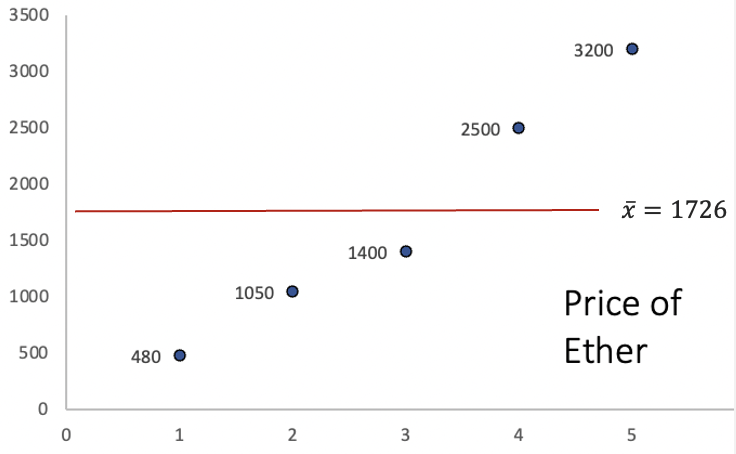
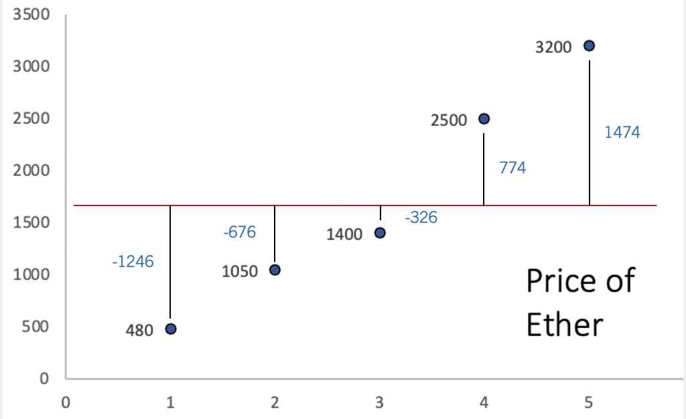
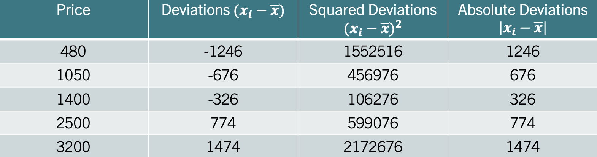
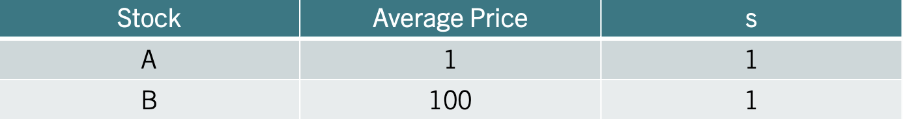
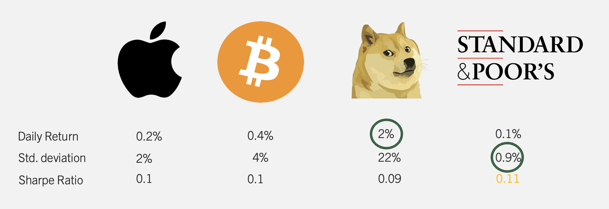
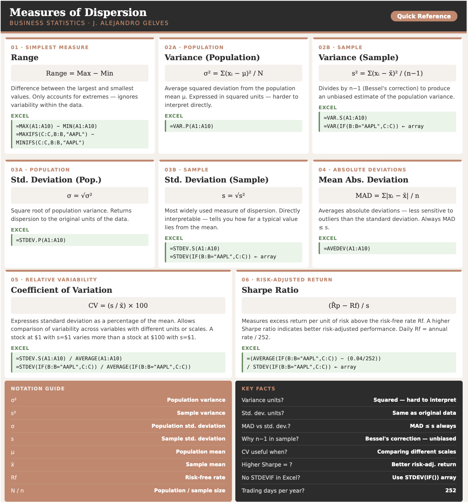

```{=html}
<style>
details {
  background-color: #F8F9FA;
  padding: 5px;
  border: 1px solid #ddd; /* Light border */
  border-radius: 5px; /* Rounded corners */
  margin: 10px 0; /* Spacing */
}

details summary {
  cursor: pointer; /* Pointer cursor for interactivity */
}
</style>
```

# Descriptive Stats IV

Measures of dispersion provide insights into how much the values in a data set deviate from the central tendency. In a business context, understanding variability is essential for assessing risk, as it helps decision-makers anticipate fluctuations in revenue, costs, and market conditions. Below, we explore the main statistics that help us quantify variability and use them to make better business decisions.

## The Range

This is the simplest measure of dispersion, defined as the difference between the largest and smallest values in a variable. While straightforward, the range only accounts for the extremes and does not reflect the variability within the variable. The **range** is calculated by:

::: {.callout-formula}
**THE RANGE**
$$Range=Maximum-Minimum$$
:::

:::{.callout-example}
**Example:** Consider the data $x=\{480, 1050, 1400, 2500, 3200\}$. The range is given by $Range=3200-480=2720$.
:::


## The Variance

The variance gives us a more comprehensive look at dispersion by considering how each data point deviates from the mean. It summarizes the squared deviations from the mean by finding their average.The **variance population parameter** is given by:

::: {.callout-formula}
**THE VARIANCE (POPULATION)**
$$\sigma^2= \frac{\sum (x_i-\mu)^2}{N}$$
where $\mu$ is the population mean and $N$ is the population size.
:::

The **variance sample statistic** is given by:

::: {.callout-formula}
**THE VARIANCE (SAMPLE)**
$$s^2=\frac{\sum (x_i-\bar{x})^2}{n-1}$$
where $\bar{x}$ is the sample mean and $n$ is the sample size.
:::


### Variance Intuition {.unnumbered}
Let's consider a sample of the price of Ether, the native cryptocurrency of the Ethereum blockchain. Ether is one of the largest cryptocurrencies by market capitalization and is widely used to pay for transactions and services on the Ethereum network. Unlike traditional assets such as stocks or bonds, cryptocurrencies like Ether are not backed by earnings or government guarantees, which makes their prices highly sensitive to speculation, regulatory news, and shifts in investor sentiment. As a result, Ether is known for dramatic price swings — sometimes gaining or losing double-digit percentages within a single day — making it an ideal case study for measures of dispersion. Below is a graph of the prices:

```{r echo=FALSE, out.width="75%", fig.align='center'}

```

The y axis represents the price, while the x axis represents the period of time. The red line is the average price of Ether. The way the variance calculates dispersion, is by first finding the distance between each point and the average. The image below illustrates these distances:

```{r echo=FALSE, out.width="75%", fig.align='center'}

```

Ideally, our measure of dispersion would simply average the distances from each data point to the mean, giving us a clear indication of how much the data varies around this central point. Since the mean is a measure that balances the distances from the mean, the sum of all deviations is equal to zero. This "balancing" effect is visually apparent in the graph, where positive deviations are exactly offset by negative ones. To address this issue, the variance squares each deviation from the mean before finding the average.

### Variance Step By Step Calculation {.unnumbered}
Consider the data $x=\{480, 1050, 1400, 2500, 3200\}$. 
Treating this as a sample, let's calculate the variance step by step.

**Step 1 — Calculate the sample mean:**

$$\bar{x} = \frac{480 + 1050 + 1400 + 2500 + 3200}{5} = \frac{8630}{5} = 1726$$

**Step 2 — Calculate the deviation of each observation from the mean:**

| $x_i$ | $x_i - \bar{x}$   |
|:-----:|:-----------------:|
| 480   | $480-1726=-1246$  |
| 1050  | $1050-1726=-676$  |
| 1400  | $1400-1726=-326$  |
| 2500  | $2500-1726=774$   |
| 3200  | $3200-1726=1474$  |

**Step 3 — Square each deviation:**

| $x_i$ | $x_i - \bar{x}$ | $(x_i - \bar{x})^2$ |
|:-----:|:---------------:|:-------------------:|
| 480   | $-1246$         | $1,552,516$         |
| 1050  | $-676$          | $456,976$           |
| 1400  | $-326$          | $106,276$           |
| 2500  | $774$           | $599,076$           |
| 3200  | $1474$          | $2,172,676$         |

**Step 4 — Sum the squared deviations:**

$$\sum(x_i-\bar{x})^2 = 1{,}552{,}516 + 456{,}976 + 106{,}276 + 599{,}076 + 2{,}172{,}676 = 4{,}887{,}520$$

**Step 5 — Divide by $n-1$:**

$$s^2 = \frac{4{,}887{,}520}{5-1} = \frac{4{,}887{,}520}{4} = 1{,}221{,}880$$

The sample variance is $s^2=1{,}221{,}880$. Note that the variance is expressed in squared units of the original data, which makes it 
difficult to interpret directly. This motivates the use of the standard deviation, which brings the measure back to the original units.


## The Standard Deviation

The standard deviation is derived by taking the square root of the variance. Remember, the variance employs squared deviations to eliminate negative values and calculate spread. By taking the square root, the standard deviation reverts the measure of dispersion back to the original units of the variable. This transformation makes the standard deviation more intuitive; it directly quantifies how much each data point deviates from the mean in the same units as the variable itself. Consequently, the standard deviation is a clear and intuitive measure of variability.

To find the **population standard deviation**, take the square root of the variance. For the population parameter use: 

::: {.callout-formula}
**THE STANDARD DEVIATION (POPULATION)**
$$\sigma=\sqrt{\sigma^2}$$
:::

For the **sample standard deviation** use: 

::: {.callout-formula}
**THE STANDARD DEVIATION (SAMPLE)**
$$s=\sqrt{s^2}$$
:::

::: {.callout-example}
**Example:** Consider once more the price of Ether. That is. $x=\{480, 1050, 1400, 2500, 3200\}$. In the previous section we found that the variance $s^2=1221880$. Using the square root we find that $s=\sqrt{1221880}=1105.387$. If the price of Ether is in dollars, then, the price varies from the mean 1105.39 dollars on average.
:::

## Mean Absolute Deviation

Another measure of data variability is the Mean Absolute Deviation (MAD), which calculates variability using absolute deviations from the mean. This approach not only keeps the measure in the same units as the data but also makes it less sensitive to large deviations. Practically, the **Mean Absolute Deviation** measures the average deviation from the mean, by using absolute deviations. It is calculated by:

::: {.callout-formula}
**THE MEAN ABSOLUTE DEVIATION (POPULATION)**
$$MAD=\frac{\sum |x_i-\mu|}{N}$$ 
where the \| \| operator indicates absolute value. 
:::

You can estimates the mad for a sample with:

::: {.callout-formula}
**THE MEAN ABSOLUTE DEVIATION (SAMPLE)**
$$mad=\frac{\sum |x_i-\bar{x}|}{n}$$
:::

**Example:** Let's consider once more the price of Ether. Recall, that if we calculate the deviations from the mean we obtain the second column in the table below:

```{r echo=FALSE, out.width="75%", fig.align='center'}

```

For the MAD, focus on the fourth column which lists the absolute deviations from the mean. Averaging these gives us the Mean Absolute Deviation (MAD), which equals $mad=899.2$. This result states that, on average, each data point is roughly $900$ dollars away from the mean. Note that the standard deviation is higher ($988.73$) since the squaring of deviations disproportionately amplifies larger ones, pushing the standard deviation above the MAD.

## Coefficient of Variation

The **Coefficient of Variation** simplifies comparisons of variability across variables with different units or scales, by dividing the standard deviation by the mean. It is calculated by:

::: {.callout-formula}
**THE COEFFICIENT OF VARIATION (CV)**
$$CV=\frac{s}{\bar{x}} \times 100$$
:::

::: {.callout-example}
**Example:** Consider the table below, that shows information on two different stocks:

```{r echo=FALSE, out.width="75%", fig.align='center'}

```

The third column shows the standard deviation of each stock. One could conclude that both stocks vary the same as they have the same standard deviation of one. Recall that the coefficient of variation considers the variable's scale by incorporating the mean into its calculation. Since one stock is centered around 1 dollar and the other around 100 dollars (second column), it is clear that they do not vary similarly percentage-wise. Stock A varies 100% from the mean, whereas Stock B only varies 1%. Hence, the coefficient of variation would identify Stock A as the more variable stock.
:::

## The Sharpe Ratio

The Sharpe Ratio measures how much excess return an investor receives for the extra volatility (risk) taken on beyond the risk-free rate. It essentially uses the same principle of normalization as the CV but adds the dimension of risk-adjusted performance. If the CV tells you the variability of returns in relation to their mean, the Sharpe Ratio tells you if that variability is worth it by comparing it against what you could safely earn without risk. In essence, while the CV highlights variability, the Sharpe Ratio motivates investment choices by rewarding higher returns per unit of risk taken.

In sum, the **Sharpe ratio** quantifies the excess return of an investment over the risk free return. It is calculated by:

::: {.callout-formula}
**THE SHARPE RATIO**
$$\frac{\bar{R_p}-R_f}{s}$$ 
where $\bar{R_p}$ is the mean return of the portfolio, $R_f$ is the risk free return, and $s$ is the standard deviation.
:::

::: {.callout-example}
**Example:** Consider the table below that includes a collection of investments.

```{r echo=FALSE, out.width="75%", fig.align='center'}

```

The table shows four investments (Apple, Bitcoin, Shiba, and S&P). Just looking at the daily return, it is clear that Shiba provides the best returns. However, the cost for that high return is reflected in variability (22% for Shiba). The S&P is clearly the safest investment with a standard deviation of only 0.9%. The Sharpe Ratio, marries these two metrics showing the return per unit of risk taken over the free rate. If we assume a 0% risk free rate, the investment with the highest Sharpe Ratio is the S&P at 0.11.
:::


## Measures of Dispersion in Excel

Excel has a collection of functions that calculate measures of dispersion. Let's use daily stock return data for three assets — Apple (AAPL), the S&P 500 ETF (SPY), and Tesla (TSLA) — to explore these functions. The data contains daily returns for each stock from January 2020 to July 2021.

[ Download Data](returns.xlsx){.btn .btn-success}

```{r echo=FALSE, message=FALSE}
library(tidyverse)
returns <- read_csv("https://jagelves.github.io/Data/returns.csv")
```

**Count:** We begin by finding the number of observations for each stock using `=COUNTIF()`. Assuming the stock names are in column B and returns in column C, the number of observations for AAPL is:

```excel
=COUNTIF(B:B, "AAPL")
```
The number of daily return observations for each stock is:

```{r echo=FALSE, message=FALSE}
returns %>% group_by(Stock) %>% summarise(N = n()) %>%
  gt::gt() %>% gt::cols_align("center") %>%
  gt::tab_style(locations = gt::cells_column_labels(),
    style = list(gt::cell_borders(sides="bottom", weight=gt::px(3)),
                 gt::cell_text(weight="bold")))
```

**Average Return:** To calculate the average return we use the geometric mean, since returns compound over time. Using `=GEOMEAN()` with the adjustment for rates and the particular stocks:


```excel
=GEOMEAN(IF(B2:B1189="AAPL", 1+C2:C1189)) - 1
```

The average daily return for each stock is:

```{r echo=FALSE, message=FALSE}
returns %>% group_by(Stock) %>%
  summarise(Avg_Return = (prod(1 + Return)^(1/n()) - 1)) %>%
  gt::gt() %>% gt::cols_align("center") %>%
  gt::fmt_percent(columns = Avg_Return, decimals = 4) %>%
  gt::tab_style(locations = gt::cells_column_labels(),
    style = list(gt::cell_borders(sides="bottom", weight=gt::px(3)),
                 gt::cell_text(weight="bold")))
```

**Minimum and Maximum:** To find the minimum and maximum return for each stock use `=MINIFS()` and `=MAXIFS()`. Assuming stock names are in column B and returns in column C:

```excel
=MINIFS(C:C, B:B, "AAPL")
=MAXIFS(C:C, B:B, "AAPL")
```

The minimum and maximum daily returns for each stock are:

```{r echo=FALSE, message=FALSE}
returns %>% group_by(Stock) %>%
  summarise(Min = min(Return), Max = max(Return)) %>%
  gt::gt() %>% gt::cols_align("center") %>%
  gt::fmt_percent(columns = c(Min, Max), decimals = 2) %>%
  gt::tab_style(locations = gt::cells_column_labels(),
    style = list(gt::cell_borders(sides="bottom", weight=gt::px(3)),
                 gt::cell_text(weight="bold")))
```

Note that TSLA shows the widest range, with a minimum daily return of around $-23\%$ and a maximum of around $+18\%$, reflecting its high 
volatility relative to AAPL and SPY.

**Variance and Standard Deviation:** To calculate the variance and 
standard deviation use `=VARPA()` and `=STDEV.S()`. Note that Excel 
does not have a `=STDEVIF()` function. To calculate a conditional 
standard deviation use an array formula:

```excel
=VAR(IF(B2:B1189="AAPL", C2:C1189))
=STDEV(IF(B2:B1189="AAPL", C2:C1189))
```
The variance and standard deviation for each stock are:

```{r echo=FALSE, message=FALSE}
returns %>% group_by(Stock) %>%
  summarise(Variance = var(Return), Std_Dev = sd(Return)) %>%
  gt::gt() %>% gt::cols_align("center") %>%
  gt::fmt(columns = c(Variance, Std_Dev), 
          fns = function(x) scales::percent(x, accuracy=0.0001)) %>%
  gt::tab_style(locations = gt::cells_column_labels(),
    style = list(gt::cell_borders(sides="bottom", weight=gt::px(3)),
                 gt::cell_text(weight="bold")))
```

**Coefficient of Variation:** The coefficient of variation (CV) 
standardizes dispersion relative to the mean, allowing comparison 
across assets. In Excel, divide the standard deviation by the average return:

```excel
=STDEV(IF(B2:B1189="AAPL",C2:C1189)) / AVERAGE(IF(B2:B1189="AAPL",C2:C1189))
```

**Sharpe Ratio:** The Sharpe ratio measures the return earned per unit of risk, adjusting for the risk-free rate. Assuming an annual risk-free rate of $4\%$, the daily risk-free rate is $r_f = 0.04/252$. In Excel:

```excel
=(AVERAGE(IF(B2:B1189="AAPL",C2:C1189)) - (0.04/252)) /
  STDEV(IF(B2:B1189="AAPL",C2:C1189))
```

The CV and Sharpe ratio for each stock are:

```{r echo=FALSE, message=FALSE}
rf_daily <- 0.04 / 252
returns %>% group_by(Stock) %>%
  summarise(
    CV = sd(Return) / mean(Return),
    Sharpe = (mean(Return) - rf_daily) / sd(Return)
  ) %>%
  gt::gt() %>% gt::cols_align("center") %>%
  gt::fmt_number(columns = c(CV, Sharpe), decimals = 4) %>%
  gt::tab_style(locations = gt::cells_column_labels(),
    style = list(gt::cell_borders(sides="bottom", weight=gt::px(3)),
                 gt::cell_text(weight="bold")))
```

A higher Sharpe ratio indicates better risk-adjusted performance. SPY offers the most consistent return per unit of risk, while TSLA has the highest volatility and the most variable Sharpe ratio — consistent with its reputation as a high-risk, high-reward asset.

## Excel Function Summary

Below is a list of the Excel functions used in this section:

- `=COUNTIF(range, criteria)` counts the number of cells in a range 
  that meet a given condition. Used here to count the number of 
  observations for each stock.
  
- `=MINIFS(min_range, criteria_range, criteria)` returns the minimum 
  value in a range filtered by one or more conditions.
  
- `=MAXIFS(max_range, criteria_range, criteria)` returns the maximum 
  value in a range filtered by one or more conditions.
  
- `=VAR.S(range)` calculates the sample variance for a range of numbers.

- `=STDEV.S(range)` calculates the sample standard deviation for a range of numbers. It is the square root of the sample variance.

- `=VAR(IF(criteria_range="condition", value_range))` calculates a 
  conditional variance. Unlike `=AVERAGEIF()`, Excel does not have a 
  native `=VARIF()` function.
  
- `=STDEV(IF(criteria_range="condition", value_range))` calculates a 
  conditional standard deviation. Like variance, there is no native 
  `=STDEVIF()` in Excel.
  
## Chapter Summary Cheat Sheet

```{r echo=FALSE, out.width="100%", fig.align='center'}

```
  
## Exercises

The following exercises will help you practice the measures of dispersion. In particular, the exercises work on:

-   Calculating the range, MAD, variance, and the standard deviation.

-   Using R to calculate measures of dispersion.

-   Calculating and using the Sharpe ratio to select investments.

Answers are provided below. Try not to peak until you have a formulated your own answer and double checked your work for any mistakes.

### Exercise 1 {.unnumbered}

For the following exercises, make your calculations by hand and verify results using R functions when possible. Make sure to calculate the deviations from the mean.

1.  Use the following observations to calculate the Range, MAD, Variance and Standard Deviation. Assume that the data below is the entire population.

    |     |     |     |     |
    |:---:|:---:|:---:|:---:|
    | 70  | 68  |  4  | 98  |

<details>

<summary>Answer</summary>

*The mean is* $60$, the Range is $94$, the MAD is $28$, the variance is $1186$ and the variance is $34.44$.

*Here is the table of deviations:*

| $x_{i}$ | $x_{i}-\bar{x}$ | $(x_{i}-\bar{x})^2$ | $|x_{i}-\bar{x}|$ |
|:-------:|:---------------:|:-------------------:|:-----------------:|
|   70    |       10        |         100         |        10         |
|   68    |        8        |         64          |         8         |
|    4    |       -56       |        3136         |        56         |
|   98    |       38        |        1444         |        38         |

*The variance averages out the squared deviations* $(x_{i}-\bar{x})^2$, the MAD averages out the absolute deviations $|x_{i}-\bar{x}|$, and the standard deviation is the square root of the variance.

</details>

2.  Use the following observations to calculate the Range, MAD, Variance and Standard Deviation. Assume that the data below is a sample from the population.

    |     |     |     |     |     |     |
    |:---:|:---:|:---:|:---:|:---:|:---:|
    | -4  |  0  | -6  |  1  | -3  |  0  |

<details>

<summary>Answer</summary>

*The mean is $-2$, Range is $7$, the MAD is $2.33$, the variance is $7.6$ and the standard deviation is $2.76$.*

*Here is the table of deviations from the mean:*

| $x_{i}$ | $x_{i}-\bar{x}$ | $(x_{i}-\bar{x})^2$ | $|x_{i}-\bar{x}|$ |
|:-------:|:---------------:|:-------------------:|:-----------------:|
|   -4    |       -2        |          4          |         2         |
|    0    |        2        |          4          |         2         |
|   -6    |       -4        |         16          |         4         |
|    1    |        3        |          9          |         3         |
|   -3    |       -1        |          1          |         1         |
|    0    |        2        |          4          |         2         |

</details>

3. Use the following observations to calculate the Range, MAD, Variance and Standard Deviation. Assume that the data below is a sample from the population.

|     |     |     |     |     |     |
|:---:|:---:|:---:|:---:|:---:|:---:|
|  2  |  8  |  4  | 10  |  6  |  6  |

<details>
<summary>Answer</summary>

*The mean is $6$, Range is $8$, the MAD is $2$, the variance is $8$ 
and the standard deviation is $2.83$.*

*Here is the table of deviations from the mean:*

| $x_{i}$ | $x_{i}-\bar{x}$ | $(x_{i}-\bar{x})^2$ | $|x_{i}-\bar{x}|$ |
|:-------:|:---------------:|:-------------------:|:-----------------:|
|    2    |       -4        |         16          |         4         |
|    8    |        2        |          4          |         2         |
|    4    |       -2        |          4          |         2         |
|   10    |        4        |         16          |         4         |
|    6    |        0        |          0          |         0         |
|    6    |        0        |          0          |         0         |

*The range is $Range = 10 - 2 = 8$.*

*The MAD is $mad = (4+2+2+4+0+0)/6 = 12/6 = 2$.*

*The sample variance is $s^2 = (16+4+4+16+0+0)/(6-1) = 40/5 = 8$.*

*The standard deviation is $s = \sqrt{8} = 2.83$.*

</details>

### Exercise 2 {.unnumbered}

You will need the **Stocks** data set to answer this question. You can find this data here:

[ Download Data](stocks.xlsx){.btn .btn-success}

The data is a sample of daily stock prices for ticker symbols TSLA (Tesla), VTI (S&P 500) and GBTC (Bitcoin).

1.  Calculate the standard deviations for each stock. Which stock had the lowest standard deviation?

<details>

<summary>Answer</summary>

*For the sample taken, GBTC has the less variation. The standard deviation of GBTC is $9.43$, which is less than $16.57$ for VTI or $50.38$ for TSLA.*

</details>

2.  Calculate the MAD. Does your answer in 1. remain the same?

<details>

<summary>Answer</summary>

*The answer is the same, since the MAD for GBTC is $8.46$ which is lower than $14.27$ for VTI or $41.67$ for TSLA.*

</details>

3.  Finally, calculate the coefficient of variation. Any changes to your conclusions?

<details>

<summary>Answer</summary>

*By considering the magnitudes of the stock prices, it seems like VTI is the less volatile stock. VTI has a CV of $0.08$ which is lower than $0.44$ for GBTC or $0.18$ for TSLA. In fact, by CV Bitcoin seems to be the most risky asset.*

</details>

### Exercise 3 {.unnumbered}

You will need the **Portfolio** data set to answer this question. The data has 100 records of the returns of two stocks. You can find the data here:

[ Download Data](portfolio.xlsx){.btn .btn-success}

1.  Calculate the mean and standard deviation for each stock. Which investment has higher returns on average? Which investment is safest as measured by the standard deviation?

<details>

<summary>Answer</summary>

*The best performing stock on average is stock X. It has an average return of $-0.078$% vs. $0.097$% for stock Y. The safest stock is stock X as well, since the standard deviation is $1.062$ percentage points vs. $1.14$ percentage points for stock Y.*

</details>

2.  Use a Risk Free rate of return of 3.5% to calculate the Sharpe ratio for each stock. Which stock would you recommend?

<details>

<summary>Answer</summary>

*The Sharpe Ratio measures the excess return per unit of risk taken. Stock X has the better Sharpe Ratio $-0.106$ vs. $-0.115$ for stock Y. Stock X is recommended since it provides a higher excess return per unit of risk taken.


</details>

### Exercise 4 {.unnumbered}
The monthly returns (in percent) for a small project can be found in the Excel sheet below:

[ Download Data](monthly_returns.xlsx){.btn .btn-success}

Compute the sample mean, sample variance, sample standard deviation, coefficient of variation (CV) (in percent), and the mean absolute deviation (MAD). Briefly interpret the CV: what does it tell you about the returns relative to their mean?

<details>
<summary>Answer</summary>

*Start by computing the sample mean:*

$$\bar{x} = \frac{2.1 + (-0.5) + 3.0 + 1.2 + (-1.8) + 0.7 + 2.5 + (-0.3)}{8} = \frac{6.9}{8} = 0.8625$$

*Here is the table of deviations from the mean:*

| $x_{i}$ | $x_{i}-\bar{x}$ | $(x_{i}-\bar{x})^2$ | $|x_{i}-\bar{x}|$ |
|:-------:|:---------------:|:-------------------:|:-----------------:|
|   2.1   |     1.2375      |       1.5314        |      1.2375       |
|  -0.5   |    -1.3625      |       1.8564        |      1.3625       |
|   3.0   |     2.1375      |       4.5689        |      2.1375       |
|   1.2   |     0.3375      |       0.1139        |      0.3375       |
|  -1.8   |    -2.6625      |       7.0889        |      2.6625       |
|   0.7   |    -0.1625      |       0.0264        |      0.1625       |
|   2.5   |     1.6375      |       2.6814        |      1.6375       |
|  -0.3   |    -1.1625      |       1.3514        |      1.1625       |

*The sample variance is:*

$$s^2 = \frac{\sum(x_i - \bar{x})^2}{n-1} = \frac{19.2188}{7} = 2.7455$$

*The sample standard deviation is:*

$$s = \sqrt{2.7455} = 1.657$$

*The Mean Absolute Deviation is:*

$$mad = \frac{\sum|x_i - \bar{x}|}{n} = \frac{10.7}{8} = 1.3375$$

*The Coefficient of Variation is:*

$$CV = \frac{s}{\bar{x}} \times 100 = \frac{1.657}{0.8625} \times 100 = 192.1\%$$

*The CV is about $192\%$, which is large: the standard deviation is almost twice the mean. This indicates the returns are highly variable relative to their average — the mean is small compared with typical month-to-month fluctuations. In practice, a CV this large signals that the project's returns are unreliable; an investor cannot count on earning close to the average return in any given month.*
</details>

### Exercise 5 {.unnumbered}

Prediction markets allow participants to bet on the outcomes of sporting events. A bettor tracks his weekly profit and loss (in dollars) over ten weeks of NFL betting in the spreadsheet below:

[ Download Data](nfl_betting.xlsx){.btn .btn-success}


1. Compute the sample mean, sample variance, sample standard deviation, and MAD. Is the bettor profitable on average?


<details>
<summary>Answer</summary>

*The sample mean is:*

$$\bar{x} = \frac{120 + (-85) + 200 + (-150) + 95 + (-60) + 310 + (-220) + 175 + (-45)}{10} = \frac{340}{10} = 34$$

*The bettor is profitable on average, earning $\$34$ per week.*

*Here is the table of deviations from the mean:*

| $x_{i}$ | $x_{i}-\bar{x}$ | $(x_{i}-\bar{x})^2$ | $|x_{i}-\bar{x}|$ |
|:-------:|:---------------:|:-------------------:|:-----------------:|
|   120   |       86        |        7,396        |        86         |
|   -85   |      -119       |       14,161        |       119         |
|   200   |       166       |       27,556        |       166         |
|  -150   |      -184       |       33,856        |       184         |
|    95   |       61        |        3,721        |        61         |
|   -60   |       -94       |        8,836        |        94         |
|   310   |       276       |       76,176        |       276         |
|  -220   |      -254       |       64,516        |       254         |
|   175   |       141       |       19,881        |       141         |
|   -45   |       -79       |        6,241        |        79         |

*The sample variance is:*

$$s^2 = \frac{262{,}340}{9} = 29{,}149$$

*The sample standard deviation is:*

$$s = \sqrt{29{,}149} = \$170.73$$

*The MAD is:*

$$mad = \frac{86+119+166+184+61+94+276+254+141+79}{10} = \frac{1{,}460}{10} = \$146$$

*The bettor is profitable on average but faces large week-to-week swings — a typical week deviates from the mean by about $\$146$ to $\$171$ depending on the measure used.*

</details>


2. Compute the Coefficient of Variation (CV). What does it tell you about the reliability of the bettor's weekly results?


<details>
<summary>Answer</summary>

$$CV = \frac{170.73}{34} \times 100 = 502\%$$

*A CV of $502\%$ is extremely large (i.e., the standard deviation is five) times the mean. This indicates that the average weekly profit of $\$34$ is tiny relative to the typical week-to-week swings of $\$171$. The bettor cannot reliably count on earning near the mean in any given week. A high CV signals that the strategy is highly risky relative to its average reward.*

</details>

3. Assuming a risk-free weekly return of $0, compute the Sharpe Ratio. Would you consider this a good risk-adjusted return?

<details>
<summary>Answer</summary>

*With a risk-free rate of $\$0$:*

$$SR = \frac{\bar{x} - R_f}{s} = \frac{34 - 0}{170.73} = 0.199$$

*A Sharpe ratio of $0.199$ is low. As a point of reference, a Sharpe ratio above $1$ is generally considered acceptable in finance. The bettor earns only $\$0.20$ of profit per dollar of risk taken — suggesting that while the strategy is marginally profitable, the risk taken to achieve that profit is not well compensated. A more disciplined betting strategy or better odds selection would be needed to improve the risk-adjusted return.*

</details>