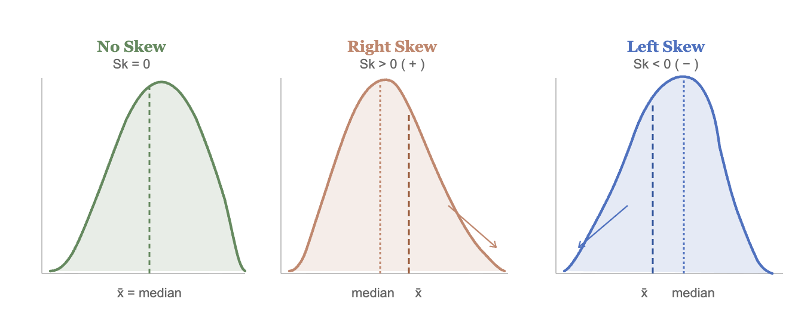
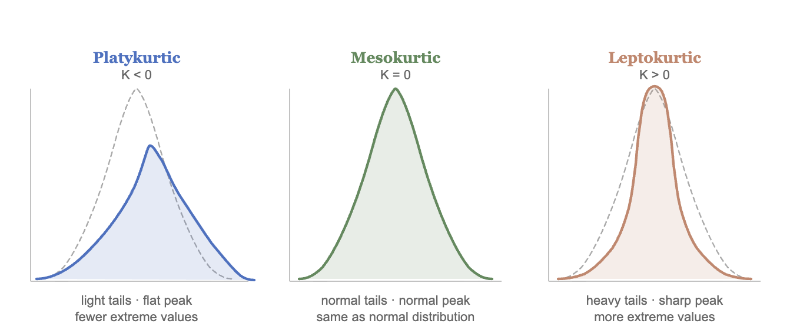
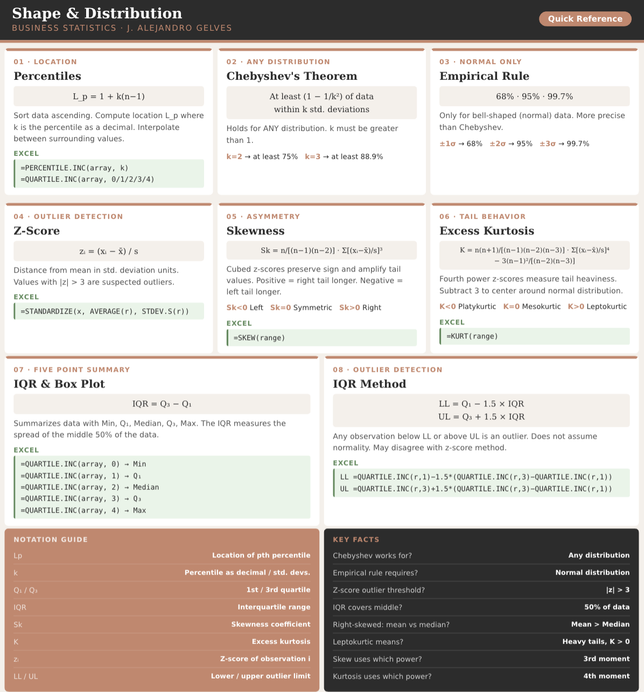

```{=html}
<style>
details {
  background-color: #F8F9FA;
  padding: 5px;
  border: 1px solid #ddd; /* Light border */
  border-radius: 5px; /* Rounded corners */
  margin: 10px 0; /* Spacing */
}

details summary {
  cursor: pointer; /* Pointer cursor for interactivity */
}
</style>
```

# Descriptive Stats V

There are statistical measures that describe the shape and distribution of the data beyond measures of central location or dispersion. They provide a view of how data is spread out, where it concentrates, and how it deviates from what might be expected. The tools shown below will help you describe the data's shape, symmetry, and anomalies.

## Quantiles and Percentiles {#.quartiles}

A **quantile** is a location within a set of ranked numbers (or distribution), below which a certain proportion, $q$, of that set lie. If we instead express quantiles as a percentage, they are referred to as **percentiles**.

::: {.callout-example}
**Example:** Imagine all your data points lined up from smallest to largest. If you say you're looking at the 25th percentile, it means you're finding the value below which 25% of your data falls. If you had 100 test scores, the 25th percentile would be the score where 25 students scored lower than that, and 75 scored higher or equal. It's a way to see where a value stands in relation to the rest of the data in terms of percentage.*
:::

To calculate a percentile we follow the steps below:

1.  Sort the data in ascending order. Each point has now a location. The smallest number will be first, the second smallest number will be second, etc.

2.  Compute the location of the percentile desired using:

::: {.callout-formula}
**Location of the pth percentile**
$$L_{p}=1+k(n-1)$$ 
where $L_{p}$$ is the location (in the sorted data) of the $P_{th}$ percentile, and $P$ is the percentile desired.
:::

3.  The data point at location $L_p$, is the the $P_{th}$ percentile.

::: {.callout-example}
**Example:** Let's use the IQ scores for a group of students to find the 25th percentile. $IQ=\{80,100,110,75,130,90\}$.

1.  We sort the data: 

$$IQ_{sorted}=\{75,80,90,100,110,130\}$$

2.  Find the location of the 25th percentile: 
$$L_{25}=1+0.25(6+1)=2.25$$ 
The 25th percentile is in the position 2.25 of the sorted data.

3.  Retrieve the 25th percentile: Since position 2 is 80 and position 3 
is 90, the 25th percentile lies $0.25$ of the way between positions 
2 and 3. Hence, the 25th percentile is:

$$P_{25} = 80 + 0.25(90 - 80) = 82.5$$.

:::

## Chebyshev's Theorem

Chebyshev's Theorem is an important theorem, as it helps you form an expectation of the proportion of data that must lie between a given standard deviation from the mean. This offers a baseline to understanding the range and distribution of your data, and aids in detecting outliers. Formally, **Chebyshev's Theorem** states that regardless of the shape of the distribution, at least ($1-1/z^2$)% of the data lies between $z$ standard deviations from the mean.

::: {.callout-formula}
**CHEBYSHEV'S THEOREM**
$$1 - \frac{1}{k^2}$$
where $k$ is the number of standard deviations from the mean and 
$k > 1$.
:::


::: {.callout-example}
**Example 1:** For a given data set, we want to know at least how much of the data lies within two standard deviations of the mean. Substituting $k=2$ into Chebyshev's formula yields $1-\frac{1}{2^2}=1-\frac{1}{4}=0.75$. Hence, at least $75\%$ of the data lies within two standard deviations from the mean.
:::

::: {.callout-example}
**Example 2:** A financial analyst is reviewing the annual returns of a mutual fund over several years. The mean annual return is $8\%$ with a standard deviation of $3\%$. Using Chebyshev's theorem with $k=3$, at least $1-1/9=0.889$ or $88.9\%$ of the annual returns lie within three standard deviations of the mean.
:::

## The Empirical Rule

Whereas Chebyshev's theorem holds for any data distribution, the empirical rule is a bit more precise when looking at "bell shaped" data. Formally, the **Empirical Rule** or ($68$,$95$,$99.7$ rule) states that $68$%, $95$%, and $99.7$% of the data lies between $1$, $2$, and $3$ standard deviations from the mean respectively. The rule requires that the data be bell shape (normally) distributed.


::: {.callout-example}
**Example:** A company reports that customer satisfaction scores are 
are in good standing as they have a mean of $\mu=78$ and a standard deviation 
of $\sigma=6$. They claim that $95\%$ of customers have satisfaction 
scores between $66$ and $90$. Note that this conclusion is only valid if the data is truly bell-shaped — a histogram of the scores should be inspected to 
verify this assumption before accepting the claim.
:::

## Outliers (Z-Scores)

Given the boundaries set by both the empirical rule and Chebyshev's theorem, we can classify points as being common (normal) and not common (outliers). Specifically, **outliers** are extreme deviations from the mean. They are values that are not "common" or rarely occurring. Since both the empirical rule and Chebyshev's theorem state that a large proportion of the data is between three standard deviations, it would be uncommon to have a data point that is more that three standard deviations away from the mean.

To identify outliers we use a **z-score**, which is a measure of 
distance from the mean in units of standard deviations. By definition, $z$-scores above $3$ are suspected to be outliers.

::: {.callout-formula}
**THE Z-SCORE**
$$z_{i}=\frac{x_i-\bar{x}}{s_x}$$
where $x_i$ is the data point, $\bar{x}$ is the sample mean, and 
$s_x$ is the sample standard deviation.
:::

::: {.callout-example}
**Example:** On Jan 22, 2006 Kobe Bryant scored 81 points against the Toronto Raptors. He had averaged 30 point per game with a standard deviation of 4 points. If we calculate the z-score we get:* $z_{81}=\frac{81-30}{4}=12.5$. This mean that 81 is 12.5 standard deviations away from the mean, making this value extremely rare.
:::

::: {.callout-example}
**Example:** On March 10, 2026, Bam Adebayo of the Miami Heat scored 
$83$ points against the Washington Wizards — the second highest 
single-game scoring performance in NBA history, surpassing Kobe 
Bryant's iconic $81$-point game. Prior to this game, Adebayo had 
averaged approximately $20$ points per game with a standard deviation 
of $5$ points. Calculating the z-score:

$$z_{83}=\frac{83-20}{5}=12.6$$

This means that Adebayo's $83$-point performance was $12.6$ standard 
deviations above his mean comparable in statistical terms to Kobe Bryant's $81$-point game in 2006, which produced a z-score of $12.5$. Both performances illustrate how z-scores allow us to compare exceptional events across different players and eras on a common scale.
:::

## Skew

A measurement of skew, identifies asymmetry in the distribution of data. If most of the data leans towards one side, it's skewed. If it leans to the left, it's left-skewed or negatively skewed, meaning the tail on the left side is longer. If it leans to the right, it's right-skewed or positively skewed, with a longer tail on the right. If the data is evenly distributed, it's not skewed at all, it's symmetric. To determine if the data is skewed, calculate the **Coefficient of Skew**. 

::: {.callout-formula}
**SKEWNESS**
$$Sk=\frac{n}{(n-1)(n-2)}\sum\left(\frac{x_i-\bar{x}}{s}\right)^3$$
where $n$ is the sample size, $\bar{x}$ is the sample mean, and $s$ 
is the sample standard deviation.

| $Sk < 0$ | $Sk = 0$ | $Sk > 0$ |
|:---:|:---:|:---:|
| Left-skewed | Symmetric | Right-skewed |
:::

The image below shows the different types of skew:

```{r echo=FALSE, out.width="100%", fig.align='center'}

```

The intuition behind the skewness formula lies in the cubed z-scores. Recall that a z-score measures how far each observation is from the 
mean in standard deviation units. Cubing these z-scores does two 
things: it preserves the sign and it amplifies large deviations, 
giving outsized influence to observations in the tails. If the right 
tail is longer, a few large positive cubed z-scores dominate the sum, producing a positive skewness. If the left tail is longer, large 
negative cubed z-scores dominate, producing a negative result. A 
symmetric distribution produces cubed z-scores that cancel out, 
yielding a skewness of zero.

::: {.callout-example}
**Example:** Consider the IQ scores $IQ=\{75, 80, 90, 100, 110, 130\}$ with $n=6$, $\bar{x}=97.5$, and $s=20.43$.

| $x_i$ | $\frac{x_i-\bar{x}}{s}$ | $\left(\frac{x_i-\bar{x}}{s}\right)^3$ |
|:-----:|:------------------------:|:--------------------------------------:|
|  75   |        $-1.101$          |              $-1.335$                  |
|  80   |        $-0.857$          |              $-0.628$                  |
|  90   |        $-0.367$          |              $-0.050$                  |
| 100   |         $0.122$          |               $0.002$                  |
| 110   |         $0.612$          |               $0.229$                  |
| 130   |         $1.591$          |               $4.024$                  |

$$Sk = \frac{6}{(5)(4)}\times(2.242) = \frac{6}{20}\times 2.242 = 0.673$$

Since $Sk > 0$ the distribution is right-skewed, which makes 
intuitive sense — most IQ scores cluster below the mean while 
the score of $130$ pulls the tail to the right.
:::

## Kurtosis

Kurtosis measures the "tailedness" of a distribution — that is, how 
much of the data is concentrated in the tails relative to a normal 
distribution. A distribution with heavy tails has more extreme values than expected, while a distribution with light tails has fewer. To 
measure kurtosis, we use the **Excess Kurtosis** formula, which 
centers the measure around zero by subtracting 3.

::: {.callout-formula}
**EXCESS KURTOSIS**
$$K = \frac{n(n+1)}{(n-1)(n-2)(n-3)}\sum\left(\frac{x_i-\bar{x}}{s}\right)^4 - \frac{3(n-1)^2}{(n-2)(n-3)}$$
where $n$ is the sample size, $\bar{x}$ is the sample mean, and $s$ 
is the sample standard deviation.

| $K < 0$ | $K = 0$ | $K > 0$ |
|:---:|:---:|:---:|
| Platykurtic (light tails) | Mesokurtic | Leptokurtic (heavy tails) |
:::

Below you can see a graph illustrating the different types of kurtosis:

```{r echo=FALSE, out.width="100%", fig.align='center'}

```

::: {.callout-example}
**Example:** Consider once more the IQ scores 
$IQ=\{75, 80, 90, 100, 110, 130\}$ with $n=6$, $\bar{x}=97.5$, 
and $s=20.43$.

| $x_i$ | $\frac{x_i-\bar{x}}{s}$ | $\left(\frac{x_i-\bar{x}}{s}\right)^4$ |
|:-----:|:------------------------:|:--------------------------------------:|
|  75   |        $-1.101$          |               $1.470$                  |
|  80   |        $-0.857$          |               $0.538$                  |
|  90   |        $-0.367$          |               $0.018$                  |
| 100   |         $0.122$          |               $0.000$                  |
| 110   |         $0.612$          |               $0.140$                  |
| 130   |         $1.591$          |               $6.401$                  |

Applying Excel's bias-corrected formula with $n=6$:

$$K = \frac{6(7)}{(5)(4)(3)}(8.567) - \frac{3(5)^2}{(4)(3)} = 5.997 - 6.25 = -0.253$$

Since $K < 0$ the distribution is platykurtic — the tails are 
lighter than a normal distribution.
:::

A distribution is **leptokurtic** ($K>0$) when it has heavier tails 
and a sharper peak than a normal distribution — extreme values are 
more common. A distribution is **platykurtic** ($K<0$) when it has 
lighter tails and a flatter peak — extreme values are rare. When 
$K=0$ the distribution has the same tail behavior as a normal 
distribution and is called **mesokurtic**.

::: {.callout-example}

**Example:** A risk analyst examines the daily returns of two assets. Asset A has an excess kurtosis of $K=3.2$ and Asset B has an excess 
kurtosis of $K=-0.8$. Since $K>0$, Asset A is leptokurtic — its 
returns have heavier tails than a normal distribution, meaning extreme gains or losses occur more frequently than expected. Since $K<0$, Asset B is platykurtic — extreme returns are rare and the distribution is flatter. An investor concerned about tail risk would prefer Asset B, as large unexpected losses are less likely.
:::

## Five Point Summary

A popular way to summarize data is by calculating the minimum, first quartile, median, third quartile and maximum (five point summary). This gives us a good idea of how data is distributed. We can additionally inquire how the middle 50% of the data varies. Recall, that we can use a range to assess dispersion. The **interquartile range (IQR)** quantifies the dispersion of the middle 50% of the data. Formally, the IQR is the difference between the third quartile (75th percentile) and the first quartile (25th percentile).

::: {.callout-formula}
**THE INTERQUARTILE RANGE (IQR)**
$$IQR = Q_3 - Q_1$$
where $Q_1$ is the first quartile (25th percentile) and $Q_3$ is 
the third quartile (75th percentile). The IQR measures the spread 
of the middle $50\%$ of the data.
:::

::: {.callout-example}
**Example:** Let's use the IQ scores for a group of students once more. Recall that the data is given by $IQ=\{80,100,110,75,130,90\}$. The minimum and the maximum are easily identified as $Max=130$ and $Min=75$. The first quartile ($P_{25}$) was calculated in [1.1](#.quartiles) as 78.75. Using the same steps the third quartile ($P_{75}$) is 115. The median is the average between the third and fourth numbers $Median=190/2=95$. The five point summary is given in the table below:

| $Min$ | $P_{25}$ | $Median$ | $P_{75}$ | $Max$ |
|:-----:|:--------:|:--------:|:--------:|:-----:|
|  75   |  78.75   |    95    |   115    |  130  |

To calculate the interquartile range we find the difference between the 75th and 25th percentiles. $IQR=115-78.75=36.25$ which means that the middle 50% of the data has a range of 36.25.
:::

## Outliers (IQR)

An alternate way to identify outliers is by using the interquartile 
range. This measure and the z-score method can disagree. Any 
observation falling outside the following limits is considered an 
outlier:

::: {.callout-formula}
**OUTLIER LIMITS (IQR METHOD)**
$$Lower\ Limit = Q_1 - 1.5 \times IQR$$
$$Upper\ Limit = Q_3 + 1.5 \times IQR$$
where $Q_1$ is the first quartile, $Q_3$ is the third quartile, and 
$IQR = Q_3 - Q_1$ is the interquartile range.
:::

If an observation $x_i$ falls below the lower limit or above the 
upper limit, it is considered an outlier.

::: {.callout-example}
**Example:** Consider once more the IQ data.
$$IQ=\{80,100,110,75,130,90\}$$ 
The lower limit for on outlier is given by:
$$LL=Q_1-1.5(IQR)=78.75-1.5(36.25)=24.375$$ 
The upper limit is given by 
$$UL=Q_3+1.5(IQR)=115+1.5(36.25)=169.375$$ 
Any data point outside the range \[24.375,169.375\] is considered an outlier. In other words, 200 and 20 would be outliers, but 100 would not.
:::

## Calculating Measures in Excel

Excel provides functions to calculate all the shape and distribution 
measures covered in this chapter. We will use the same `faithful` 
dataset from R, which contains data on eruptions of the Old Faithful 
geyser in Yellowstone National Park. The variable `eruptions` 
measures the duration of each eruption in minutes.

```{r echo=FALSE, message=FALSE}
library(tidyverse)
library(gt)
head(faithful, 5) %>%
  gt() %>%
  cols_align("center") %>%
  tab_style(
    locations = cells_column_labels(columns = everything()),
    style = list(cell_borders(sides = "bottom", weight = px(3)),
                 cell_text(weight = "bold")))
```

Assuming the `eruptions` variable is in column A of your Excel 
spreadsheet, the functions below will replicate the R output.

### Outliers in Excel {.unnumbered}

To identify outliers using the z-score method, calculate the z-score 
for each observation using `=STANDARDIZE()`. In a new column, enter:

```excel
=STANDARDIZE(A2, AVERAGE(A:A), STDEV.S(A:A))
```

Copy the formula down for all observations. Any value greater than 
$3$ or less than $-3$ in absolute value is a suspected outlier. To 
filter outliers automatically, use `=IF()`:

```excel
=IF(ABS(STANDARDIZE(A2, AVERAGE($A:$A), STDEV.S($A:$A))) > 3, "Outlier", "Normal")
```

The z-scores for the first five observations of the `faithful` 
dataset are:

```{r echo=FALSE, message=FALSE}
faithful %>% 
  head(5) %>%
  mutate(z_eruptions = round(scale(eruptions)[,1], 4)) %>%
  gt() %>%
  cols_align("center") %>%
  tab_style(
    locations = cells_column_labels(columns = everything()),
    style = list(cell_borders(sides = "bottom", weight = px(3)),
                 cell_text(weight = "bold")))
```

As confirmed earlier, none of the observations are outliers as all 
z-scores are within three standard deviations of the mean.

### Five Point Summary in Excel {.unnumbered}

To calculate the five point summary use `=QUARTILE.INC()`. The 
argument `quart` takes values $0$ through $4$:

```excel
=QUARTILE.INC(A:A, 0)   /* Minimum    */
=QUARTILE.INC(A:A, 1)   /* Q1 (P25)   */
=QUARTILE.INC(A:A, 2)   /* Median     */
=QUARTILE.INC(A:A, 3)   /* Q3 (P75)   */
=QUARTILE.INC(A:A, 4)   /* Maximum    */
```

The IQR can then be calculated as:

```excel
=QUARTILE.INC(A:A, 3) - QUARTILE.INC(A:A, 1)
```

The five point summary for the `eruptions` variable is:

```{r echo=FALSE, message=FALSE}
tibble(
  Min    = min(faithful$eruptions),
  Q1     = quantile(faithful$eruptions, 0.25, type = 7),
  Median = median(faithful$eruptions),
  Q3     = quantile(faithful$eruptions, 0.75, type = 7),
  Max    = max(faithful$eruptions),
  IQR    = IQR(faithful$eruptions)
) %>%
  gt() %>%
  cols_align("center") %>%
  fmt_number(decimals = 3) %>%
  tab_style(
    locations = cells_column_labels(columns = everything()),
    style = list(cell_borders(sides = "bottom", weight = px(3)),
                 cell_text(weight = "bold")))
```

### Skewness and Kurtosis in Excel {.unnumbered}

To calculate skewness use `=SKEW()` and for excess kurtosis use 
`=KURT()`. Both functions use the bias-corrected formulas presented 
in this chapter:

```excel
=SKEW(A:A)    /* Skewness        */
=KURT(A:A)    /* Excess Kurtosis */
```

The skewness and kurtosis for the `eruptions` variable are:

```{r echo=FALSE, message=FALSE}
library(e1071)
tibble(
  Skewness = skewness(faithful$eruptions),
  Kurtosis = kurtosis(faithful$eruptions)
) %>%
  gt() %>%
  cols_align("center") %>%
  fmt_number(decimals = 4) %>%
  tab_style(
    locations = cells_column_labels(columns = everything()),
    style = list(cell_borders(sides = "bottom", weight = px(3)),
                 cell_text(weight = "bold")))
```

The negative skewness confirms the mild left skew identified earlier 
in the chapter. The negative excess kurtosis indicates that the 
distribution is platykurtic (i.e., the eruption durations have lighter tails than a normal distribution), with fewer extreme values than expected.

## Excel Function Summary

Below is a list of the Excel functions used in this section:

- `=PERCENTILE.INC(array, k)` returns the $k$th percentile of a range using the formula $L_p = 1 + k(n-1)$, where $k$ is expressed as a decimal between 0 and 1. This matches the method used in this chapter.

- `=PERCENTILE.EXC(array, k)` returns the $k$th percentile using the 
  formula $L_p = k(n+1)$. 
  
- `=QUARTILE.INC(array, quart)` returns the five point summary. The 
  argument `quart` takes values 0 (minimum), 1 ($Q_1$), 2 (median), 
  3 ($Q_3$), and 4 (maximum).

- `=STANDARDIZE(x, mean, std_dev)` calculates the z-score for a value `x` given the mean and standard deviation. Alternatively, compute it manually as `=(A1 - AVERAGE(A:A)) / STDEV.S(A:A)`.

- `=SKEW(range)` calculates the skewness of a range using the 
  Fisher-Pearson standardized moment coefficient. Note that Excel does not have a direct equivalent to Pearson's Coefficient of Skew 
  $Sk=3(\bar{x}-Median)/s_x$ — this must be calculated manually as 
  `=3*(AVERAGE(range) - MEDIAN(range)) / STDEV.S(range)`.

- `=KURT(range)` calculates the excess kurtosis of a range. A positive value indicates leptokurtic (heavy tails) and a negative value indicates platykurtic (light tails).

## Chapter Summary Cheat Sheet

```{r echo=FALSE, out.width="100%", fig.align='center'}

```

## Exercises

The following exercises will help you practice other statistical measures. In particular, the exercises work on:

-   Constructing a five point summary and a boxplot.

-   Applying Chebyshev's Theorem.

-   Identifying skewness.

-   Identifying outliers.

Answers are provided below. Try not to peak until you have a formulated your own answer and double checked your work for any mistakes.

### Exercise 1 {.unnumbered}

For the following exercises, make your calculations by hand and verify results using R functions when possible.

1.  Use the following observations to calculate the minimum, the first, second and third quartiles, and the maximum. Are there any outliers? Find the IQR to answer the question.

    |     |     |     |     |     |     |     |
    |:---:|:---:|:---:|:---:|:---:|:---:|:---:|
    |  3  | 10  |  4  |  1  |  0  | 30  |  6  |

<details>

<summary>Answer</summary>

*The minimum is* $0$, the first quartile is $2$, second quartile is $4$, third quartile is $8$, and maximum is $30$. $30$ is an outlier since it is beyond $Q_{3}+1.5 \times IQR$.

*Quartiles are calculated using the percentile formula* $(n+1)P/100$. The data set has seven numbers. The first quartile's location is $8/4=2$, the second quartile's location is $8/2=4$ and the third quartile's location is $24/4=6$. The values at these location, when data is organized in ascending order, are $1$, $4$, and $10$.

*In R we can get the five number summary by using the `quantile()` function. Since there are various rules that can be used to calculate percentiles, we specify type* $6$ to match our rules.

```{r}
Ex1<-c(3,10,4,1,0,30,6)
quantile(Ex1,type = 6)
```

*The interquartile range is needed to determine if there are any outliers. The* $IQR$ for this data set is $Q_{3}-Q_{1}=9$. This reveals that $30$ is and outlier, since $10+1.5 \times 9=23.5$. Everything beyond $23.5$ is an outlier.

</details>

2.  Confirm your finding of an outlier by calculating the $z$-score. Is $30$ an outlier when using a $z$-Score?

<details>

<summary>Answer</summary>

*If we use the* $z$-score instead we find that $30$ is not an outlier since the $z$-score is $Z_{30}=2.15$. This observation is only $2.15$ standard deviations away from the mean.

*In R we can make a quick calculation of the* $z$-Score to confirm our results. The $z$-score is given by $Z_{i}=\frac{x_{30}-\mu}{\sigma}$.

```{r}
(Z30<-(30-mean(Ex1))/sd(Ex1))
```

</details>

3.  Use Chebyshev's theorem to determine what percent of the data falls between the $z$-score found in $2$.

<details>

<summary>Answer</summary>

*Chebyshev's theorem states that* $1-\frac{1}{z_{2}}$ of the data lies between $z$ standard deviation from the mean.

*Substituting the* $z$-score found in 2. we get $78.34$% of the data lies between the standard deviation calculated. In R:

```{r}
1-1/(Z30)^2
```

</details>

### Exercise 2 {.unnumbered}

A financial analyst tracks the monthly revenue growth rates (in 
percent) of a small e-commerce startup over five months:

|  1  |  2  |  3  |  4  |  5  |
|:---:|:---:|:---:|:---:|:---:|
|  2  |  2  |  2  |  6  | 13  |

1. Calculate the sample mean and sample standard deviation.

<details>
<summary>Answer</summary>
<div style="padding-left: 1.5em;">

$$\bar{x} = \frac{2+2+2+6+13}{5} = \frac{25}{5} = 5$$

$$s = \sqrt{\frac{9+9+9+1+64}{4}} = \sqrt{23} = 4.796$$

</div>
</details>

2. For each observation compute the standardized value 
$\frac{x_i - \bar{x}}{s}$, its cube, and its fourth power. 
Organize your results in a table.

<details>
<summary>Answer</summary>
<div style="padding-left: 1.5em;">

| $x_i$ | $x_i - \bar{x}$ | $\frac{x_i-\bar{x}}{s}$ | $\left(\frac{x_i-\bar{x}}{s}\right)^3$ | $\left(\frac{x_i-\bar{x}}{s}\right)^4$ |
|:-----:|:---------------:|:------------------------:|:--------------------------------------:|:--------------------------------------:|
|   2   |      $-3$       |        $-0.625$          |              $-0.244$                  |               $0.153$                  |
|   2   |      $-3$       |        $-0.625$          |              $-0.244$                  |               $0.153$                  |
|   2   |      $-3$       |        $-0.625$          |              $-0.244$                  |               $0.153$                  |
|   6   |       $1$       |         $0.208$          |               $0.009$                  |               $0.002$                  |
|  13   |       $8$       |         $1.667$          |               $4.630$                  |               $7.716$                  |

</div>
</details>

3. Use the results from part 2 to calculate the skewness. 
Is the distribution left-skewed, right-skewed, or symmetric?

<details>
<summary>Answer</summary>
<div style="padding-left: 1.5em;">

$$Sk = \frac{5}{(4)(3)}\sum\left(\frac{x_i-\bar{x}}{s}\right)^3 = \frac{5}{12}(-0.244-0.244-0.244+0.009+4.630)$$
$$= \frac{5}{12}(3.907) = 1.628$$

*Since $Sk > 0$ the distribution is right-skewed. Three months had 
modest growth of $2\%$ while one exceptional month of $13\%$ pulls 
the tail to the right.*

</div>
</details>

4. Use the results from part 2 to calculate the excess kurtosis. 
Is the distribution leptokurtic, mesokurtic, or platykurtic?

<details>
<summary>Answer</summary>
<div style="padding-left: 1.5em;">

$$K = \frac{5(6)}{(4)(3)(2)}\sum\left(\frac{x_i-\bar{x}}{s}\right)^4 - \frac{3(4)^2}{(3)(2)}$$
$$= \frac{30}{24}(0.153+0.153+0.153+0.002+7.716) - \frac{48}{6}$$
$$= \frac{30}{24}(8.177) - 8 = 10.221 - 8 = 2.221$$

*Since $K > 0$ the distribution is leptokurtic — the tail is heavier 
than a normal distribution, driven by the exceptional month of 
$13\%$ growth.*

</div>
</details>

5. Verify your results using `=SKEW()` and `=KURT()` in Excel.

<details>
<summary>Answer</summary>
<div style="padding-left: 1.5em;">

- `=SKEW(2,2,2,6,13)` → $1.628$
- `=KURT(2,2,2,6,13)` → $2.221$

</div>
</details>


### Exercise 3 {.unnumbered}

You will need the **Stocks** data set to answer this question. You can find this data here:

[ Download Data](stocks.xlsx){.btn .btn-success}

The data is a sample of daily stock prices for ticker symbols TSLA (Tesla), VTI (S&P 500) and GBTC (Bitcoin).

1.  Construct a boxplot for Stock A. Is the data skewed or symmetric?

<details>

<summary>Answer</summary>

*The data is skewed to the right.*

```{r echo=FALSE, message=FALSE}
library(ggthemes)
StockPrices<-read.csv("https://jagelves.github.io/Data/Stocks.csv")

StockPrices %>% 
  ggplot() +
  geom_boxplot(aes(y=VTI),
               fill="lightgrey", alpha=0.5,
               col="black", width=0.3) +
  theme_clean() +
  scale_x_continuous(breaks = NULL, limits=c(-1,1))
```

*The boxplot shows that there are no outliers. The data also looks like it has a slight skew to the right.*

</details>

2.  Create a histogram of the data. Include a vertical line for the mean and median. Explain how the mean and median indicates a skew in the data. Calculate the skewness statistic to confirm your result.

<details>

<summary>Answer</summary>

*The mean is more sensitive to outliers than the median. Hence, when the data is skewed to the right we expect that the mean is larger than the median.*

```{r echo=FALSE, message=FALSE}
StockPrices %>% ggplot() +
  geom_histogram(aes(VTI), bins = 8,
                 binwidth = 8,
                 col="black", bg="grey",
                 boundary=179) +
  theme_clean() +
  geom_vline(xintercept = mean(StockPrices$VTI), col="black")+
  geom_vline(xintercept = median(StockPrices$VTI), col="orange")
```

*The lines are close to each other but the mean is slightlty larger than the median. Let's confirm with the skewness statistic*: 

```{r echo=FALSE, message=FALSE}
(skew<-3*(mean(StockPrices$VTI-median(StockPrices$VTI))/sd(StockPrices$VTI)))
```

*This indicates that there is a slight skew to the right of the data.*

</details>

3.  Use a line chart to plot your data. Can you explain why the data has a skew?

<details>

<summary>Answer</summary>

*The line chart indicates that the data has a downward trend in the early periods. This creates a few points that are large. In later periods the stock price stabilizes to lower levels.*

```{r echo=FALSE, message=FALSE}
StockPrices %>% ggplot() +
  geom_line(aes(y=VTI, x=seq(1,length(VTI)))) + theme_clean() +
  labs(x="Period")
```

</details>

### Exercise 4 {.unnumbered}

You will need the **mtcars** data set to answer this question. The dataset contains data on 32 automobile models and 11 variables including miles per gallon (mpg), number of cylinders (cyl), horsepower (hp), weight (wt), and transmission type (am), among others. You can find the data here:

[ Download Data](mtcars.xlsx){.btn .btn-success}

1.  Construct a boxplot for the *hp* variable. Which car is the outlier?

<details>

<summary>Answer</summary>

*The outlier is the Masserati Bora. The horse power is* $335$.


```{r echo=FALSE, message=FALSE}
mtcars %>% 
  ggplot() +
  geom_boxplot(aes(y=hp),
               fill="lightgrey", alpha=0.5,
               col="black", width=0.3,
               outlier.colour = "red") +
  theme_clean() +
  scale_x_continuous(breaks = NULL, limits=c(-1,1))
```

*From the graph it seems like the outlier is beyond a horsepower of 275, which is th Masserati Bora!* 

</details>

2.  Create a histogram of the data. Is the data skewed or leptokurtic? Calculate the skewness and kurtosis statistics to confirm your result.

<details>

<summary>Answer</summary>

*The histogram looks skewed to the right. This is confirmed by the estimation of the coefficient of skewness of $0.8$. The histogram also shows also heavy tails which is confirmed with the kurtosis being $0.275>0$.*

```{r echo=FALSE, message=FALSE}
mtcars %>% ggplot() +
  geom_histogram(aes(hp), bins = 5,
                 binwidth = 60,
                 col="black", bg="grey",
                 boundary=50) +
  theme_clean() +
  geom_vline(xintercept = mean(StockPrices$VTI), col="black")+
  geom_vline(xintercept = median(StockPrices$VTI), col="orange")
```

</details>

3.  Transform the data by taking a natural logarithm. Specifically, create a new variable called *Loghp*. Repeat the procedure in 2. Is the skew still there?

<details>

<summary>Answer</summary>

*The skew is still there, but the distribution now looks more symmetrical and the Skew coefficient has decreased to $-0.1$. The kurtosis has turned platykurtic -0.73.*

```{r echo=FALSE, message=FALSE}
LogHP<-log(mtcars$hp)
ggplot() +
  geom_histogram(aes(LogHP), bins = 5,
                 col="black", bg="grey") +
  theme_clean() +
  geom_vline(xintercept = mean(LogHP), col="black")+
  geom_vline(xintercept = median(LogHP), col="orange")
```

*The mean and the variance now look closer together.* 
</details>


### Exercise 5 {.unnumbered}

A quality control manager records the number of units produced per 
hour by a manufacturing machine over eight shifts:

|  1  |  2  |  3  |  4  |  5  |  6  |  7  |  8  |
|:---:|:---:|:---:|:---:|:---:|:---:|:---:|:---:|
|  5  | 48  | 52  | 55  | 58  | 62  | 65  | 70  |

1. Find the five point summary: minimum, $Q_1$, median, $Q_3$, 
and maximum.

<details>
<summary>Answer</summary>
<div style="padding-left: 1.5em;">

*Sort the data: $\{5, 48, 52, 55, 58, 62, 65, 70\}$.*

*Using $L_p = 1 + k(n-1)$:*

*$L_{25} = 1 + 0.25(7) = 2.75$ → $Q_1 = 48 + 0.75(52-48) = 51$*

*$L_{50} = 1 + 0.50(7) = 4.5$ → $Median = 55 + 0.5(58-55) = 56.5$*

*$L_{75} = 1 + 0.75(7) = 6.25$ → $Q_3 = 62 + 0.25(65-62) = 62.75$*

| $Min$ | $Q_1$ | $Median$ | $Q_3$ | $Max$ |
|:-----:|:-----:|:--------:|:-----:|:-----:|
|   5   |  51   |   56.5   | 62.75 |  70   |

</div>
</details>

2. Calculate the IQR and the lower and upper outlier limits.

<details>
<summary>Answer</summary>
<div style="padding-left: 1.5em;">

$$IQR = Q_3 - Q_1 = 62.75 - 51 = 11.75$$

$$LL = Q_1 - 1.5 \times IQR = 51 - 1.5(11.75) = 51 - 17.625 = 33.375$$

$$UL = Q_3 + 1.5 \times IQR = 62.75 + 1.5(11.75) = 62.75 + 17.625 = 80.375$$

*Any observation below $33.375$ or above $80.375$ is an outlier. 
The value $5$ falls below the lower limit and is therefore 
identified as an outlier. This likely represents a shift where 
the machine malfunctioned or was taken offline for maintenance.*

</div>
</details>

3. Draw a box plot with whiskers and clearly mark any outliers.

<details>
<summary>Answer</summary>
<div style="padding-left: 1.5em;">

*The box plot is constructed using the five point summary. The 
whiskers extend from $Q_1$ to the smallest non-outlier value ($48$) 
and from $Q_3$ to the largest non-outlier value ($70$). The outlier 
$5$ is shown as a point below the lower whisker.*

```{r echo=FALSE, message=FALSE}
library(ggplot2)
library(ggthemes)

data <- c(5, 48, 52, 55, 58, 62, 65, 70)

ggplot(data.frame(x = data), aes(y = x)) +
  geom_boxplot(fill = "lightgrey", alpha = 0.5,
               col = "black", width = 0.3) +
  theme_clean() +
  scale_x_continuous(breaks = NULL, limits = c(-1, 1)) +
  labs(x = "", y = "Units Produced per Hour",
       title = "Units Produced per Hour",
       subtitle = "Manufacturing Machine — 8 Shifts") +
  geom_jitter(aes(x = 0.35), width = 0.1,
              pch = 21, alpha = 0.6, bg = "grey")
```

*The box plot clearly shows the outlier at $5$ units as an isolated 
point well below the lower whisker. The remaining seven observations 
are tightly clustered between $48$ and $70$, suggesting the machine 
operates consistently when functioning normally.*

</div>
</details>