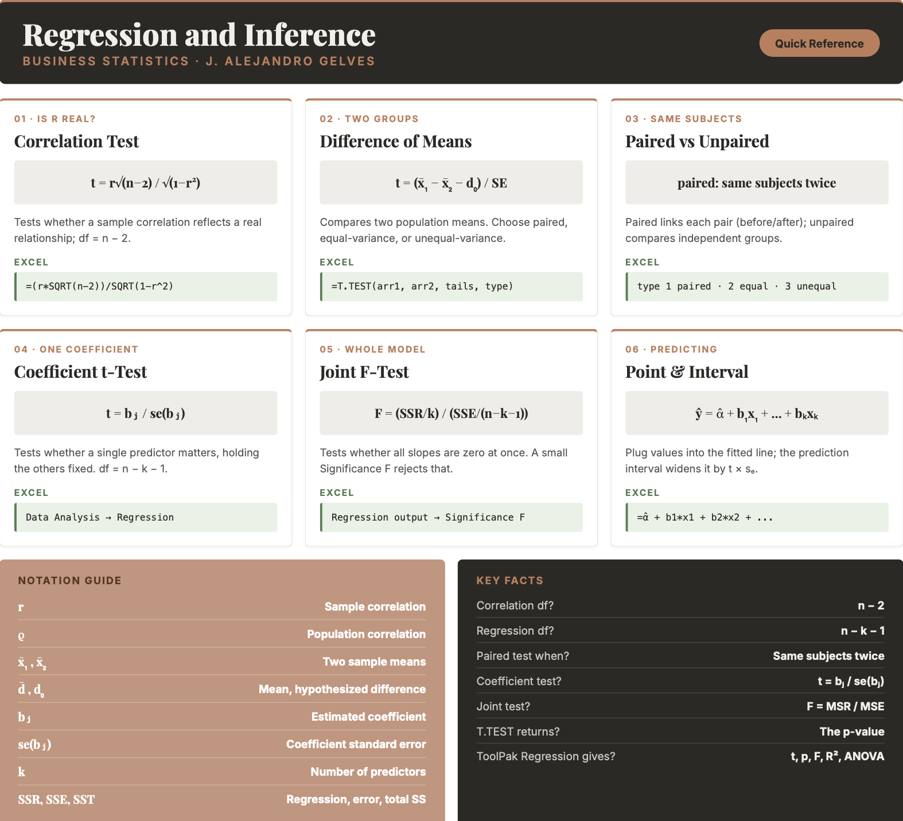

```{=html}
<style>
details {
  background-color: #F8F9FA;
  padding: 5px;
  border: 1px solid #ddd; /* Light border */
  border-radius: 5px; /* Rounded corners */
  margin: 10px 0; /* Spacing */
}

details summary {
  cursor: pointer; /* Pointer cursor for interactivity */
}
</style>
```

# Regression and Inference

This final chapter brings hypothesis testing and regression together. You will learn to judge whether a correlation is real or just noise, whether two groups truly differ, and whether a regression coefficient carries any explanatory weight. These are the tools that turn a descriptive relationship into a defensible conclusion — letting you evaluate market trends, compare performance across groups, and decide which predictors actually matter in a model. It is a fitting close to the book: it unites the descriptive tool of regression with the inferential habit of asking whether a pattern is real, turning a fitted line into a tested claim about the world.

## Correlation Significance

A sample correlation coefficient is almost never exactly zero, even when the two variables are unrelated. To decide whether an observed correlation reflects a real relationship in the population, we test the population correlation $\rho$:

- $H_0: \rho \geq 0$ vs. $H_a: \rho < 0$ — left-tailed
- $H_0: \rho \leq 0$ vs. $H_a: \rho > 0$ — right-tailed
- $H_0: \rho = 0$ vs. $H_a: \rho \ne 0$ — two-tailed

::: callout-formula
**CORRELATION TEST STATISTIC** $$t = \frac{r_{xy}\sqrt{n-2}}{\sqrt{1-r_{xy}^2}}$$ with degrees of freedom $df = n - 2$, where $r_{xy}$ is the sample correlation coefficient and $n$ is the sample size.
:::

::: callout-example
**Example:** A sample of $n = 30$ shows a correlation of $r = 0.5$ between advertising and sales. Testing $H_0: \rho = 0$ against $H_a: \rho \ne 0$: $$t = \frac{0.5\sqrt{30-2}}{\sqrt{1-0.5^2}} = \frac{0.5 \times 5.29}{0.866} = 3.06$$ With $df = 28$, the two-tailed p-value is about $0.005$. Because $0.005 < 0.05$, we reject the null and conclude the correlation is statistically significant.
:::

## Difference of Means Tests

We often want to know whether two populations have different means — for example, whether two divisions post different sales, or whether a treatment changes an outcome. The test statistic depends on how the two samples relate.

::: callout-formula
**DIFFERENCE OF MEANS TEST STATISTICS** $$\text{Unpaired, unequal variances:} \quad t = \frac{(\bar{x}_1 - \bar{x}_2) - d_0}{\sqrt{\frac{s_1^2}{n_1} + \frac{s_2^2}{n_2}}}$$ $$\text{Unpaired, equal variances:} \quad t = \frac{(\bar{x}_1 - \bar{x}_2) - d_0}{\sqrt{s_p^2\left(\frac{1}{n_1} + \frac{1}{n_2}\right)}}$$ $$\text{Paired:} \quad t = \frac{\bar{d} - d_0}{s / \sqrt{n}}$$ where $d_0$ is the hypothesized difference, $s_p^2$ is the pooled variance, and $\bar{d}$ and $s$ are the mean and standard deviation of the paired differences.

The degrees of freedom differ across the three tests:

| Test | Degrees of freedom |
|:---------------:|:----------------------------------------------------:|
| Unpaired, unequal variances | $df = \dfrac{\left(\frac{s_1^2}{n_1} + \frac{s_2^2}{n_2}\right)^2}{\frac{(s_1^2/n_1)^2}{n_1-1} + \frac{(s_2^2/n_2)^2}{n_2-1}}$ (rounded down) |
| Unpaired, equal variances | $df = n_1 + n_2 - 2$ |
| Paired | $df = n - 1$, where $n$ is the number of **pairs**, not the number of observations |
:::

A **paired** test is used when the two samples are naturally linked — the same subjects measured twice (before and after), for instance. An **unpaired** (independent) test is used when the two samples come from separate groups.

::: callout-example
**Example (unpaired).** A company evaluates a training program. Six employees who took the program score a mean of $\bar{x}_1 = 33.17$ on a productivity assessment (with $s_1 = 7.55$), while six *different* employees who did not take it score a mean of $\bar{x}_2 = 30.00$ (with $s_2 = 7.18$). Testing $H_0: \mu_1 - \mu_2 = 0$ against $H_a: \mu_1 - \mu_2 \ne 0$ with unequal variances: $$t = \frac{(33.17 - 30.00) - 0}{\sqrt{\frac{7.55^2}{6} + \frac{7.18^2}{6}}} = \frac{3.17}{4.25} = 0.74$$ The Welch formula gives about $10$ degrees of freedom, and the two-tailed p-value is roughly $0.47$. Because $0.47 > 0.05$, we fail to reject the null: the $3.17$-point gap is swamped by the large variation *between* employees, so we cannot conclude the program helped.
:::

::: callout-example
**Example (paired).** Now suppose those same six employees were each measured *before and after* the program, so every "after" score is matched to that person's own "before" score:

| Employee | Before | After | Difference |
|:--------:|:------:|:-----:|:----------:|
|    1     |   20   |  23   |     3      |
|    2     |   32   |  36   |     4      |
|    3     |   25   |  27   |     2      |
|    4     |   40   |  43   |     3      |
|    5     |   28   |  31   |     3      |
|    6     |   35   |  39   |     4      |

The group means are identical to the unpaired case ($30.00$ before, $33.17$ after), but now we work with each person's change. The individual gains are remarkably consistent: $\bar{d} = 3.17$ with $s = 0.75$. Testing $H_0: \mu_d = 0$ against $H_a: \mu_d \ne 0$: $$t = \frac{\bar{d} - 0}{s / \sqrt{n}} = \frac{3.17}{0.75 / \sqrt{6}} = 10.30$$ With $df = n - 1 = 6 - 1 = 5$ (six *pairs*, not twelve observations) the two-tailed p-value is about $0.0001$. Because $0.0001 < 0.05$, we strongly reject the null: the program clearly raised productivity.
:::

The two examples use the **same numbers** yet reach opposite conclusions, and the reason is the design. The unpaired test must carry the large variation *between* employees — scores range from $20$ to $40$ — and that noise hides the modest improvement. The paired test cancels that person-to-person variation by looking only at each individual's change, leaving a small, consistent difference that stands out sharply ($s$ drops from about $7.5$ to $0.75$). Whenever the data are naturally matched, pairing is the more powerful choice.

## Regression Inference

After fitting a regression, two kinds of tests tell us whether the model has explanatory power.

**Testing a single coefficient.** Each coefficient is tested against zero — is this predictor related to $y$, holding the others fixed?

::: callout-formula
**TEST FOR A SINGLE COEFFICIENT** $$H_0: \beta_j = 0 \quad\text{vs.}\quad H_a: \beta_j \ne 0, \qquad t = \frac{b_j}{se(b_j)}$$ where $b_j$ is the estimated coefficient and $se(b_j)$ is its standard error, with $df = n - k - 1$.
:::

**Testing joint significance.** The $F$-test asks whether *all* the slope coefficients are zero at once — is the model, as a whole, better than no predictors?

::: callout-formula
**JOINT SIGNIFICANCE (F-TEST)** $$H_0: \beta_1 = \beta_2 = \dots = \beta_k = 0, \qquad F = \frac{SSR/k}{SSE/(n-k-1)} = \frac{MSR}{MSE}$$ where $k$ is the number of predictors and $n$ is the sample size.
:::

The ANOVA table organizes these pieces:

|   Source   |   df    |  SS   |            MS             |           F           |
|:-----------:|:-----------:|:-----------:|:-----------------:|:--------------:|
| Regression |   $k$   | $SSR$ |   $MSR = \frac{SSR}{k}$   | $F = \frac{MSR}{MSE}$ |
|  Residual  | $n-k-1$ | $SSE$ | $MSE = \frac{SSE}{n-k-1}$ |                       |
|   Total    |  $n-1$  | $SST$ |                           |                       |

## Regression and Inference in Excel

**Correlation significance.** Compute the correlation with `=CORREL(x_range, y_range)`, then turn it into a test statistic and p-value:

``` excel
=(r*SQRT(n-2)) / SQRT(1 - r^2)
```

followed by `=T.DIST.2T(ABS(t), n-2)` for a two-tailed test (or `=T.DIST` / `=T.DIST.RT` for one tail).

**Difference of means.** The `=T.TEST(array1, array2, tails, type)` function returns the p-value directly. The `tails` argument is `1` (one-tailed) or `2` (two-tailed); the `type` argument is `1` (paired), `2` (two-sample, equal variances), or `3` (two-sample, unequal variances). For full output — the test statistic, critical values, and both one- and two-tailed p-values — use the **Data Analysis ToolPak**, which offers `t-Test: Paired Two Sample for Means`, `t-Test: Two-Sample Assuming Equal Variances`, and `t-Test: Two-Sample Assuming Unequal Variances`.

**Regression inference.** Run `Data → Data Analysis → Regression`. The output reports each coefficient with its standard error, $t$-statistic, and p-value (the individual coefficient tests), the $F$-statistic with its **Significance F** (the joint test), and the ANOVA table — everything in this chapter in a single step.

## Excel Function Summary

Below is a list of the Excel functions and tools used in this section:

- `=CORREL(x_range, y_range)` returns the correlation coefficient, the starting point for a correlation test.

- `=T.TEST(array1, array2, tails, type)` returns the p-value of a difference-of-means test. `type` is `1` (paired), `2` (equal variances), or `3` (unequal variances).

- `=T.DIST.2T(x, deg_freedom)`, `=T.DIST(x, df, TRUE)`, and `=T.DIST.RT(x, df)` convert a test statistic to a p-value.

- **Data Analysis ToolPak → t-Test** performs the three difference-of-means tests with full output.

- **Data Analysis ToolPak → Regression** returns coefficients, standard errors, $t$-statistics, p-values, the $F$-statistic, $R^2$, and the ANOVA table.

## Chapter Summary Cheat Sheet

```{r echo=FALSE, out.width="100%", fig.align='center'}

```

## Exercises

The following exercises will help you test your knowledge of regression and inference. In particular, the exercises work on:

- Determining the significance of a correlation.
- Conducting paired and unpaired tests of means.
- Determining the significance of regression coefficients, individually and jointly.
- Making predictions from a regression model.

Try not to peek at the answers until you have formulated your own answer and double checked your work for any mistakes.

### Exercise 1 {.unnumbered}

1.  Consider the competing hypotheses $H_{0}: \rho = 0$, $H_{a}: \rho \neq 0$. A sample of $25$ observations reveals a correlation coefficient of $0.15$ between two variables. At a $5\%$ significance level, can we reject the null hypothesis?

    <details>

    <summary>Answer</summary>

    ::: {style="padding-left: 1.5em;"}
    *We cannot reject the null: the p-value of* $0.47$ is greater than $0.05$.

    *In Excel:*

    - `=(0.15*SQRT(25-2)) / SQRT(1 - 0.15^2)` → $0.73$ (test statistic)
    - `=T.DIST.2T(0.73, 23)` → $0.47$ (two-tailed p-value)
    :::

    </details>

2.  Use the **Hitters** data set to examine the relationship between *Hits* and *Salary*. Calculate the correlation coefficient and test $H_{0}: \rho = 0$ against $H_{a}: \rho \neq 0$ at the $1\%$ significance level.

    [ Download Data](Hitters.xlsx){.btn .btn-success}

    <details>

    <summary>Answer</summary>

    ::: {style="padding-left: 1.5em;"}
    *The correlation is* $0.44$ and the test statistic is $7.89$. The p-value is approximately $0$, so we reject the null hypothesis — the correlation between Hits and Salary is highly significant.

    *In Excel (there are* $263$ players with a recorded salary):

    - `=CORREL(Hits_range, Salary_range)` → $0.44$
    - `=(0.44*SQRT(263-2)) / SQRT(1 - 0.44^2)` → $7.89$ (test statistic)
    - `=T.DIST.2T(7.89, 261)` → approximately $0$
    :::

    </details>

### Exercise 2 {.unnumbered}

1.  Use the **Hitters** data set to investigate whether the average number of *Hits* differs between the two leagues (American and National), using the *NewLeague* and *Hits* variables. Test at the $5\%$ significance level. Is there reason to believe the population variances differ?

    [ Download Data](Hitters.xlsx){.btn .btn-success}

    <details>

    <summary>Answer</summary>

    ::: {style="padding-left: 1.5em;"}
    *There is no strong reason to believe the variances differ — players are recruited from a common pool. At the* $5\%$ level the difference in mean Hits is not significant, so we cannot reject the null.

    *Copy the Hits for `NewLeague = "A"` into one column and the Hits for `NewLeague = "N"` into another (or filter the data). This is an unpaired, two-tailed test assuming equal variances:*

    - `=T.TEST(A_range, N_range, 2, 2)` → $0.28$ (p-value)

    *Since* $0.28 > 0.05$, we fail to reject the null.
    :::

    </details>

2.  Use the **BrainCancer** data set to test whether males have a higher average survival *time* than females, using the *sex* and *time* variables. Test at the $5\%$ significance level. Is there reason to believe the population variances differ?

    [ Download Data](BC.xlsx){.btn .btn-success}

    <details>

    <summary>Answer</summary>

    ::: {style="padding-left: 1.5em;"}
    *There may be reason to believe the variances differ, so we use an unequal-variance test. At the* $5\%$ level we cannot reject $H_{0}: \mu_{male} - \mu_{female} \leq 0$ — there is no evidence that males survive longer.

    *Run `Data → Data Analysis → t-Test: Two-Sample Assuming Unequal Variances` on the male and female survival times. The male mean (*$26.78$) is actually **below** the female mean ($28.10$), giving a test statistic of $-0.31$. Because the difference points opposite to the alternative, the one-tailed p-value is about $0.62$ — far above $0.05$ — so we fail to reject the null.
    :::

    </details>

### Exercise 3 {.unnumbered}

Use the **sleep** data set. At the $1\%$ significance level, is there an effect of the drug on the $10$ patients? Treat *group* $1$ as the measurement before the drug and *group* $2$ as after, so the two groups are the **same** patients measured twice.

[ Download Data](sleep.xlsx){.btn .btn-success}

<details>

<summary>Answer</summary>

::: {style="padding-left: 1.5em;"}
*The drug has an effect: we reject* $H_{0}: \bar{d} = 0$. The mean difference in extra sleep is statistically different from zero.

*Because the same patients are measured twice, use a paired, two-tailed test. With the Group 1 values in `A2:A11` and the Group 2 values in `A12:A21`:*

- `=T.TEST(A2:A11, A12:A21, 2, 1)` → $0.0028$ (p-value)

*Since* $0.0028 < 0.01$, we reject the null at the $1\%$ level.
:::

</details>

### Exercise 4 {.unnumbered}

1.  Use the **Hitters** data set to investigate the effect of *HmRun*, *RBI*, and *Years* on a player's *Salary*. Which variables are statistically different from zero? Are the variables jointly significant? Does the $R^2$ suggest a good fit?

    [ Download Data](Hitters.xlsx){.btn .btn-success}

    <details>

    <summary>Answer</summary>

    ::: {style="padding-left: 1.5em;"}
    *RBI and Years are statistically significant (p-values near* $0$): salary rises with experience and with RBIs. Home runs are **not** significant (p-value about $0.14$). The $F$-statistic is highly significant, so the predictors are jointly significant. However, the $R^2$ and adjusted $R^2$ are only about $0.32$, so the model explains just $32\%$ of the variation in salary — more variables would be needed for a better fit.

    *Copy `HmRun`, `RBI`, and `Years` into three adjacent columns (the ToolPak needs a contiguous X range), then run `Data → Data Analysis → Regression` with `Salary` as the Input Y Range and those three columns as the Input X Range. The output gives:*

    - each coefficient's **p-value** (the individual tests): RBI and Years significant, HmRun not
    - the **Significance F** (the joint test): approximately $0$
    - **R Square** and **Adjusted R Square**: about $0.33$ and $0.32$
    :::

    </details>

2.  José Altuve had $28$ home runs, $57$ RBIs, and $12$ years in the league. What salary does the model predict for him, and what is the $95\%$ prediction interval? (The model predicts a 1987 salary.)

    <details>

    <summary>Answer</summary>

    ::: {style="padding-left: 1.5em;"}
    *The predicted salary is* $619.93$ (thousand dollars), with a $95\%$ prediction interval of $[-129.89,\ 1369.7]$.

    *Using the coefficients from the regression output (*$\hat{\alpha}=-90.09$, $b_{HmRun}=-7.35$, $b_{RBI}=9.16$, $b_{Years}=32.82$), the point prediction is:

    - `=-90.09 + (-7.35)*28 + 9.16*57 + 32.82*12` → $619.93$

    *The prediction interval widens the estimate by* $t \times s_e$, where $t =$ `T.INV.2T(0.05, 259)` $\approx 1.97$ and $s_e$ is the regression's standard error ($\approx 381$ for a new observation). This gives $619.93 \pm 749.8 = [-129.89,\ 1369.7]$. The interval is very wide — and even includes negative salaries — because the model explains only about a third of the variation in salary.
    :::

    </details>
