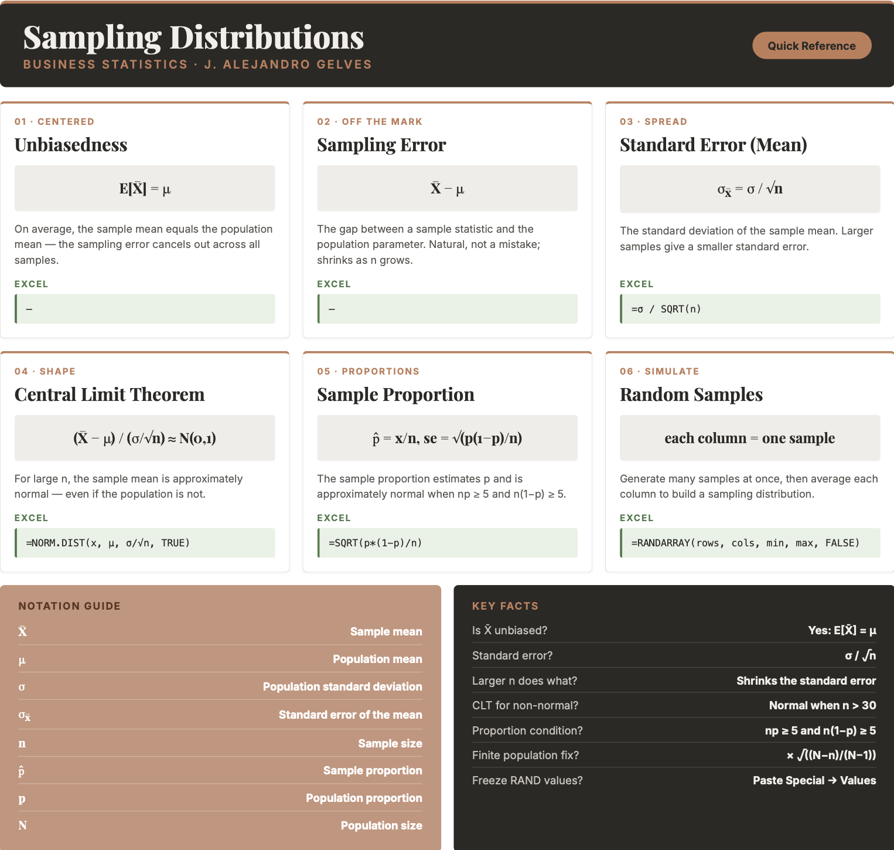

```{=html}
<style>
details {
  background-color: #F8F9FA;
  padding: 5px;
  border: 1px solid #ddd; /* Light border */
  border-radius: 5px; /* Rounded corners */
  margin: 10px 0; /* Spacing */
}

details summary {
  cursor: pointer; /* Pointer cursor for interactivity */
}
</style>
```

# Inference I

Statistical inference is a cornerstone of modern business decision-making. It enables companies to extract meaningful insights from data amid uncertainty and complexity. Businesses can predict customer behavior, optimize marketing strategies, and assess risks by drawing reliable conclusions from sample data. In this chapter, we explore how we can draw insights about a population using sample data. This is the stage the whole book has been building toward: moving from describing a sample to reasoning about the population behind it, using probability to keep our uncertainty honest.

## Statistical Inference

The power of statistical inference lies in allowing us to learn about a population by studying a sample. We estimate a **sample statistic**, such as the sample mean $\bar{x}$, and use it as a guess for the corresponding **population parameter**, such as the population mean $\mu$ — as long as the sample is drawn randomly. Certain properties of the sample mean make this a sound guess. Below we study three of them: unbiasedness, consistency, and precision, and then the shape of the sampling distribution through the Central Limit Theorem.

## Unbiasedness

**Unbiasedness** states that the expected value of the sample mean equals the population mean.

::: callout-formula
**UNBIASEDNESS** $$E[\bar{X}] = \mu$$ where $\bar{X}$ is the sample mean and $\mu$ is the population mean.
:::

The difference between a sample mean and the population mean is called the **sampling error**.

::: callout-formula
**SAMPLING ERROR** $$\text{Sampling Error} = \bar{x} - \mu$$
:::

Sampling error is not a mistake — it is the natural consequence of sampling variability. It would be zero if the sample included the entire population, and it tends to shrink as the sample size grows.

::: callout-example
**Example:** Consider the four numbers below as the entire population:

| $x_1$ | $x_2$ | $x_3$ | $x_4$ |
|:-----:|:-----:|:-----:|:-----:|
|   3   |  12   |  18   |  30   |

The population mean is $\mu = \frac{3 + 12 + 18 + 30}{4} = 15.75$.

In practice we rarely see the whole population. Suppose instead we take a random sample of three elements. The table lists all possible samples of size three and their sample means:

| Sample |  Outcome   | $\bar{x}$ |
|:------:|:----------:|:---------:|
|   1    | {3,12,18}  |   $11$    |
|   2    | {3,12,30}  |   $15$    |
|   3    | {3,18,30}  |   $17$    |
|   4    | {12,18,30} |   $20$    |

None of the individual sample means equals $\mu = 15.75$ — each carries some sampling error. Yet the **mean of the sample means** is exactly the population mean:

$$\frac{11 + 15 + 17 + 20}{4} = \frac{63}{4} = 15.75 = \mu$$

This confirms $E[\bar{X}] = \mu$: although any single sample mean deviates from $\mu$, on average the sample mean lands on the true population mean.
:::

::: callout-note
To explore how the sampling error changes with the sample size press [here](https://jagelves.shinyapps.io/Sampling/).
:::

## Consistency

**Consistency** states that as the sample size increases, the sample mean converges to the population mean. Larger samples produce more accurate estimates, so the probability that the sample mean deviates from $\mu$ by more than any fixed amount approaches zero as $n$ grows.

::: callout-example
**Example:** Using the same population {3, 12, 18, 30} with $\mu = 15.75$, we compare the average absolute sampling error for samples of size two, three, and four.

For all samples of size two:

| Sample | Outcome | $\bar{x}$ | $\bar{x} - \mu$ |
|:------:|:-------:|:---------:|:---------------:|
|   1    | {3,12}  |   $7.5$   |     $-8.25$     |
|   2    | {3,18}  |  $10.5$   |     $-5.25$     |
|   3    | {3,30}  |  $16.5$   |     $0.75$      |
|   4    | {12,18} |   $15$    |     $-0.75$     |
|   5    | {12,30} |   $21$    |     $5.25$      |
|   6    | {18,30} |   $24$    |     $8.25$      |

The average absolute error for size two is $\frac{8.25 + 5.25 + 0.75 + 0.75 + 5.25 + 8.25}{6} = 4.75$.

For size three (means $11, 15, 17, 20$) the average absolute error falls to $\frac{4.75 + 0.75 + 1.25 + 4.25}{4} = 2.75$.

For size four (the entire population) the error is $\bar{x} - \mu = 15.75 - 15.75 = 0$.

As the sample size increases from two to four, the average error shrinks from $4.75$ to $0$.
:::

## Precision

**Precision** means that as the sample size grows, the sample mean becomes a more tightly clustered estimate of $\mu$. This is because the standard deviation of the sample mean — the **standard error** — is smaller than the population standard deviation.

::: callout-formula
**THE STANDARD ERROR OF THE MEAN** $$\sigma_{\bar{x}} = \frac{\sigma}{\sqrt{n}}$$ where $\sigma$ is the population standard deviation and $n$ is the sample size. The sample size $n$ inversely affects the spread: larger samples give smaller standard errors.
:::

When the population is small relative to the sample, a **finite population correction** is applied: $\sigma_{\bar{x}} = \frac{\sigma}{\sqrt{n}}\sqrt{\frac{N-n}{N-1}}$, where $N$ is the population size. Most populations are large enough that this correction can be ignored.

::: callout-example
**Example:** For the population {3, 12, 18, 30}, the population variance is $$\sigma^2 = \frac{(3-15.75)^2 + (12-15.75)^2 + (18-15.75)^2 + (30-15.75)^2}{4} = 96.1875$$

For a sample of size $n=3$ from this finite population of size $N=4$, the variance of the sample mean is $$\frac{\sigma^2}{n}\cdot\frac{N-n}{N-1} = \frac{96.1875}{3}\cdot\frac{4-3}{4-1} = 10.6875$$

We can verify this directly from the four sample means ($11, 15, 17, 20$): $$Var(\bar{x}) = \frac{(11-15.75)^2 + (15-15.75)^2 + (17-15.75)^2 + (20-15.75)^2}{4} = 10.6875$$

The variance of the sample mean ($10.6875$) is far smaller than the population variance ($96.1875$) — and it shrinks further as $n$ grows.
:::

## Asymptotic Normality and the Central Limit Theorem

To build confidence intervals or test hypotheses, we need the *shape* of the sampling distribution, not just its center and spread. This is where the **Central Limit Theorem (CLT)** becomes one of the most useful results in statistics. It states that, regardless of the population's distribution (provided it has finite variance), the standardized sample mean becomes approximately normal as $n$ grows large.

::: callout-formula
**CENTRAL LIMIT THEOREM (MEAN)** $$\frac{\bar{X} - \mu}{\sigma / \sqrt{n}} \approx N(0, 1)$$
:::

This lets us use the normal ($z$) distribution for probability statements even when the data are skewed or discrete. In summary, for the sample mean $\bar{X}$:

- If the population is normal, the sampling distribution of $\bar{X}$ is exactly normal for any $n$.
- If the population is non-normal, the sampling distribution of $\bar{X}$ is approximately normal for large $n$ (a common rule of thumb is $n > 30$).

## Inference for Proportions

Inference also applies to **proportions** — for example, the proportion of left-handed people or of customers who churn. A proportion is the outcome of a binomial process: the number of successes $x$ in $n$ trials, where $x/n$ is the proportion of successes. To estimate the population proportion $p$, we use the **sample proportion** $\hat{p} = x/n$, which is unbiased ($E[\hat{p}] = p$). Its standard error is:

::: callout-formula
**THE STANDARD ERROR OF THE PROPORTION** $$se(\hat{p}) = \sqrt{\frac{p(1-p)}{n}}$$ where $p$ is the proportion and $n$ is the sample size.
:::

By the Central Limit Theorem, the sampling distribution of $\hat{p}$ is also approximately normal for a large enough sample.

::: callout-formula
**CENTRAL LIMIT THEOREM (PROPORTION)** $$\frac{\hat{p} - p}{\sqrt{p(1-p)/n}} \approx N(0, 1)$$
:::

Because the underlying population is binary, the normal approximation is only good when there are enough expected successes and failures — the usual rule is $np \geq 5$ and $n(1-p) \geq 5$ (some texts use a more conservative threshold of $10$). In practice we check these conditions using the estimated $\hat{p}$.

::: callout-note
To explore the Central Limit Theorem and how the sample size affects the sampling distribution press [here](https://jagelves.shinyapps.io/Central/).
:::

## Sampling in Excel

Excel can both generate random samples and compute the normal probabilities used in inference. There is no need for a programming loop — you fill a block of cells with formulas, and each column can serve as a separate sample.

**Generating random numbers.** `=RAND()` returns a random decimal between 0 and 1, and `=RANDBETWEEN(min, max)` returns a random integer. To draw from a continuous uniform distribution on $[a, b]$, use `=a + (b - a)*RAND()`. To draw from a normal distribution, invert a random probability with `=NORM.INV(RAND(), mean, standard_dev)`. In modern Excel, `=RANDARRAY(rows, cols, min, max, FALSE)` fills an entire block at once — for example, a block with one column per sample.

``` excel
=RANDARRAY(10, 1000, 100, 200, FALSE)
```

This single formula creates 1000 samples of size 10, each drawn from a uniform distribution on $[100, 200]$.

**Freezing a sample.** `RAND`, `RANDBETWEEN`, and `RANDARRAY` recalculate every time the sheet changes (or when you press `F9`). To lock a sample in place, copy the block and use `Paste Special → Values`.

**Computing probabilities.** Use `=NORM.DIST(x, mean, standard_dev, TRUE)` for $P(X \le x)$, `=1 - NORM.DIST(...)` for the upper tail, and the difference of two calls for an interval. The standard error is entered directly as the `standard_dev` argument, for example `=NORM.DIST(85, 80, 14/SQRT(100), TRUE)`.

**Summarizing samples.** Use `=AVERAGE(range)` for the mean of a sample and `=STDEV.S(range)` for its standard deviation.

## Excel Function Summary

Below is a list of the Excel functions used in this section:

- `=RAND()` returns a random decimal between 0 and 1.

- `=RANDBETWEEN(bottom, top)` returns a random integer in a range.

- `=RANDARRAY(rows, cols, min, max, integer)` fills a block with random numbers — ideal for generating many samples at once.

- `=NORM.INV(probability, mean, standard_dev)` returns a value from a probability; paired with `RAND()` it generates normal random numbers.

- `=NORM.DIST(x, mean, standard_dev, cumulative)` returns a normal probability (`TRUE` for the cumulative distribution).

- `=AVERAGE(range)` and `=STDEV.S(range)` return the mean and standard deviation of a sample.

## Chapter Summary Cheat Sheet

```{r echo=FALSE, out.width="100%", fig.align='center'}

```

## Exercises

The following exercises will help you test your knowledge of inference. In particular, the exercises work on:

- The Central Limit Theorem.

- The sampling distribution of the mean.

- The sampling distribution of the proportion.

Answers are provided below. Try not to peek until you have formulated your own answer and double checked your work for any mistakes.

### Exercise 1 {.unnumbered}

In this exercise we will simulate the Central Limit Theorem in Excel. The idea is to generate many samples of random numbers, where **each column is one sample**, and then study the distribution of the sample means.

1.  Using the uniform distribution with a minimum of $100$ and a maximum of $200$, generate $1000$ samples of size $10$. Fill a block of $10$ rows and $1000$ columns with random numbers so that each column is one sample. What are the mean and standard deviation of this population?

<details>

<summary>Answer</summary>

::: {style="padding-left: 1.5em;"}
*In a modern version of Excel, type the following in the top-left cell of an empty block; it will spill into a* $10 \times 1000$ grid where each column is a sample of size $10$:

- `=RANDARRAY(10, 1000, 100, 200, FALSE)`

*In an older version, enter `=100 + 100*RAND()` in the top-left cell and copy it across* $1000$ columns and down $10$ rows.

*Because the values are drawn from a uniform distribution on* $[100, 200]$, the population mean is $\mu = \frac{100+200}{2} = 150$ and the population standard deviation is $\sigma = \frac{200-100}{\sqrt{12}} \approx 28.87$. (The values recalculate on every edit; to freeze a sample, copy the block and use `Paste Special → Values`.)
:::

</details>

2.  Compute the mean of each sample (each column). Then find the mean and the standard deviation of the $1000$ sample means. How do they compare to the population mean and to $\sigma / \sqrt{n}$?

<details>

<summary>Answer</summary>

::: {style="padding-left: 1.5em;"}
*Below the block, compute the mean of each column and copy it across all* $1000$ columns:

- `=AVERAGE(A1:A10)` → the mean of the first sample

*This produces* $1000$ sample means. Summarize them with:

- `=AVERAGE(...)` → about $150$, matching the population mean (unbiasedness)
- `=STDEV.S(...)` → about $9.1$

*The standard deviation of the sample means is far smaller than the population standard deviation (*$\approx 28.87$), and it matches the standard error $\sigma / \sqrt{n} = 28.87 / \sqrt{10} \approx 9.13$.
:::

</details>

3.  Create a histogram of the sample means. Is the distribution uniform or normal? What is the probability that a sample mean falls between $140$ and $160$?

<details>

<summary>Answer</summary>

::: {style="padding-left: 1.5em;"}
*Select the* $1000$ sample means and go to `Insert → Charts → Histogram` (or use the bins-and-PivotTable method from Descriptive Statistics II). Although the population is uniform, the distribution of the sample means is bell-shaped — this is the Central Limit Theorem in action.

*Using a normal distribution with mean* $150$ and standard error $9.13$:

- `=NORM.DIST(160, 150, 9.13, TRUE) - NORM.DIST(140, 150, 9.13, TRUE)` → about $0.73$

*There is roughly a* $73\%$ probability that the sample mean falls between $140$ and $160$. Because the numbers are random, your exact value will vary slightly each time the sheet recalculates.
:::

</details>

### Exercise 2 {.unnumbered}

1.  A random sample of $n=100$ is taken from a population with mean $\mu=80$ and standard deviation $\sigma=14$. Calculate the expected value and standard error of the sampling distribution of the sample mean. What is the probability that the sample mean falls between $77$ and $85$?

<details>

<summary>Answer</summary>

::: {style="padding-left: 1.5em;"}
*The expected value is* $80$ (equal to the population mean). The standard error is $1.4$, and the probability is $98.38\%$.

*In Excel:*

- `=14/SQRT(100)` → $1.4$ (standard error)
- `=NORM.DIST(85, 80, 1.4, TRUE) - NORM.DIST(77, 80, 1.4, TRUE)` → $0.9838$
:::

</details>

2.  Assume that miles-per-gallon of combustion cars are normally distributed with a mean of $33.8$ and a standard deviation of $3.5$. What is the probability that the mean mpg of four randomly selected cars is more than $35$? What is the probability that all four selected cars have mpg greater than $35$?

<details>

<summary>Answer</summary>

::: {style="padding-left: 1.5em;"}
*The probabilities are* $24.66\%$ and $1.8\%$.

*For the mean of four cars, use the standard error* $3.5/\sqrt{4}$:

- `=1 - NORM.DIST(35, 33.8, 3.5/SQRT(4), TRUE)` → $0.2466$

*For all four cars, first find the probability that one car exceeds* $35$, then raise it to the fourth power (the draws are independent):

- `=(1 - NORM.DIST(35, 33.8, 3.5, TRUE))^4` → $0.018$
:::

</details>

### Exercise 3 {.unnumbered}

1.  A random sample of $n=200$ is taken from a population with a proportion of $p=0.75$. Calculate the expected value and standard error of the sampling distribution of the proportion. What is the probability that the sample proportion is between $0.7$ and $0.8$?

<details>

<summary>Answer</summary>

::: {style="padding-left: 1.5em;"}
*The expected value is* $0.75$ (the same as the population). The standard error is $\sqrt{p(1-p)/n} = 0.03$, and the probability is $0.8975$.

*In Excel:*

- `=SQRT(0.75*0.25/200)` → $0.0306$
- `=NORM.DIST(0.8, 0.75, SQRT(0.75*0.25/200), TRUE) - NORM.DIST(0.7, 0.75, SQRT(0.75*0.25/200), TRUE)` → $0.8975$
:::

</details>

2.  Twenty-three percent of employees at a fintech firm work from home. If we take a sample of $50$ employees, what is the probability that more than $20\%$ of them work from home? What if the sample increases to $200$? Why does the probability change?

<details>

<summary>Answer</summary>

::: {style="padding-left: 1.5em;"}
*The probability with a sample of* $50$ is $69.29\%$. With a sample of $200$ it rises to $84.33\%$. As the sample size increases, the standard error shrinks, so the sampling distribution of $\hat{p}$ becomes tighter around $0.23$ and more of its area lies above $0.20$.

*In Excel:*

- `=1 - NORM.DIST(0.2, 0.23, SQRT(0.23*0.77/50), TRUE)` → $0.6929$
- `=1 - NORM.DIST(0.2, 0.23, SQRT(0.23*0.77/200), TRUE)` → $0.8433$
:::

</details>

### Exercise 4 {.unnumbered}

1.  A production process for energy drinks is being evaluated. The machine that fills the cans is calibrated so that each can has $350$ml of drink with a standard deviation of $10$ml. Every hour, ten cans are sampled and the average amount of drink is recorded (see table below). Is the machine working properly?

| 1 | 2 | 3 | 4 | 5 | 6 | 7 | 8 |
|:-------:|:-------:|:-------:|:-------:|:-------:|:-------:|:-------:|:-------:|
| $\bar{x}=310$ | $\bar{x}=315$ | $\bar{x}=325$ | $\bar{x}=330$ | $\bar{x}=328$ | $\bar{x}=347$ | $\bar{x}=339$ | $\bar{x}=350$ |

<details>

<summary>Answer</summary>

::: {style="padding-left: 1.5em;"}
*The process appears to be out of control. In the early samples the machine is not filling the cans with enough drink; it recovers in later periods, but the early behavior is a warning sign.*

*Build a control chart. The center line is* $350$, and the limits are three standard errors away, where the standard error is $10/\sqrt{10}$:

- `=350 + 3*(10/SQRT(10))` → $359.49$ (upper limit)
- `=350 - 3*(10/SQRT(10))` → $340.51$ (lower limit)

*Plot the eight sample means together with the two limits: put the sample numbers, the sample means, and two columns holding the constant limits side by side, then insert a Line or Scatter chart. Several early samples fall below the lower limit of* $340.51$, confirming the process is out of control.
:::

</details>

2.  The production of Good Guy dolls has a $1\%$ defective rate. A quality inspector takes five samples of size $1000$. The proportions are shown in the table below. Is the production process under control?

| 1 | 2 | 3 | 4 | 5 |
|:-------------:|:-------------:|:-------------:|:-------------:|:-------------:|
| $\hat{p}=0.009$ | $\hat{p}=0.012$ | $\hat{p}=0.008$ | $\hat{p}=0.011$ | $\hat{p}=0.0102$ |

<details>

<summary>Answer</summary>

::: {style="padding-left: 1.5em;"}
*The process looks in control. All five proportions fall within three standard errors of the mean.*

*The center line is* $0.01$, and the limits use the standard error $\sqrt{0.01 \times 0.99 / 1000}$:

- `=0.01 + 3*SQRT(0.01*0.99/1000)` → $0.0194$ (upper limit)
- `=0.01 - 3*SQRT(0.01*0.99/1000)` → $0.0006$ (lower limit)

*Plotting the five proportions against these limits shows every point inside the band, so the process is under control.*
:::

</details>
