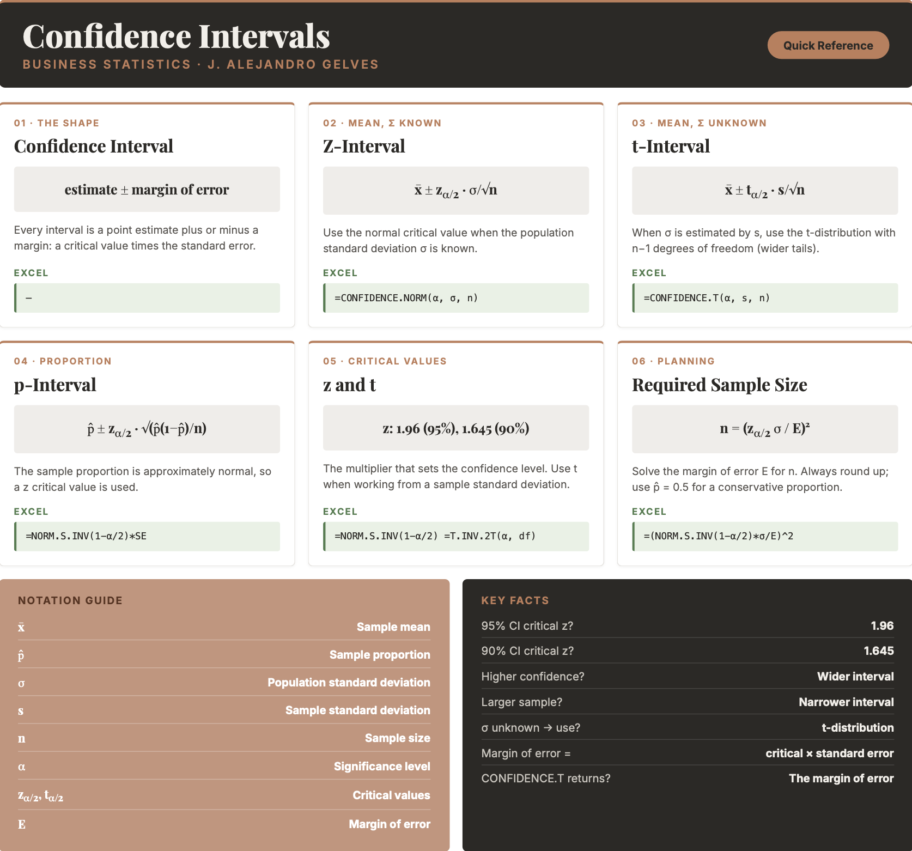

```{=html}
<style>
details {
  background-color: #F8F9FA;
  padding: 5px;
  border: 1px solid #ddd; /* Light border */
  border-radius: 5px; /* Rounded corners */
  margin: 10px 0; /* Spacing */
}

details summary {
  cursor: pointer; /* Pointer cursor for interactivity */
}
</style>
```

# Inference II

A single number is rarely the whole story. When a business estimates average customer spending or the proportion of defective units from a sample, the estimate is almost never exactly right — it carries sampling error. Reporting a lone **point estimate** hides this uncertainty. Instead, we surround the estimate with a range of plausible values and attach a level of confidence to it. This chapter shows how to build these **confidence intervals** for means and proportions, how the sample size and confidence level affect their width, and how to construct them in Excel.

## Confidence Intervals

A **confidence interval (CI)** is a range of plausible values for a population parameter, together with a **confidence level** that states how often the procedure captures the true parameter. A 95% confidence interval means that if we repeated the sampling process many times, about 95% of the intervals produced would contain the true population parameter.

The confidence level and the **significance level** $\alpha$ are two sides of the same coin: a 95% confidence level corresponds to $\alpha = 0.05$, the risk that the interval misses the parameter. Every confidence interval has the same shape — a point estimate plus or minus a **margin of error**:

::: callout-formula
**THE CONFIDENCE INTERVAL** $$\text{point estimate} \pm \text{margin of error}$$ The margin of error is a **critical value** (from the normal or $t$ distribution) multiplied by the **standard error** of the estimate.
:::

Two forces control the width of the interval. A **higher confidence level** widens it (more certainty requires a bigger net), and a **larger sample** narrows it (more data gives a more precise estimate).

::: callout-note
A confidence interval describes the *procedure*, not a single interval. Once computed, a specific interval either contains the parameter or it does not — the 95% refers to how often the method succeeds over many samples.
:::

## Confidence Intervals for the Mean

When the population standard deviation $\sigma$ is known and the sampling distribution is normal (by the Central Limit Theorem), the confidence interval for the mean uses a $z$ critical value:

::: callout-formula
**CONFIDENCE INTERVAL FOR THE MEAN (**$\sigma$ known) $$\bar{x} \pm z_{\alpha/2} \cdot \frac{\sigma}{\sqrt{n}}$$ where $\bar{x}$ is the sample mean, $z_{\alpha/2}$ is the normal critical value (e.g., $1.96$ for 95%), $\sigma$ is the population standard deviation, and $n$ is the sample size.
:::

::: callout-example
**Example:** A sample of $n = 50$ gives an average life expectancy of $\bar{x} = 78.1$ years, and the population standard deviation is $\sigma = 4.5$. For a 90% confidence interval, $z_{0.05} \approx 1.645$. The standard error is $$\frac{\sigma}{\sqrt{n}} = \frac{4.5}{\sqrt{50}} \approx 0.637$$ so the interval is $$78.1 \pm 1.645 \times 0.637 \approx 78.1 \pm 1.05 = [77.05,\ 79.15]$$ We are 90% confident that the true mean life expectancy is between $77.05$ and $79.15$ years.
:::

## The t-Distribution

In practice we almost never know the population standard deviation $\sigma$. When we estimate it with the sample standard deviation $s$, the extra uncertainty means the normal distribution is no longer exact. Instead we use the $t$-distribution, which is bell-shaped like the normal but has heavier tails. The $t$-distribution has one parameter, the **degrees of freedom** ($n - 1$); as the sample size grows, its tails thin out and it converges to the normal distribution.

::: callout-formula
**CONFIDENCE INTERVAL FOR THE MEAN (**$\sigma$ unknown) $$\bar{x} \pm t_{\alpha/2} \cdot \frac{s}{\sqrt{n}}$$ where $s$ is the sample standard deviation and $t_{\alpha/2}$ is the $t$ critical value with $n - 1$ degrees of freedom.
:::

::: callout-example
**Example:** A sample of $n = 20$ customer wait times has a mean of $\bar{x} = 8.4$ minutes and a sample standard deviation of $s = 2.1$. For a 95% confidence interval with $n - 1 = 19$ degrees of freedom, $t_{0.025} \approx 2.093$. The margin of error is $$2.093 \times \frac{2.1}{\sqrt{20}} \approx 0.98$$ so the interval is $8.4 \pm 0.98 = [7.42,\ 9.38]$ minutes. Because we estimated $\sigma$ from the sample, the $t$ critical value ($2.093$) is slightly larger than the corresponding $z$ value ($1.96$), making the interval a little wider.
:::

## Confidence Intervals for a Proportion

For a population proportion $p$, the sample proportion $\hat{p} = x/n$ is approximately normal by the Central Limit Theorem, so the interval uses a $z$ critical value:

::: callout-formula
**CONFIDENCE INTERVAL FOR A PROPORTION** $$\hat{p} \pm z_{\alpha/2} \cdot \sqrt{\frac{\hat{p}(1-\hat{p})}{n}}$$ where $\hat{p}$ is the sample proportion and $n$ is the sample size.
:::

::: callout-example
**Example:** A random sample of $100$ yields $40$ successes, so $\hat{p} = 0.4$. For a 90% confidence interval, $z_{0.05} \approx 1.645$. The standard error is $$\sqrt{\frac{0.4 \times 0.6}{100}} \approx 0.049$$ so the interval is $$0.4 \pm 1.645 \times 0.049 \approx 0.4 \pm 0.081 = [0.319,\ 0.481]$$ We are 90% confident that the true population proportion is between $31.9\%$ and $48.1\%$.
:::

## Determining the Sample Size

Because the margin of error shrinks as $n$ grows, we can turn the question around: how large a sample do we need to achieve a desired margin of error $E$? Solving the margin-of-error expression for $n$ gives:

::: callout-formula
**REQUIRED SAMPLE SIZE** $$\text{Mean:} \quad n = \left(\frac{z_{\alpha/2}\,\sigma}{E}\right)^2 \qquad\qquad \text{Proportion:} \quad n = \hat{p}(1-\hat{p})\left(\frac{z_{\alpha/2}}{E}\right)^2$$ Always round $n$ **up** to the next whole number. If $\hat{p}$ is unknown, use $\hat{p} = 0.5$ for the most conservative (largest) sample size.
:::

::: callout-example
**Example:** To estimate a mean within $E = 2$ units at 95% confidence when $\sigma = 10$: $$n = \left(\frac{1.96 \times 10}{2}\right)^2 = (9.8)^2 = 96.04 \rightarrow 97$$ A sample of $97$ observations is needed.
:::

## Confidence Intervals in Excel

Excel can produce the margin of error directly, so a confidence interval is just the sample mean plus or minus that margin.

**Critical values.** For a $z$ critical value use `=NORM.S.INV(1 - alpha/2)` — for example, `=NORM.S.INV(0.975)` returns $1.96$. For a $t$ critical value use `=T.INV.2T(alpha, deg_freedom)`, which returns the positive two-tailed value directly — for example, `=T.INV.2T(0.05, 19)` returns $2.093$.

**Margin of error for a mean.** Excel has two dedicated functions that return the margin of error in one step. Use `=CONFIDENCE.NORM(alpha, standard_dev, size)` when $\sigma$ is known, and `=CONFIDENCE.T(alpha, standard_dev, size)` when it is estimated by $s$. The `alpha` argument is the significance level (`0.05` for 95%).

``` excel
=CONFIDENCE.T(0.05, 2.1, 20)
```

This returns $0.98$, the margin of error for the wait-time example. The interval is then `=8.4 - 0.98` and `=8.4 + 0.98`.

**Margin of error for a proportion.** There is no dedicated function, so build it from the standard error:

``` excel
=NORM.S.INV(1 - 0.05/2) * SQRT(0.4*(1-0.4)/100)
```

This returns $0.096$, the 95% margin of error for the proportion example.

## Excel Function Summary

Below is a list of the Excel functions used in this section:

- `=CONFIDENCE.NORM(alpha, standard_dev, size)` returns the margin of error for a mean using the normal distribution (when $\sigma$ is known).

- `=CONFIDENCE.T(alpha, standard_dev, size)` returns the margin of error for a mean using the $t$-distribution (when $\sigma$ is unknown).

- `=NORM.S.INV(probability)` returns a $z$ critical value; `=T.INV.2T(probability, deg_freedom)` returns a two-tailed $t$ critical value.

- `=AVERAGE(range)` and `=STDEV.S(range)` return the sample mean and sample standard deviation.

## Chapter Summary Cheat Sheet

```{r echo=FALSE, out.width="100%", fig.align='center'}

```

## Exercises

The following exercises will help you test your knowledge of confidence intervals. In particular, the exercises work on:

- Simulating confidence intervals.
- Estimating confidence intervals for means using the $t$-distribution.
- Estimating confidence intervals for proportions.

Try not to peek at the answers until you have formulated your own answer and double checked your work for any mistakes.

### Exercise 1 {.unnumbered}

In this exercise you will simulate confidence intervals in Excel. The idea is to draw many samples, build a confidence interval around each one, and see how often the interval captures the population mean.

1.  Using the exponential distribution with a rate of $0.02$, generate $10{,}000$ samples of size $50$. Arrange the data so that **each row is one sample**. What are the population mean and standard deviation?

    <details>

    <summary>Answer</summary>

    ::: {style="padding-left: 1.5em;"}
    *For an exponential distribution with rate* $\lambda = 0.02$, the mean and standard deviation are both $1/\lambda = 50$. To draw an exponential value in Excel, transform a uniform random number:

    - `=-LN(RAND())/0.02`

    *Fill a block of* $10{,}000$ rows and $50$ columns with this formula; each row is a sample of size $50$. (The values recalculate on every edit — copy the block and use `Paste Special → Values` to freeze them.)
    :::

    </details>

2.  Compute the mean of each sample (each row). What are the mean and standard deviation of the $10{,}000$ sample means?

    <details>

    <summary>Answer</summary>

    ::: {style="padding-left: 1.5em;"}
    *In the column just after the data, average each row and copy the formula down all* $10{,}000$ rows:

    - `=AVERAGE(A2:AX2)` → the mean of the first sample

    *Summarizing the* $10{,}000$ sample means:

    - `=AVERAGE(...)` → about $50$, matching the population mean
    - `=STDEV.S(...)` → about $7.07$, which matches the standard error $\sigma/\sqrt{n} = 50/\sqrt{50} \approx 7.07$
    :::

    </details>

3.  Using the standard error from part 2, construct a $90\%$ confidence interval around the first sample mean. Does it include the population mean of $50$?

    <details>

    <summary>Answer</summary>

    ::: {style="padding-left: 1.5em;"}
    *With the standard error stored in a cell (call it `SE`* $\approx 7.07$), the limits are the sample mean plus or minus $z_{0.05} \times SE$:

    - `=FirstMean - NORM.S.INV(0.95)*SE` → lower limit
    - `=FirstMean + NORM.S.INV(0.95)*SE` → upper limit

    *Because a typical sample mean sits near* $50$, the interval will usually contain the population mean. About $90\%$ of such intervals do.
    :::

    </details>

4.  Build a $90\%$ confidence interval around every sample mean and count how many include the population mean. About how many of the $10{,}000$ intervals do you expect to succeed?

    <details>

    <summary>Answer</summary>

    ::: {style="padding-left: 1.5em;"}
    *Rather than build* $10{,}000$ pairs of limits, note that an interval includes $50$ exactly when the sample mean is within $z_{0.05} \times SE$ of $50$. Add a helper column:

    - `=IF(ABS(SampleMean - 50) <= NORM.S.INV(0.95)*SE, 1, 0)`

    *Copy it down and sum it with `=SUM(...)`. About* $9{,}000$ of the $10{,}000$ intervals contain the population mean — that is exactly what a $90\%$ confidence level means.
    :::

    </details>

### Exercise 2 {.unnumbered}

1.  A random sample of $24$ observations is used to estimate the population mean. The sample mean is $104.6$ and the standard deviation is $28.8$. The population is normally distributed. Construct a $90\%$ and a $95\%$ confidence interval for the population mean. How does the confidence level affect the size of the interval?

    <details>

    <summary>Answer</summary>

    ::: {style="padding-left: 1.5em;"}
    *The 90% interval is* $[94.52,\ 114.68]$ and the 95% interval is $[92.44,\ 116.76]$. The higher the confidence level, the wider the interval.

    *Since* $\sigma$ is unknown, use the $t$-distribution. `CONFIDENCE.T` returns the margin of error directly:

    - `=CONFIDENCE.T(0.10, 28.8, 24)` → $10.08$, so the 90% interval is $104.6 \pm 10.08$
    - `=CONFIDENCE.T(0.05, 28.8, 24)` → $12.16$, so the 95% interval is $104.6 \pm 12.16$
    :::

    </details>

2.  A random sample from a normally distributed population yields a mean of $48.68$ and a standard deviation of $33.64$. Compute a $95\%$ confidence interval assuming (a) the sample size is $16$ and (b) the sample size is $25$. What happens to the interval as the sample size increases?

    <details>

    <summary>Answer</summary>

    ::: {style="padding-left: 1.5em;"}
    *The interval for* $n = 16$ is $[30.75,\ 66.61]$ and for $n = 25$ is $[34.79,\ 62.57]$. As the sample size grows, the interval gets narrower and more precise.

    *In Excel:*

    - `=CONFIDENCE.T(0.05, 33.64, 16)` → $17.93$, so the interval is $48.68 \pm 17.93$
    - `=CONFIDENCE.T(0.05, 33.64, 25)` → $13.89$, so the interval is $48.68 \pm 13.89$
    :::

    </details>

### Exercise 3 {.unnumbered}

You will need the **sleep** data set for this problem. It records the extra hours of sleep (*extra*) for ten students under each of two sleep-inducing drugs (*group*). Construct a $95\%$ confidence interval for each group. Which drug appears more effective at increasing sleeping time?

[ Download Data](sleep.xlsx){.btn .btn-success}

<details>

<summary>Answer</summary>

::: {style="padding-left: 1.5em;"}
*The 95% interval for Group 1 is* $[-0.53,\ 2.03]$ and for Group 2 is $[0.90,\ 3.76]$.

*The data is sorted by group, so with `extra` in column A the ten Group 1 values are in `A2:A11` and the ten Group 2 values in `A12:A21`. For each group, find the mean and the margin of error:*

- `=AVERAGE(A2:A11)` → $0.75$ for Group 1, and `=AVERAGE(A12:A21)` → $2.33$ for Group 2
- `=CONFIDENCE.T(0.05, STDEV.S(A2:A11), 10)` → the margin of error, giving `AVERAGE ± margin`

*(You can also get each group's mean with `=AVERAGEIF(B:B, "1", A:A)`.) Drug 2 appears more effective. Its interval lies entirely above zero, so it is unlikely to have no effect, and its mean increase in sleep is $2.33$ hours, well above Drug 1's $0.75$ hours.*
:::

</details>

### Exercise 4 {.unnumbered}

1.  A random sample of $100$ observations results in $40$ successes. Construct a $90\%$ and a $95\%$ confidence interval for the population proportion. Can we conclude at either confidence level that the population proportion differs from $0.5$?

    <details>

    <summary>Answer</summary>

    ::: {style="padding-left: 1.5em;"}
    *The 90% interval is* $[0.319,\ 0.481]$ and the 95% interval is $[0.304,\ 0.496]$. Neither includes $0.5$, so at both levels we can conclude the population proportion differs from $0.5$.

    *With* $\hat{p} = 0.4$ and $n = 100$, the standard error is `=SQRT(0.4*0.6/100)` $= 0.049$. The margins of error are:

    - `=NORM.S.INV(0.95) * SQRT(0.4*0.6/100)` → $0.081$, giving $0.4 \pm 0.081$
    - `=NORM.S.INV(0.975) * SQRT(0.4*0.6/100)` → $0.096$, giving $0.4 \pm 0.096$
    :::

    </details>

2.  You will need the **HairEyeColor** data set for this problem. It records the hair and eye color of $592$ statistics students. Construct a $95\%$ confidence interval for the proportion of students with Hazel eyes.

    [ Download Data](HairEyeColor.xlsx){.btn .btn-success}

    <details>

    <summary>Answer</summary>

    ::: {style="padding-left: 1.5em;"}
    *The 95% confidence interval is* $[0.128,\ 0.186]$.

    *The data is in tidy form with columns `Hair`, `Eye`, `Sex`, and `n` (the count). Total the Hazel rows and divide by the overall total to get the sample proportion:*

    - `=SUMIF(Eye_range, "Hazel", n_range)` → $93$ Hazel-eyed students
    - `=SUM(n_range)` → $592$ students, so $\hat{p} = 93/592 = 0.157$

    *Then the margin of error and interval are:*

    - `=NORM.S.INV(0.975) * SQRT(0.157*(1-0.157)/592)` → $0.029$, giving $0.157 \pm 0.029 = [0.128,\ 0.186]$
    :::

    </details>
