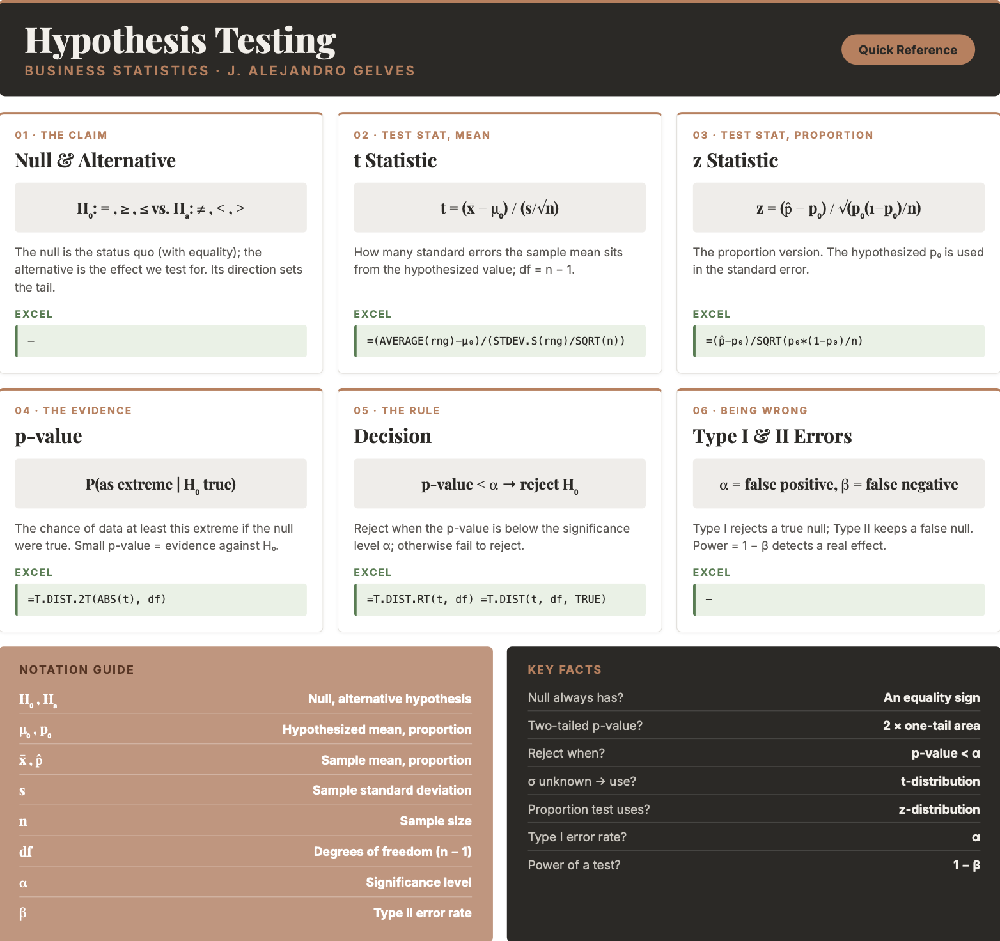

```{=html}
<style>
details {
  background-color: #F8F9FA;
  padding: 5px;
  border: 1px solid #ddd; /* Light border */
  border-radius: 5px; /* Rounded corners */
  margin: 10px 0; /* Spacing */
}

details summary {
  cursor: pointer; /* Pointer cursor for interactivity */
}
</style>
```

# Inference III

Business decisions are often framed as claims to be tested: a new supplier promises fewer defects, a marketing team believes a campaign lifted sales, an analyst suspects average spending has changed. **Hypothesis testing** is the formal procedure for deciding whether the evidence in a sample is strong enough to support such a claim, or whether the difference we see could just be sampling error. In this chapter you will learn to state null and alternative hypotheses, compute a test statistic, weigh it against a chosen level of risk, and reach a defensible conclusion — all in Excel. This is where the cycle closes: we began by wanting to learn something about the world, and hypothesis testing is the formal step of asking whether the data we collected actually support the idea we started with.

## Hypothesis Testing Intuition

The **null hypothesis** ($H_0$) is a statement about a population parameter — usually the status quo, or "no effect." It always contains some form of the equality sign ($=$, $\geq$, or $\leq$). The **alternative hypothesis** ($H_a$) directly contradicts the null and states the effect we are looking for, using a strict inequality ($\ne$, $>$, or $<$).

Suppose we hypothesize that the average annual income in the U.S. is \$50,000. When we take a large sample, the sample mean behaves like a normal random variable (by the Central Limit Theorem) centered at the hypothesized value. Our job is to decide whether the observed sample mean is "close enough" to \$50,000 to have plausibly come from that distribution, or "far enough" that we should doubt the null and favor the alternative.

::: callout-example
**Example:** We test whether the average income is \$50,000. A sample of $100$ people has a mean of \$48,000. Is \$48,000 close to \$50,000, or far? It depends entirely on the **standard error** of the sampling distribution:

- If the standard error were small (say \$1,000), then \$48,000 is two standard errors below \$50,000 — strong evidence *against* the null.
- If the standard error were large (say \$15,000), then \$48,000 is only a fraction of a standard error away — perfectly *consistent* with the null.

Distance alone tells us nothing; distance measured in standard errors is what matters.
:::

We capture that idea with the **test statistic**, which measures how far the sample mean sits from the hypothesized value in standard-error units.

::: callout-formula
**TEST STATISTIC FOR A MEAN** $$t = \frac{\bar{x} - \mu_0}{s / \sqrt{n}}$$ with degrees of freedom $df = n - 1$, where $\bar{x}$ is the sample mean, $\mu_0$ is the hypothesized mean, $s$ is the sample standard deviation, and $n$ is the sample size.
:::

The larger the test statistic in absolute value, the stronger the evidence against the null hypothesis.

## The Null and Alternative Hypotheses

Every test starts by writing the two competing hypotheses. The direction of the alternative determines whether the test is one-tailed or two-tailed.

**For a mean:**

- $H_0: \mu \leq \mu_0$ vs. $H_a: \mu > \mu_0$ — right-tailed test
- $H_0: \mu \geq \mu_0$ vs. $H_a: \mu < \mu_0$ — left-tailed test
- $H_0: \mu = \mu_0$ vs. $H_a: \mu \ne \mu_0$ — two-tailed test

**For a proportion:**

- $H_0: p \leq p_0$ vs. $H_a: p > p_0$ — right-tailed test
- $H_0: p \geq p_0$ vs. $H_a: p < p_0$ — left-tailed test
- $H_0: p = p_0$ vs. $H_a: p \ne p_0$ — two-tailed test

## Two Approaches to a Decision

There are two equivalent ways to decide whether the observed difference is too large to be explained by sampling error. Both always reach the same conclusion at the same significance level $\alpha$.

**The critical value (rejection region) approach.** Choose a significance level $\alpha$, look up the **critical value** from the $t$ or $z$ distribution for that $\alpha$ and the direction of the test, and reject $H_0$ if the test statistic falls beyond it. For a two-tailed test at $\alpha = 0.05$ with $df = 99$, the critical values are approximately $\pm 1.984$; a test statistic more extreme than these lands in the outer $5\%$ of the distribution.

**The p-value approach.** Compute the **p-value** — the probability, assuming the null is true, of observing a test statistic at least as extreme as the one obtained. Then apply the decision rule: reject $H_0$ if $\text{p-value} \leq \alpha$, and fail to reject it otherwise. A small p-value (say $0.003$) means the data would be very unlikely if the null were true, so it is evidence *against* $H_0$; a large p-value (say $0.42$) means the data are consistent with $H_0$.

## Type I and Type II Errors

Because a decision is made from a sample, it can be wrong in two ways.

|                          |      $H_0$ is true      |      $H_0$ is false      |
|:---------------------|:------------------------:|:-----------------------:|
| **Reject** $H_0$         | Type I error ($\alpha$) | Correct decision (power) |
| **Fail to reject** $H_0$ |    Correct decision     | Type II error ($\beta$)  |

A **Type I error** is rejecting a true null hypothesis (a false positive); its probability is the significance level $\alpha$. A **Type II error** is failing to reject a false null hypothesis (a false negative); its probability is $\beta$. The **power** of a test, $1 - \beta$, is the chance of correctly detecting a real effect. Lowering $\alpha$ guards against false positives but makes false negatives more likely, so the choice of $\alpha$ balances the two risks.

## Steps to Perform a Hypothesis Test

1.  **State the hypotheses.** Write $H_0$ and $H_a$ using the forms above.

2.  **Choose the significance level** $\alpha$. Common choices are $0.10$, $0.05$, and $0.01$, corresponding to confidence levels of $90\%$, $95\%$, and $99\%$.

3.  **Compute the test statistic.** For a mean, use the $t$ statistic given above. For a proportion, use:

    ::: callout-formula
    **TEST STATISTIC FOR A PROPORTION** $$z = \frac{\hat{p} - p_0}{\sqrt{p_0(1 - p_0)/n}}$$ where $\hat{p}$ is the sample proportion, $p_0$ is the hypothesized proportion, and $n$ is the sample size. Note that the hypothesized $p_0$ is used in the standard error.
    :::

4.  **Find the p-value** (replacing $t$ with $z$ for proportions):

    - Right-tailed test: $\text{p-value} = P(T \geq t)$
    - Left-tailed test: $\text{p-value} = P(T \leq t)$
    - Two-tailed test: $\text{p-value} = 2 \times P(T \geq |t|)$

5.  **Decide.** Reject $H_0$ if $\text{p-value} < \alpha$; otherwise fail to reject it. Remember that failing to reject $H_0$ is *not* proof that $H_0$ is true — it only means the sample did not provide enough evidence against it.

## Hypothesis Testing in Excel

Excel does not have a one-click one-sample test, but every piece is a single formula. First build the test statistic from the sample, then convert it to a p-value.

**The test statistic.** With the data in a range, the $t$ statistic for a mean is:

``` excel
=(AVERAGE(A2:A21) - 100) / (STDEV.S(A2:A21) / SQRT(COUNT(A2:A21)))
```

**p-values from the** $t$-distribution. Use `=T.DIST(t, df, TRUE)` for a left-tailed test, `=T.DIST.RT(t, df)` for a right-tailed test, and `=T.DIST.2T(ABS(t), df)` for a two-tailed test. For the critical value use `=T.INV.2T(alpha, df)` (two-tailed) or `=T.INV(alpha, df)` (one-tailed).

**p-values for a proportion.** The proportion test statistic is a $z$ value, so use the standard normal: `=NORM.S.DIST(z, TRUE)` for a left-tailed test, `=1 - NORM.S.DIST(z, TRUE)` for a right-tailed test, and `=2*(1 - NORM.S.DIST(ABS(z), TRUE))` for a two-tailed test.

## Excel Function Summary

Below is a list of the Excel functions used in this section:

- `=T.DIST(x, deg_freedom, TRUE)` returns the left-tail probability of the $t$-distribution.

- `=T.DIST.RT(x, deg_freedom)` returns the right-tail probability, and `=T.DIST.2T(x, deg_freedom)` returns the two-tailed probability (with a positive `x`).

- `=T.INV.2T(probability, deg_freedom)` returns the two-tailed $t$ critical value.

- `=NORM.S.DIST(z, TRUE)` returns the standard normal cumulative probability, used for proportion tests.

- `=AVERAGE`, `=STDEV.S`, `=COUNT`, and `=COUNTIF` build the sample mean, standard deviation, size, and counts that go into the test statistic.

## Chapter Summary Cheat Sheet

```{r echo=FALSE, out.width="100%", fig.align='center'}

```

## Exercises

The following exercises will help you test your knowledge of hypothesis testing. In particular, the exercises work on:

- Stating null and alternative hypotheses.
- Testing hypotheses about a population mean.
- Testing hypotheses about a population proportion.

Try not to peek at the answers until you have formulated your own answer and double checked your work for any mistakes.

### Exercise 1 {.unnumbered}

1.  Consider the following hypothesis: $H_{0}: \mu = 50$, $H_{a}: \mu \neq 50$. A sample of $16$ observations yields a mean of $46$ and a standard deviation of $10$. Calculate the test statistic. At a $5\%$ significance level, does the population mean differ from $50$?

    <details>

    <summary>Answer</summary>

    ::: {style="padding-left: 1.5em;"}
    *The test statistic is* $-1.6$. The two-tailed p-value is $13.04\%$, which is greater than $5\%$, so we cannot reject the null. The population mean is not statistically different from $50$.

    *In Excel:*

    - `=(46 - 50) / (10 / SQRT(16))` → $-1.6$ (test statistic)
    - `=T.DIST.2T(ABS(-1.6), 15)` → $0.1304$ (two-tailed p-value)

    *The critical value `=T.INV.2T(0.05, 15)` is* $2.131$. Since $|-1.6| < 2.131$, we fail to reject the null.
    :::

    </details>

2.  Consider the following hypothesis: $H_{0}: \mu \geq 100$, $H_{a}: \mu < 100$. A sample from a normally distributed population yields the values in the table below. Test the hypothesis at a $1\%$ significance level.

    |     |     |     |     |     |     |
    |:---:|:---:|:---:|:---:|:---:|:---:|
    | 96  | 102 | 93  | 87  | 92  | 82  |

    <details>

    <summary>Answer</summary>

    ::: {style="padding-left: 1.5em;"}
    *The null hypothesis cannot be rejected: the left-tailed p-value of* $1.9\%$ is greater than the $1\%$ significance level.

    *Enter the data in a range (say `A2:A7`). In Excel:*

    - `=AVERAGE(A2:A7)` → $92$ and `=STDEV.S(A2:A7)` → $6.96$
    - `=(92 - 100) / (6.96 / SQRT(6))` → $-2.82$ (test statistic)
    - `=T.DIST(-2.82, 5, TRUE)` → $0.019$ (left-tailed p-value)
    :::

    </details>

3.  Consider the following hypothesis: $H_{0}: \mu \leq 210$, $H_{a}: \mu > 210$. A sample from a normally distributed population yields the values in the table below. Test the hypothesis at a $10\%$ significance level.

    |     |     |     |     |     |     |     |     |     |     |
    |:---:|:---:|:---:|:---:|:---:|:---:|:---:|:---:|:---:|:---:|
    | 210 | 220 | 299 | 220 | 290 | 280 | 233 | 221 | 292 | 299 |

    <details>

    <summary>Answer</summary>

    ::: {style="padding-left: 1.5em;"}
    *The null hypothesis can be rejected: the right-tailed p-value of* $0.2\%$ is less than the $10\%$ significance level.

    *Enter the data in a range (say `A2:A11`). In Excel:*

    - `=AVERAGE(A2:A11)` → $256.4$ and `=STDEV.S(A2:A11)` → $38.28$
    - `=(256.4 - 210) / (38.28 / SQRT(10))` → $3.83$ (test statistic)
    - `=T.DIST.RT(3.83, 9)` → $0.002$ (right-tailed p-value)
    :::

    </details>

### Exercise 2 {.unnumbered}

According to [nps.gov](https://www.nps.gov), the time between Old Faithful's eruptions is on average $92$ minutes. Use the **faithful** data set and a two-tailed test to determine whether this claim is true.

[ Download Data](faithful.xlsx){.btn .btn-success}

<details>

<summary>Answer</summary>

::: {style="padding-left: 1.5em;"}
*The claim that the average waiting time is* $92$ minutes can be rejected at the $10\%$, $5\%$, and $1\%$ significance levels.

*With the `waiting` column in column B (272 observations), in Excel:*

- `=AVERAGE(B2:B273)` → $70.9$ and `=STDEV.S(B2:B273)` → $13.6$
- `=(70.9 - 92) / (13.6 / SQRT(272))` → $-25.6$ (test statistic)
- `=T.DIST.2T(ABS(-25.6), 271)` → approximately $0$ (two-tailed p-value)

*The sample mean is so far below* $92$ that the p-value is essentially zero, so we reject the null at any conventional level.
:::

</details>

### Exercise 3 {.unnumbered}

1.  To test whether the population proportion differs from $0.4$, a scientist draws a random sample of $100$ observations and obtains a sample proportion of $0.48$. State the competing hypotheses. At a $5\%$ significance level, does the population proportion differ from $0.4$?

    <details>

    <summary>Answer</summary>

    ::: {style="padding-left: 1.5em;"}
    *The hypotheses are* $H_{0}: p = 0.4$ and $H_{a}: p \neq 0.4$. The two-tailed p-value is $0.102$, greater than $0.05$, so we cannot reject the null. The population proportion is not significantly different from $0.4$.

    *In Excel:*

    - `=(0.48 - 0.4) / SQRT(0.4*(1-0.4)/100)` → $1.633$ (test statistic)
    - `=2*(1 - NORM.S.DIST(1.633, TRUE))` → $0.102$ (two-tailed p-value)
    :::

    </details>

2.  A sample of $320$ observations yields $128$ successes. Test $H_{0}: p \geq 0.45$ against $H_{a}: p < 0.45$ at a $5\%$ significance level.

    <details>

    <summary>Answer</summary>

    ::: {style="padding-left: 1.5em;"}
    *The sample proportion is* $128/320 = 0.4$. The left-tailed p-value of $3.6\%$ is less than $5\%$, so we reject the null and conclude the population proportion is less than $0.45$.

    *In Excel:*

    - `=(0.4 - 0.45) / SQRT(0.45*(1-0.45)/320)` → $-1.80$ (test statistic)
    - `=NORM.S.DIST(-1.80, TRUE)` → $0.036$ (left-tailed p-value)
    :::

    </details>

3.  Determine whether more than $50\%$ of the observations in a population are below $10$, using the sample data below. Conduct the test at a $1\%$ significance level.

    |     |     |     |     |     |     |     |     |     |     |
    |:---:|:---:|:---:|:---:|:---:|:---:|:---:|:---:|:---:|:---:|
    |  8  | 12  |  5  |  9  | 14  | 11  |  9  |  3  |  7  | 12  |

    <details>

    <summary>Answer</summary>

    ::: {style="padding-left: 1.5em;"}
    *The hypotheses are* $H_{0}: p \leq 0.5$ and $H_{a}: p > 0.5$. The right-tailed p-value of $0.26$ is greater than the $1\%$ significance level, so we cannot reject the null. We therefore **cannot** conclude that more than $50\%$ of the population is below $10$.

    *Enter the data in a range (say `A2:A11`). In Excel:*

    - `=COUNTIF(A2:A11, "<10") / COUNT(A2:A11)` → $0.6$ (sample proportion)
    - `=(0.6 - 0.5) / SQRT(0.5*(1-0.5)/10)` → $0.632$ (test statistic)
    - `=1 - NORM.S.DIST(0.632, TRUE)` → $0.264$ (right-tailed p-value)
    :::

    </details>

### Exercise 4 {.unnumbered}

According to [worldatlas.com](https://www.worldatlas.com), $5\%$ of the population has hazel eyes. Use the **HairEyeColor** data set and a two-tailed test to determine whether this claim holds for the $592$ surveyed students.

[ Download Data](HairEyeColor.xlsx){.btn .btn-success}

<details>

<summary>Answer</summary>

::: {style="padding-left: 1.5em;"}
*We reject the null hypothesis: the proportion of hazel-eyed students is significantly different from* $5\%$.

*The data is tidy, with columns `Hair`, `Eye`, `Sex`, and `n`. In Excel:*

- `=SUMIF(Eye_range, "Hazel", n_range)` → $93$ and `=SUM(n_range)` → $592$, so $\hat{p} = 93/592 = 0.157$
- `=(0.157 - 0.05) / SQRT(0.05*(1-0.05)/592)` → $11.96$ (test statistic)
- `=2*(1 - NORM.S.DIST(11.96, TRUE))` → approximately $0$ (two-tailed p-value)

*The sample proportion of* $15.7\%$ is nearly $12$ standard errors above the claimed $5\%$, so we reject the null decisively.
:::

</details>
