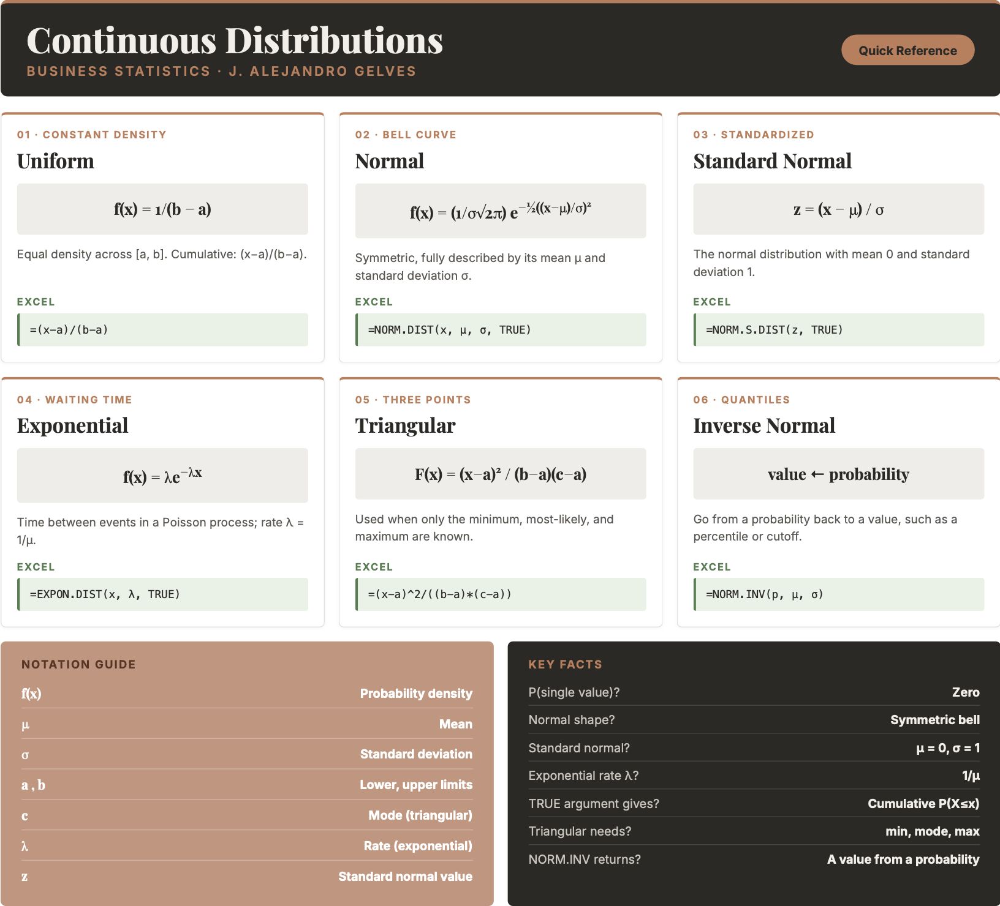

```{=html}
<style>
details {
  background-color: #F8F9FA;
  padding: 5px;
  border: 1px solid #ddd; /* Light border */
  border-radius: 5px; /* Rounded corners */
  margin: 10px 0; /* Spacing */
}

details summary {
  cursor: pointer; /* Pointer cursor for interactivity */
}
</style>
```

# Probability III

Studying continuous probability distributions is crucial for understanding and predicting outcomes in uncertain scenarios where variables can take on any value within a range, rather than being limited to distinct, countable outcomes. These distributions are widely used in fields such as engineering, economics, natural sciences, and machine learning to model phenomena like time to failure, stock prices, rainfall amounts, or human heights. By mastering continuous probability distributions, analysts and decision-makers can assess uncertainties, estimate probabilities of events, and develop data-driven strategies to address real-world challenges. Below, we introduce some popular continuous distributions and their practical applications.

## Continuous Random Variables

Continuous random variables are characterized by their probability density function $f(x)$. The probability density function does not directly provide probabilities!

The probability of a continuous random variable assuming a single value is zero. Instead, probabilities are defined for intervals. These are calculated by areas under the PDF curve (integral).

## Uniform Distribution

The **uniform** distribution assigns equal density across an interval $[a,b]$:

::: callout-formula
**THE UNIFORM DISTRIBUTION** $$f(x)= \frac {1}{b-a} \quad (a \leq x \leq b)$$ $$E(x)= \frac {a+b}{2} \qquad var(x)= \frac {(b-a)^2}{12}$$ where $a$ is the lower limit and $b$ is the upper limit; $f(x)=0$ outside $[a,b]$.
:::

::: callout-example
**Example:** Consider the travel time between NY and CHI. Typically, this trips can take anywhere from 120-140 minutes. The specific time of a particular flight is unpredictable, but assumed to be anywhere between this interval. We assume a uniform distribution with upper limit of 140 and lower limit of 120. The probability that the flight take 122 minutes is zero since the interval has an infinite amount of possible values. The probability of the flight taking 130 minutes or less is 0.5. $$f(x<=130)=\frac{130-120}{20}=0.5$$ The uniform distribution has no dedicated Excel function, but its cumulative probability follows directly from the formula. In Excel, `=(130-120)/(140-120)` returns $0.5$.
:::

## Normal Distribution

The **normal** PDF is given by

::: callout-formula
**THE NORMAL DISTRIBUTION** $$f(x)= \frac {1}{\sigma \sqrt{2\pi}} e^{\frac {-1}{2} (\frac {x-\mu}{\sigma})^2}$$ where $\mu$ is the mean, $\sigma$ is the standard deviation, $\pi \approx 3.1416$, and $e \approx 2.7183$.
:::

The normal distribution has the following properties:

- It is symmetrical about the mean $\mu$.

- The mean is at the middle and divides the area of the distribution into halves.

- The total area under the curve is equal to 1.

- The distribution is completely determined by its mean and standard deviation.

The **standard normal** has a mean of $0$ and a standard deviation of $1$. Otherwise, it has the exact same properties as the normal distribution.

::: callout-example
**Example:** Dr Tires is planning on offering a mileage guarantee on each set of tires they sell. They are considering a 40,000 mile guarantee. Given that the mean tire mileage is 36,500 miles with a standard deviation of 5,000 miles, we can estimate that the probability that a tire lasts more than 40,000 miles is 24.2%. In Excel, use `=1 - NORM.DIST(40000, 36500, 5000, TRUE)`, which returns $0.242$.
:::

## Exponential Distribution

The **exponential distribution** is useful in computing probabilities for the time it takes to complete a task. It describes the time between events in a Poisson process.

The probability density function is given by:

::: callout-formula
**THE EXPONENTIAL DISTRIBUTION** $$f(x)=\frac{1}{\mu} e^{-x/\mu}=\lambda e^{-\lambda x}$$ where $\mu$ is the mean and $\lambda = 1/\mu$ is the rate.
:::

::: callout-example
**Example:** Let $x$ represent the loading time for a truck at the Dock Dash loading dock. If the average loading time is 15 minutes, the probability that loading a truck will take 6 minutes or less is 32.97%. In Excel, the exponential functions use the rate $\lambda = 1/\mu = 1/15$: `=EXPON.DIST(6, 1/15, TRUE)` returns $0.3297$.

We can also estimate that the probability that it takes between 6 and 18 minutes is 36.91%: `=EXPON.DIST(18, 1/15, TRUE) - EXPON.DIST(6, 1/15, TRUE)` returns $0.3691$.
:::

## Triangular Distribution

The **triangular distribution** is characterized by a single mode (the peak of the distribution) and two boundaries. It is often used in situations where the lower and upper bounds of a potential outcome are known, but the exact likelihood of the outcome is uncertain.

The probability density function, expected value, and variance are:

::: callout-formula
**THE TRIANGULAR DISTRIBUTION** $$f(x)=\frac {2(x-a)}{(b-a)(c-a)} \;\; (a \leq x < c), \quad f(x)=\frac {2}{b-a} \;\; (x=c), \quad f(x)=\frac {2(b-x)}{(b-a)(b-c)} \;\; (c < x \leq b)$$ $$E(x)= \frac {a+b+c}{3} \qquad var(x) = \frac {a^2+b^2+c^2-ab-ac-bc}{18}$$ where $a$ is the minimum, $b$ is the maximum, and $c$ is the mode; $f(x)=0$ outside $[a,b]$.
:::

::: callout-example
**Example:** Bite Bliss is planning a new store in Williamsburg. It is estimated that the minimum weekly sales are 1000 and the maximum is 6000. They also estimate that the most likely outcome is around 3000. The probability that future sales will be between 2000 and 2500 is 12.5%. Excel has no triangular distribution function, but the cumulative probability follows from its formula. For a value $x$ in the lower part of the range ($a \le x < c$), $F(x)=\frac{(x-a)^2}{(b-a)(c-a)}$. In Excel:

``` excel
=(2500-1000)^2/((6000-1000)*(3000-1000)) - (2000-1000)^2/((6000-1000)*(3000-1000))
```

This returns $0.225 - 0.10 = 0.125$.
:::

## Continuous Distributions in Excel

Excel provides functions for the normal and exponential distributions. The uniform and triangular distributions do not have dedicated functions, but their probabilities follow directly from their formulas.

**Uniform.** The density is $f(x)=1/(b-a)$ and the cumulative probability is $P(X \le x)=(x-a)/(b-a)$. Both are computed with ordinary arithmetic.

**Normal.** Use `=NORM.DIST(x, mean, standard_dev, cumulative)` — set `cumulative` to `TRUE` for $P(X \le x)$ and `FALSE` for the density. For the standard normal ($\mu=0$, $\sigma=1$) use `=NORM.S.DIST(z, cumulative)`. To find a value given a probability (a quantile), use `=NORM.INV(probability, mean, standard_dev)` or `=NORM.S.INV(probability)`.

**Exponential.** Use `=EXPON.DIST(x, lambda, cumulative)`, where `lambda` is the rate $\lambda = 1/\mu$. Set `cumulative` to `TRUE` for $P(X \le x)$ and `FALSE` for the density.

**Triangular.** Compute the cumulative probability from its formula: $F(x)=\frac{(x-a)^2}{(b-a)(c-a)}$ for $a \le x < c$, and $F(x)=1-\frac{(b-x)^2}{(b-a)(b-c)}$ for $c \le x \le b$.

## Excel Function Summary

Below is a list of the Excel functions used in this section:

- `=NORM.DIST(x, mean, standard_dev, cumulative)` returns the normal probability (`TRUE` for the cumulative distribution, `FALSE` for the density).

- `=NORM.S.DIST(z, cumulative)` returns the standard normal probability.

- `=NORM.INV(probability, mean, standard_dev)` and `=NORM.S.INV(probability)` return the value (quantile) corresponding to a given cumulative probability.

- `=EXPON.DIST(x, lambda, cumulative)` returns the exponential probability, where `lambda` is the rate $1/\mu$.

- The **uniform** and **triangular** distributions have no built-in functions; compute their probabilities directly from the formulas above.

## Chapter Summary Cheat Sheet

```{r echo=FALSE, out.width="100%", fig.align='center'}

```

## Exercises

The following exercises will help you practice some probability concepts and formulas. In particular, the exercises work on:

- Calculating probabilities for continuous random variables.

- Calculating the expected value and standard deviation.

- Applying the uniform, normal, and exponential distributions.

Answers are provided below. Try not to peek until you have formulated your own answer and double checked your work for any mistakes.

### Exercise 1 {.unnumbered}

For the following exercises, make your calculations by hand and verify results with a calculator or Excel.

1.  A random variable $X$ follows a continuous uniform distribution with minimum of $-2$ and maximum of $4$. Determine the height of the density function $f(x)$, the mean, the standard deviation, and calculate $P(X \leq -1)$.

<details>

<summary>Answer</summary>

*The height of the density function* $f(x)=0.1667$, the mean is $1$, standard deviation is $1.73$, and $P(X \leq -1)=0.1667$.

*The uniform distribution has no Excel function, so each quantity is computed directly from its formula:*

- Height $f(x)=\frac{1}{b-a}$: `=1/(4-(-2))` → $0.1667$
- Mean $\mu=\frac{a+b}{2}$: `=(-2+4)/2` → $1$
- Standard deviation $\sigma=\sqrt{\frac{(b-a)^2}{12}}$: `=SQRT((4-(-2))^2/12)` → $1.73$
- $P(X \leq -1)=\frac{x-a}{b-a}$: `=(-1-(-2))/(4-(-2))` → $0.1667$

</details>

2.  Your internet provider will arrive sometime between 10:00 am and 12:00 pm. Suppose you have to run a quick errand at 10:00 am. If it takes $15$ minutes to run the errand, what is the probability that you will be back before the internet provider arrives? What if you take $30$ minutes?

<details>

<summary>Answer</summary>

*The probability that you will arrive on time is* $0.875$. If the time of the errand is 30 minutes, then the probability goes down to $0.75$.

*There is a* $120$ minute interval in which the provider can arrive, so $P(X>t)=1-\frac{t}{120}$. In Excel:

- `=1 - 15/120` → $0.875$
- `=1 - 30/120` → $0.75$

</details>

### Exercise 2 {.unnumbered}

1.  A random variable $Z$ follows a standard normal distribution. Find $P(-0.67 \leq Z \leq -0.23)$, $P(0 \leq Z \leq 1.96)$, $P(-1.28 \leq Z \leq 0)$ and $P(Z > 4.2)$.

<details>

<summary>Answer</summary>

$P(-0.67 \leq Z \leq -0.23)=0.158$, $P(0 \leq Z \leq 1.96)=0.475$, $P(-1.28 \leq Z \leq 0)=0.4$ and $P(Z > 4.2) \approx 0$.

*Use the `=NORM.S.DIST()` function for the standard normal distribution:*

- `=NORM.S.DIST(-0.23, TRUE) - NORM.S.DIST(-0.67, TRUE)` → $0.158$
- `=NORM.S.DIST(1.96, TRUE) - NORM.S.DIST(0, TRUE)` → $0.475$
- `=NORM.S.DIST(0, TRUE) - NORM.S.DIST(-1.28, TRUE)` → $0.4$
- `=1 - NORM.S.DIST(4.2, TRUE)` → $\approx 0$

</details>

2.  Let $Y$ be normally distributed with $\mu=2.5$ and $\sigma=2$. Find $P(Y>7.6)$, $P(7.4 \leq Y \leq 10.6)$, a $y$ such that $P(Y>y)=0.025$, and a $y$ such that $P(y \leq Y \leq 2.5)=0.4943$.

<details>

<summary>Answer</summary>

$P(Y>7.6)=0.005386$, $P(7.4 \leq Y \leq 10.6)=0.0071$, a $y$ such that $P(Y>y)=0.025$ is $6.42$, and a $y$ such that $P(y \leq Y \leq 2.5)$ is $-2.56$.

*Use `=NORM.DIST()` for probabilities and `=NORM.INV()` for quantiles:*

- `=1 - NORM.DIST(7.6, 2.5, 2, TRUE)` → $0.005386$
- `=NORM.DIST(10.6, 2.5, 2, TRUE) - NORM.DIST(7.4, 2.5, 2, TRUE)` → $0.0071$
- $P(Y>y)=0.025$ means $y$ is the $97.5$th percentile: `=NORM.INV(0.975, 2.5, 2)` → $6.42$
- Since $2.5$ is the mean, $P(y \leq Y \leq 2.5)=0.4943$ leaves $0.5-0.4943=0.0057$ in the left tail: `=NORM.INV(0.0057, 2.5, 2)` → $-2.56$

</details>

3.  Assume that football game times are normally distributed with a mean of $3$ hours and a standard deviation of $0.4$ hour. What is the probability that the game lasts at most $2.5$ hours? Find the maximum value for a game to be in the bottom $1$% of the distribution.

<details>

<summary>Answer</summary>

*The probability is* $10.56$%. A game lasting no more than $2.069$ hours would be in the bottom $1$%.

*In Excel:*

- `=NORM.DIST(2.5, 3, 0.4, TRUE)` → $0.1056$
- `=NORM.INV(0.01, 3, 0.4)` → $2.069$

</details>

### Exercise 3 {.unnumbered}

1.  Random variable $S$ is exponentially distributed with mean of $0.1$. What is the standard deviation of $S$? What is $P(0.10 \leq S \leq 0.2)$?

<details>

<summary>Answer</summary>

*The standard deviation is equal to the mean* $0.1$. $P(0.10 \leq S \leq 0.2)=0.2325$

*The rate is* $\lambda = 1/\mu = 1/0.1 = 10$. In Excel:

- `=EXPON.DIST(0.2, 10, TRUE) - EXPON.DIST(0.1, 10, TRUE)` → $0.2325$

</details>

2.  A tollbooth operator has observed that cars arrive randomly at a rate of $360$ cars per hour. What is the mean time between car arrivals? What is the probability that the next car will arrive within ten seconds?

<details>

<summary>Answer</summary>

*The mean time between car arrivals is* $1/360=0.002778$ hours. The probability that the next car will arrive within the next 10 seconds is $0.6321$.

*Ten seconds is* $10/3600 = 1/360$ of an hour. Using a rate of $\lambda = 360$ cars per hour in Excel:

- `=EXPON.DIST(1/360, 360, TRUE)` → $0.6321$

</details>
