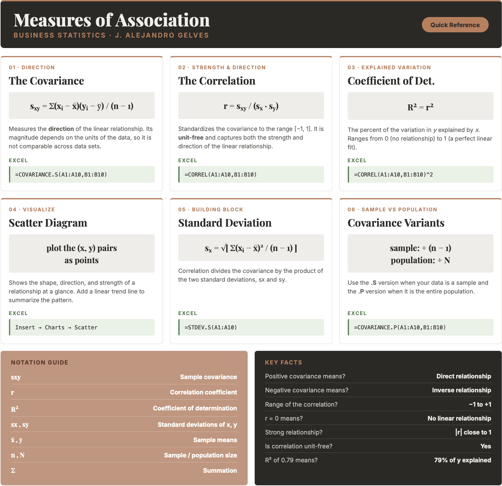

```{=html}
<style>
details {
  background-color: #F8F9FA;
  padding: 5px;
  border: 1px solid #ddd;
  border-radius: 5px;
  margin: 10px 0;
}
details summary {
  cursor: pointer;
}
</style>
```

# Regression I

Measures of association are essential tools in business statistics
for analyzing relationships between variables. They help determine
whether changes in one variable are linked to changes in another,
providing valuable insights into patterns and dependencies.
Understanding these relationships is critical for making informed
decisions. By quantifying the strength and direction of associations,
businesses can better interpret data, optimize strategies, and drive
meaningful outcomes. Below we study important measures of association.

## The Covariance

The **covariance** is a measure that determines the direction of the
relationship between two variables. It is calculated by:

::: {.callout-formula}
**THE COVARIANCE**
$$s_{xy}=\frac{\sum(x_i-\bar{x})(y_i-\bar{y})}{n-1}$$
where $x_i$ and $y_i$ are observations, $\bar{x}$ and $\bar{y}$ are
the sample means, and $n$ is the sample size.

| $s_{xy} > 0$ | $s_{xy} = 0$ | $s_{xy} < 0$ |
|:---:|:---:|:---:|
| Direct relationship | No relationship | Inverse relationship |
:::

::: {.callout-example}
**Example:** Let's consider the following data that captures the
price of stocks (SPY) and bonds (BND):

| Period | SPY | BND |
|:------:|:---:|:---:|
| 1      | 87  | 316 |
| 2      | 86  | 380 |
| 3      | 84  | 416 |
| 4      | 85  | 430 |
| 5      | 83  | 440 |

The idea behind calculating a covariance is to determine whether
there is a relationship between the two variables. We start by
finding the deviations from the mean for both SPY and BND:

| Period | SPY | BND | $SPY - \bar{SPY}$ | $BND - \bar{BND}$ | Product |
|:------:|:---:|:---:|:-----------------:|:-----------------:|:-------:|
| 1      | 87  | 316 | $2$               | $-80$             | $-160$  |
| 2      | 86  | 380 | $1$               | $-16$             | $-16$   |
| 3      | 84  | 416 | $-1$              | $20$              | $-20$   |
| 4      | 85  | 430 | $0$               | $34$              | $0$     |
| 5      | 83  | 440 | $-2$              | $44$              | $-88$   |

The covariance is the average of the products column using $n-1$:

$$s_{xy} = \frac{-160 + (-16) + (-20) + 0 + (-88)}{5-1} =
\frac{-284}{4} = -71$$

Since $s_{xy} < 0$ there is an inverse relationship between SPY
and BND. Intuitively, the covariance checks whether on average the
products of the deviations from the mean is positive or negative.
Whenever $x$ lies below its mean and $y$ lies above its mean, the
product is negative — and vice versa — reflecting the inverse
relationship between the two variables.
:::

## The Correlation

The **correlation** measures the strength of the linear relationship
between two variables. It is calculated by:

::: {.callout-formula}
**THE CORRELATION COEFFICIENT**
$$r = \frac{s_{xy}}{s_x \cdot s_y}$$
where $s_{xy}$ is the covariance, $s_x$ is the standard deviation
of $x$, and $s_y$ is the standard deviation of $y$.

The correlation coefficient lies between $[-1, 1]$:

| $r = -1$ | $-1 < r < 0$ | $r = 0$ | $0 < r < 1$ | $r = 1$ |
|:---:|:---:|:---:|:---:|:---:|
| Perfect inverse | Inverse | No relationship | Direct | Perfect direct |
:::

The strength of the relationship is determined by the absolute value
of $r$. Values close to $1$ indicate a strong relationship, values
close to $0$ indicate a weak relationship.

::: {.callout-example}
**Example:** Consider the SPY and BND data. The standard deviation
of SPY is $s_{SPY} = 1.58$ and that of BND is $s_{BND} = 50.37$.
Substituting into the correlation formula:

$$r = \frac{-71}{1.58 \times 50.37} = -0.89$$

This indicates that the relationship between SPY and BND is inverse
and strong.
:::

## The Coefficient of Determination ($R^2$)

The **coefficient of determination** or $R^2$ measures the percent
of variation in $y$ explained by variations in $x$. It is calculated
by:

::: {.callout-formula}
**THE COEFFICIENT OF DETERMINATION**
$$R^2 = r^2$$
where $r$ is the correlation coefficient. $R^2$ ranges from $0$
(no relationship) to $1$ (perfect relationship).
:::

::: {.callout-example}
**Example:** Consider once more the SPY and BND example. The
correlation coefficient is $r = -0.89$. Hence:

$$R^2 = (-0.89)^2 = 0.79$$

This indicates that about $79\%$ of the variation in BND can be
explained by changes in SPY. The two variables are closely related.
:::

## Measures of Association in Excel

Excel provides straightforward functions to calculate all three
measures of association. Let's use the SPY and BND data from the
example above.

[ Download Data](spybnd.xlsx){.btn .btn-success}

**Covariance:** To calculate the sample covariance use
`=COVARIANCE.S()`. Assuming SPY is in column A and BND is in
column B:

```excel
=COVARIANCE.S(A2:A6, B2:B6)
```

**Correlation:** To calculate the correlation coefficient use
`=CORREL()`:

```excel
=CORREL(A2:A6, B2:B6)
```

**Coefficient of Determination:** There is no direct Excel function
for $R^2$ between two variables. Simply square the correlation
coefficient:

```excel
=CORREL(A2:A6, B2:B6)^2
```

The results for the SPY and BND data are:

| Covariance | Correlation | $R^2$  |
|:----------:|:-----------:|:------:|
| $-71.00$   | $-0.8916$   | $0.79$ |

**Scatter Plot:** To create a scatter plot in Excel, select both
columns and go to `Insert → Charts → Scatter`. This will display
the relationship between SPY and BND visually. To add a trend line,
right-click any point in the scatter plot and select
`Add Trendline → Linear`.

## Excel Function Summary

Below is a list of the Excel functions used in this section:

- `=COVARIANCE.S(array1, array2)` calculates the sample covariance
  between two variables. Use `=COVARIANCE.P()` for the population
  covariance.

- `=CORREL(array1, array2)` calculates the correlation coefficient
  between two variables. The result is always between $-1$ and $1$.

- `=CORREL(array1, array2)^2` calculates the coefficient of
  determination $R^2$ by squaring the correlation coefficient. Excel
  does not have a standalone $R^2$ function for two variables.

## Chapter Summary Cheat Sheet

```{r echo=FALSE, out.width="100%", fig.align='center'}

```

## Exercises

The following exercises will help you understand statistical measures
that establish the relationship between two variables. In particular,
the exercises work on:

- Calculating covariance and correlation.
- Creating scatter diagrams in Excel.
- Calculating the coefficient of determination.
- Interpreting measures of association in a real-world context.

Answers are provided below. Try not to peek until you have formulated
your own answer and double checked your work for any mistakes.

### Exercise 1 {.unnumbered}

For the following exercises, make your calculations by hand and
verify results using Excel functions when possible.

1. Consider the data below. Calculate the covariance and correlation
coefficient by finding deviations from the mean. Verify your result
using Excel. Is there a direct or inverse relationship between the
two variables? How strong is the relationship?

| **x** | 20  | 21  | 15  | 18  | 25  |
|:-----:|:---:|:---:|:---:|:---:|:---:|
| **y** | 17  | 19  | 12  | 13  | 22  |

<details>
<summary>Answer</summary>
<div style="padding-left: 1.5em;">

*The covariance is $14.9$ and the correlation is $0.96$. The results
indicate that there is a strong direct relationship between the two
variables.*

*Start by finding the mean of each variable: $\bar{x} = 19.8$ and
$\bar{y} = 16.6$. Then build the deviations table:*

| $x_i$ | $y_i$ | $x_i-\bar{x}$ | $y_i-\bar{y}$ | Product |
|:-----:|:-----:|:-------------:|:-------------:|:-------:|
| 20    | 17    | $0.2$         | $0.4$         | $0.08$  |
| 21    | 19    | $1.2$         | $2.4$         | $2.88$  |
| 15    | 12    | $-4.8$        | $-4.6$        | $22.08$ |
| 18    | 13    | $-1.8$        | $-3.6$        | $6.48$  |
| 25    | 22    | $5.2$         | $5.4$         | $28.08$ |

$$s_{xy} = \frac{0.08+2.88+22.08+6.48+28.08}{4} = \frac{59.6}{4} = 14.9$$

$$r = \frac{14.9}{sd(x) \times sd(y)} = \frac{14.9}{3.49 \times 4.34} = 0.96$$

*To verify in Excel, enter x in column A and y in column B and use:*

- `=COVARIANCE.S(A2:A6, B2:B6)` → $14.9$
- `=CORREL(A2:A6, B2:B6)` → $0.96$

</div>
</details>

2. Consider the data below. Calculate the covariance and correlation
coefficient by finding deviations from the mean. Verify your result
using Excel. Is there a direct or inverse relationship between the
two variables? How strong is the relationship?

| **w** | 19  | 16  | 14  | 11  | 18  |
|:-----:|:---:|:---:|:---:|:---:|:---:|
| **z** | 17  | 20  | 20  | 16  | 18  |

<details>
<summary>Answer</summary>
<div style="padding-left: 1.5em;">

*The covariance is $0.85$ and the correlation is $0.148$. The results
indicate that there is a very weak direct relationship between the two
variables. They might be unrelated.*

*To verify in Excel, enter w in column A and z in column B and use:*

- `=COVARIANCE.S(A2:A6, B2:B6)` → $0.85$
- `=CORREL(A2:A6, B2:B6)` → $0.148$

</div>
</details>

### Exercise 2 {.unnumbered}

You will need the **mtcars** data set to answer this question.
You can download it here:

[ Download Data](mtcars.xlsx){.btn .btn-success}

1. Calculate the correlation coefficient between `hp` and `mpg`.
Explain the results. Specifically, the direction of the relationship
and the strength given the context of the problem.

<details>
<summary>Answer</summary>
<div style="padding-left: 1.5em;">

*The correlation coefficient is $-0.78$. This is indicative of a
moderately strong inverse relationship between mpg and hp. As
horsepower increases, fuel efficiency tends to decrease.*

*In Excel, assuming `mpg` is in column A and `hp` is in column B:*

- `=CORREL(A2:A33, B2:B33)` → $-0.78$

</div>
</details>

2. Create a scatter diagram of the two variables. Is the scatter
diagram what you expected after you calculated the correlation
coefficient?

<details>
<summary>Answer</summary>
<div style="padding-left: 1.5em;">

*The scatter diagram is downward sloping and most points are close
to the trend line. It is what was expected from a correlation
coefficient of $-0.78$.*

*In Excel, select the `hp` and `mpg` columns and go to
`Insert → Charts → Scatter`. To add the trend line, right-click any
point and choose `Add Trendline → Linear`.*

</div>
</details>

3. Calculate the coefficient of determination. How close is it to
one? What else could be explaining the variation in the `mpg`? Let
your dependent variable be `mpg`.

<details>
<summary>Answer</summary>
<div style="padding-left: 1.5em;">

*The coefficient of determination is $0.60$. This value is not very
close to one. This is expected since miles per gallon can also vary
because of the car's weight and fuel efficiency. It makes sense that
`hp` only explains $60\%$ of the total variation.*

*In Excel, square the correlation coefficient:*

- `=CORREL(A2:A33, B2:B33)^2` → $0.60$

</div>
</details>

### Exercise 3 {.unnumbered}

You will need the **College** data set to answer this question.
You can download it here:

[ Download Data](College.xlsx){.btn .btn-success}

1. Create a scatter diagram between `GRAD_DEBT_MDN` (Median Debt)
on the y-axis and `MD_EARN_WNE_P10` (Median Earnings) on the x-axis.
What type of relationship do you observe between the variables?

<details>
<summary>Answer</summary>
<div style="padding-left: 1.5em;">

*It seems like there is a direct relationship between both variables.
The more debt a graduate takes on, the higher the earnings tend to be.*

*In Excel, select the `MD_EARN_WNE_P10` and `GRAD_DEBT_MDN` columns
and go to `Insert → Charts → Scatter`. Add a linear trend line by
right-clicking a point and choosing `Add Trendline → Linear`.*

</div>
</details>

2. Calculate the correlation coefficient and the coefficient of
determination. According to the data, are higher debts correlated
with higher earnings?

<details>
<summary>Answer</summary>
<div style="padding-left: 1.5em;">

*The correlation coefficient shows a moderate direct relationship
between earnings and debt, $r = 0.46$. The coefficient of
determination indicates that only $21\%$ of the variation in
earnings can be explained by debt.*

*In Excel, assuming `GRAD_DEBT_MDN` is in column A and
`MD_EARN_WNE_P10` is in column B:*

- `=CORREL(A2:A1000, B2:B1000)` → $0.46$
- `=CORREL(A2:A1000, B2:B1000)^2` → $0.21$

*Note: use `=CORREL()` rather than `=COVARIANCE.S()` when there are
missing values, as CORREL handles them more gracefully in Excel.*

</div>
</details>

### Exercise 4 {.unnumbered}

You will need the **HomePrices** data set to answer this question.
You can download it here:

[ Download Data](HomePrices.xlsx){.btn .btn-success}

1. Create a scatter diagram between `bedrooms` (number of bedrooms)
and `Price` (home sale price). What type of relationship do you
observe between the two variables? Does the direction make intuitive
sense?

<details>
<summary>Answer</summary>
<div style="padding-left: 1.5em;">

*There is a direct relationship between bedrooms and price. As the
number of bedrooms increases, sale prices tend to rise. This is
intuitive since larger homes generally command higher market values.*

*In Excel, select the `bedrooms` and `Price` columns and go to
`Insert → Charts → Scatter`. Add a linear trend line by right-clicking
a point and choosing `Add Trendline → Linear`.*

</div>
</details>

2. Calculate the correlation coefficient between `bedrooms` and
`Price`. Explain the direction and strength of the relationship in
the context of the housing market.

<details>
<summary>Answer</summary>
<div style="padding-left: 1.5em;">

*The correlation coefficient is $r = 0.92$, indicating a strong
direct relationship between bedrooms and sale price. Larger homes
tend to sell for higher prices, though many other factors (location,
condition, amenities) also influence price, which prevents a perfect
correlation.*

*In Excel, assuming `bedrooms` is in column A and `Price` is in
column B:*

- `=CORREL(A2:A348, B2:B348)` → $0.92$

</div>
</details>

3. Calculate the coefficient of determination. What percentage of
the variation in `Price` is explained by `bedrooms`? What other
factors might account for the remaining variation?

<details>
<summary>Answer</summary>
<div style="padding-left: 1.5em;">

*The coefficient of determination is $R^2 = 0.85$, so about $85\%$
of the variation in home prices is explained by the number of
bedrooms alone. The remaining variation is likely driven by factors
such as location, number of bathrooms, lot size, school district
quality, and the overall condition of the property.*

*In Excel, square the correlation coefficient:*

- `=CORREL(A2:A348, B2:B348)^2` → $0.85$

</div>
</details>
