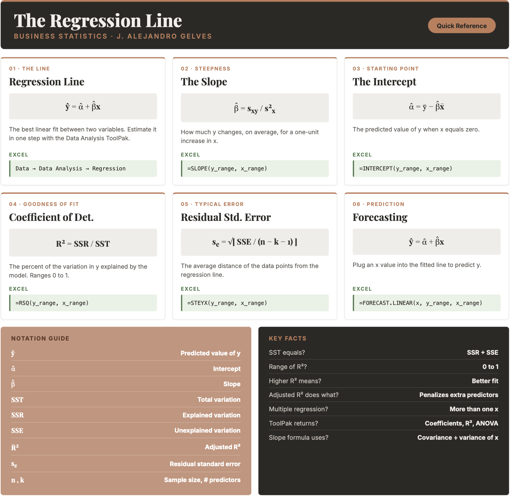

```{=html}
<style>
details {
  background-color: #F8F9FA;
  padding: 5px;
  border: 1px solid #ddd;
  border-radius: 5px;
  margin: 10px 0;
}
details summary {
  cursor: pointer;
}
</style>
```

# Regression II

Quantifying relationships between variables is an important skill in business analytics. The regression line, representing the best linear fit between two variables, enables businesses to make predictions, identify trends, and optimize strategies using data-driven insights. Understanding how to calculate and interpret a regression line provides the foundation for analyzing business relationships, such as the effect of advertising on sales or customer satisfaction on revenue. Below, we delve into generating and analyzing a regression line. Fitting a line is a descriptive act — a compact summary of how the data behave — but it is also the model whose reliability we will later test in the inference chapters, once we ask how much a different sample might have shifted it.

## The Regression Line

The regression line is calculated to minimize the average distance (or errors) between the line and the observed data points. It is defined by two key components: a **slope** ($\hat{\beta}$) and an **intercept** ($\hat{\alpha}$). Mathematically, the regression line is expressed as:

::: callout-formula
**THE REGRESSION LINE** $$\hat{y_i}=\hat{\alpha}+\hat{\beta}x_i$$ where $\hat{y_i}$ are the predicted values of $y$ given $x_i$, $\hat{\alpha}$ is the intercept, and $\hat{\beta}$ is the slope.
:::

The **slope** determines the steepness of the line and quantifies how much a unit increase in $x$ changes $y$ on average. It is calculated using the covariance between $y$ and $x$ and the variance of $x$:

::: callout-formula
**THE SLOPE** $$\hat{\beta}= \frac{s_{xy}}{s_{x}^2}$$ where $s_{xy}$ is the sample covariance between $x$ and $y$, and $s_x^2$ is the sample variance of $x$.
:::

The **intercept** determines where the line crosses the $y$ axis — the predicted value of $y$ when $x$ is zero. Once the slope is estimated, the intercept is calculated by:

::: callout-formula
**THE INTERCEPT** $$\hat{\alpha}=\bar{y}-\hat{\beta}\bar{x}$$ where $\bar{y}$ is the mean of $y$ and $\bar{x}$ is the mean of $x$.
:::

::: callout-example
**Example:** Let's examine a data set on Price and Advertisement. In general, one expects that when a company advertises, it can convince consumers to pay more for their product. Below is the data:

| Advertisement (x) | Price (y) |
|:-----------------:|:---------:|
|         2         |     7     |
|         1         |     3     |
|         3         |     8     |
|         4         |    10     |

The data shows a clear direct relationship between advertisement and price. Regression allows us to answer two key questions:

1.  **Effectiveness:** How much can we increase the price for every additional dollar spent on advertisement?
2.  **Prediction:** What is the predicted price if we have a budget of $6$ for advertisement?

**Step 1 — Calculate the slope:** Given that the covariance is $s_{xy}=3.67$ and the variance of $x$ is $s_x^2=1.67$:

$$\hat{\beta}= \frac{3.67}{1.67}=2.2$$

For every additional dollar spent on advertisement, price increases by $2.2$ on average.

**Step 2 — Calculate the intercept:** Since $\bar{x}=2.5$ and $\bar{y}=7$:

$$\hat{\alpha}=7-2.2(2.5)=1.5$$

If we do not advertise, the predicted price is $1.5$.

**Step 3 — Write the regression line:**

$$\hat{y_i}=1.5+2.2x_i$$

**Step 4 — Make a prediction:** With an advertisement budget of $6$:

$$\hat{y_i}=1.5+2.2(6)=14.7$$

In conclusion, for every dollar spent on advertisement the price increases by $2.2$, and with a budget of $6$ the predicted price is $14.7$.
:::

## Measures of Goodness of Fit

When analyzing the effectiveness of a regression model, it is crucial to assess how well the model fits the data. Below we revisit the coefficient of determination $R^2$ and introduce additional measures.

### Coefficient of Determination {.unnumbered}

The **coefficient of determination** or $R^2$ is the percent of the variation in $y$ that is explained by changes in $x$. The higher the $R^2$ the better the explanatory power of the model.

::: callout-formula
**THE COEFFICIENT OF DETERMINATION** $$R^2=\frac{SSR}{SST}$$

where:

- $SST = \sum(y_i-\bar{y})^2$ — total variation in $y$
- $SSR = \sum(\hat{y_i}-\bar{y})^2$ — variation explained by the model
- $SSE = \sum(y_i-\hat{y_i})^2$ — variation unexplained by the model
- $SST = SSR + SSE$

$R^2$ is always between $[0,1]$.
:::

::: callout-example
**Example:** Consider data on the Weight ($y$) and Exercise ($x$) of a particular person:

| Weight (y) | Exercise (x) |
|:----------:|:------------:|
|    165     |      45      |
|    170     |      10      |
|    168     |      25      |
|    164     |      30      |
|    165     |      40      |

If we used only the mean $\bar{y}=166.4$ as our prediction, the total squared error would be:

$$SST=(-1.4)^2+(3.6)^2+(1.6)^2+(-2.4)^2+(-1.4)^2=25.2$$

Using the regression line reduces these errors. The mistakes made by the regression line are quantified by:

$$SSE=0.81+0.29+0.69+5.76+0.02=7.57$$

The improvement gained by using regression over the mean is:

$$SSR=5.29+9.4+0.59+0+2.35=17.63$$

Hence the coefficient of determination is:

$$R^2=\frac{SSR}{SST}=\frac{17.63}{25.2}\approx0.70$$

The regression line explains about $70\%$ of the variation in Weight using Exercise.
:::

## Multiple Regression

If we were to predict weight we could use several other variables to get a better prediction. **Multiple regression** is a technique used to predict a variable using more than one independent variable.

::: callout-formula
**THE MULTIPLE REGRESSION LINE** $$\hat{y_i}=\hat{\beta_0}+\hat{\beta_1}x_1+\hat{\beta_2}x_2+...+\hat{\beta_k}x_k$$ where $k$ is the total number of independent variables included in the model.
:::

::: callout-example
**Example:** Let's consider an additional variable in our Weight and Exercise example. The table below includes information on Calories ($z$):

| Weight (y) | Exercise (x) | Calories (z) |
|:----------:|:------------:|:------------:|
|    165     |      45      |     1200     |
|    170     |      10      |     1260     |
|    168     |      25      |     1220     |
|    164     |      30      |     1180     |
|    165     |      40      |     1190     |

The multiple regression line estimated by computer software is:

$$\hat{y_i}=83.96-0.025x+0.069z$$

Two conclusions follow from this result. First, as exercise increases weight tends to go down, while more calories increases weight. Second, reducing calorie consumption by $1$ unit decreases weight by $0.069$ pounds, whereas one additional minute of exercise only reduces weight by $0.025$ pounds — making calorie reduction more effective per unit.
:::

### Anova {.unnumbered}

The Anova table helps us understand how well each variable in our regression model explains the dependent variable. It decomposes the $SSR$ by variable and tracks the remaining errors.

::: callout-example
**Example:** For the Weight, Exercise, and Calories regression, the Anova table is:

|  Source   | Sum Squares |
|:---------:|:-----------:|
|     x     |    17.63    |
|     z     |    6.55     |
| Residuals |    1.01     |

Exercise explains $17.63$ of the total variation. Adding Calories reduces the remaining unexplained variation by another $6.55$, bringing the total $SSR$ to $24.18$ and the $SSE$ down to $1.01$. The $R^2$ increases from $0.70$ to:

$$R^2=\frac{17.63+6.55}{25.2}=0.96$$
:::

### Adjusted $R^2$ {.unnumbered}

The **adjusted** $R^2$ penalizes a model for including additional explanatory variables, preventing artificial inflation of $R^2$.

::: callout-formula
**THE ADJUSTED** $R^2$ $$\bar{R}^2=1-(1-R^2)\frac{n-1}{n-k-1}$$ where $k$ is the number of explanatory variables and $n$ is the sample size.
:::

::: callout-example
**Example:** For the Weight example with both Exercise and Calories ($k=2$, $n=5$, $R^2=0.96$):

$$\bar{R}^2=1-(1-0.96)\frac{5-1}{5-2-1}=0.92$$
:::

### Residual Standard Error {.unnumbered}

The **Residual Standard Error** estimates the average dispersion of the data points around the regression line.

::: callout-formula
**THE RESIDUAL STANDARD ERROR** $$s_e=\sqrt{\frac{SSE}{n-k-1}}$$ where $k$ is the number of independent variables and $n$ is the sample size.
:::

::: callout-example
**Example:** For the Weight and Exercise model ($k=1$):

$$s_e=\sqrt{\frac{7.57}{5-1-1}}=1.59$$

Adding Calories ($k=2$) reduces this to:

$$s_e=\sqrt{\frac{1.01}{5-2-1}}=0.71$$

The smaller residual standard error confirms that adding Calories improves the model's fit.
:::

## Regression with Dummy Variables

So far every predictor has been numerical. But many of the variables we care about in business are **categorical** — the brand of a product, whether a customer churned, the gender of a respondent, or the instructor teaching a class. Regression can use these variables too, once we encode them as numbers. The tool for doing so is the **dummy variable**.

::: callout-formula
**THE DUMMY VARIABLE** $$d_i = \begin{cases} 1 & \text{if observation } i \text{ is in the category} \\ 0 & \text{otherwise} \end{cases}$$ A dummy (or *indicator*) variable equals $1$ when an observation belongs to a particular category and $0$ when it does not.
:::

**A single dummy recovers a difference of means.** Suppose we regress a numerical variable $y$ on a single dummy $d$, giving $\hat{y}=\hat{\beta_0}+\hat{\beta_1}d$. Because $d$ takes only two values, the line makes only two predictions. When $d=0$ the prediction is $\hat{\beta_0}$; when $d=1$ it is $\hat{\beta_0}+\hat{\beta_1}$. Those two predictions are exactly the two group averages:

::: callout-formula
**A DUMMY AND THE GROUP MEANS** $$\hat{\beta_0}=\bar{y}_{0} \qquad \hat{\beta_1}=\bar{y}_{1}-\bar{y}_{0}$$ The intercept is the mean of the **baseline** group (the one coded $0$), and the slope is the *difference* between the two group means.
:::

In other words, regressing a variable on a single dummy is just another way of computing a difference of means — the slope *is* that difference.

**More than two categories.** When a categorical variable has $k$ categories, we create $k-1$ dummies and leave one category out to act as the **baseline** (or reference). Each remaining dummy's coefficient measures the gap between its category's mean and the baseline mean. We never include a dummy for *every* category alongside an intercept — doing so makes the columns perfectly collinear (the **dummy variable trap**), and the regression cannot be estimated.

::: callout-example
**Example:** The **Spin** data set records $90$ spin classes taught by three instructors — Olivia, Sam, and Ben — along with `Total_kj`, the total energy (in kilojoules) burned during each class. We want each instructor's average energy output.

Because there are three instructors, we build two dummies and let **Olivia** be the baseline:

- $Sam = 1$ if the class was taught by Sam, $0$ otherwise.
- $Ben = 1$ if the class was taught by Ben, $0$ otherwise.

An Olivia class therefore has $Sam=0$ and $Ben=0$. Regressing `Total_kj` on the two dummies gives:

$$\widehat{Total\_kj}=197.03-75.67\,Sam+27.90\,Ben$$

Reading off each instructor's predicted (average) energy:

|    Instructor     | $Sam$ | $Ben$ |      Prediction       | Mean `Total_kj` |
|:-----------------:|:-----:|:-----:|:---------------------:|:---------------:|
| Olivia (baseline) |  $0$  |  $0$  |       $197.03$        |    $197.03$     |
|        Sam        |  $1$  |  $0$  | $197.03-75.67=121.37$ |    $121.37$     |
|        Ben        |  $0$  |  $1$  | $197.03+27.90=224.93$ |    $224.93$     |

The predictions land exactly on the three group averages. The intercept is Olivia's mean; the coefficient on $Sam$ ($-75.67$) says Sam's classes burn about $75.67$ kJ *less* than Olivia's on average, and the coefficient on $Ben$ ($+27.90$) says Ben's burn about $27.90$ kJ *more*. Regression with dummy variables has reproduced the group means — and, as a bonus, reported how far each group sits from the baseline.
:::

### Dummy Variables in Excel {.unnumbered}

[ Download Data](Spin.xlsx){.btn .btn-success}

1.  Add one column for each non-baseline category. With `Instructor` in column A, create a **Sam** dummy and a **Ben** dummy:

    ``` excel
    =IF($A2="Sam", 1, 0)
    =IF($A2="Ben", 1, 0)
    ```

2.  Copy both formulas down for all $90$ rows.

3.  Go to `Data → Data Analysis → Regression`. Set the **Input Y Range** to `Total_kj` and the **Input X Range** to the two dummy columns together, then click `OK`.

The **Intercept** in the output is Olivia's mean, and the two dummy coefficients are the differences from Olivia. You can confirm each group mean directly with `AVERAGEIF` (here `Total_kj` sits in column C):

``` excel
=AVERAGEIF(A2:A91, "Olivia", C2:C91)   → 197.03
=AVERAGEIF(A2:A91, "Sam", C2:C91)      → 121.37
=AVERAGEIF(A2:A91, "Ben", C2:C91)      → 224.93
```

## Regression in Excel

Excel provides a straightforward way to estimate regression models using the **Data Analysis ToolPak**. If it is not already enabled, go to `File → Options → Add-ins → Analysis ToolPak → Go` and check the box.

[ Download Data](weight_exercise.xlsx){.btn .btn-success}

**Simple Regression (Weight and Exercise):**

1.  Go to `Data → Data Analysis → Regression`
2.  Set the **Input Y Range** to the Weight column
3.  Set the **Input X Range** to the Exercise column
4.  Check **Labels** if your data includes headers
5.  Select an output location and click `OK`

Excel will produce a full regression output including the coefficients, $R^2$, Adjusted $R^2$, Standard Error, and Anova table — all in one step.

**Reading the Excel Output:**

- **Intercept** row → $\hat{\alpha}$
- **X Variable 1** row → $\hat{\beta}$
- **R Square** → $R^2$
- **Adjusted R Square** → $\bar{R}^2$
- **Standard Error** → $s_e$

**Multiple Regression (Weight, Exercise, and Calories):**

Follow the same steps but set the **Input X Range** to include both the Exercise and Calories columns. Excel handles multiple predictors automatically.

**Making Predictions:** Once you have the coefficients from the output, use them directly in a formula. For the Advertisement and Price example, if the intercept is in cell B17 and slope in B18:

``` excel
=B17 + B18 * 6
```

This returns the predicted price for an advertisement budget of $6$.

## Excel Function Summary

Below is a list of the Excel functions and tools used in this section:

- **Data Analysis ToolPak → Regression** is the primary tool for estimating regression models in Excel. It returns coefficients, $R^2$, adjusted $R^2$, standard error, and the Anova table in a single output.

- `=SLOPE(y_range, x_range)` calculates the slope $\hat{\beta}$ of the simple regression line directly.

- `=INTERCEPT(y_range, x_range)` calculates the intercept $\hat{\alpha}$ of the simple regression line directly.

- `=FORECAST.LINEAR(x, y_range, x_range)` returns the predicted value of $y$ for a given value of $x$ using simple linear regression.

- `=RSQ(y_range, x_range)` returns the $R^2$ for a simple regression.

- `=STEYX(y_range, x_range)` returns the residual standard error $s_e$ for a simple regression.

- `=IF(cell="Category", 1, 0)` builds a dummy variable, coding each row $1$ when it belongs to a category and $0$ otherwise.

- `=AVERAGEIF(range, criteria, average_range)` returns the mean of a numerical column for the rows matching a category — a quick way to verify the group means produced by a dummy-variable regression.

## Chapter Summary Cheat Sheet

```{r echo=FALSE, out.width="100%", fig.align='center'}

```

## Exercises

The following exercises will help you get practice on Regression Line estimation and interpretation. In particular, the exercises work on:

- Estimating the slope and intercept.
- Calculating measures of goodness of fit.
- Prediction using the regression line.

Answers are provided below. Try not to peek until you have formulated your own answer and double checked your work for any mistakes.

### Exercise 1 {.unnumbered}

For the following exercises, make your calculations by hand and verify results using Excel functions when possible.

1.  Consider the data below. Calculate the deviations from the mean for each variable and use the results to estimate the regression line. Verify your result using Excel. On average, by how much does *y* increase per unit increase of *x*?

| **x** | 20  | 21  | 15  | 18  | 25  |
|:-----:|:---:|:---:|:---:|:---:|:---:|
| **y** | 17  | 19  | 12  | 13  | 22  |

<details>

<summary>Answer</summary>

::: {style="padding-left: 1.5em;"}
*The regression line is* $\hat{y}=-4.93+1.09x$. For each unit increase in $x$, $y$ increases on average by $1.09$.

*Start with the deviations from the mean (*$\bar{x}=19.8$, $\bar{y}=16.6$):

| $x_i$ | $y_i$ | $x_i-\bar{x}$ | $y_i-\bar{y}$ | Product | $(x_i-\bar{x})^2$ |
|:-----:|:-----:|:-------------:|:-------------:|:-------:|:-----------------:|
|  20   |  17   |     $0.2$     |     $0.4$     | $0.08$  |      $0.04$       |
|  21   |  19   |     $1.2$     |     $2.4$     | $2.88$  |      $1.44$       |
|  15   |  12   |    $-4.8$     |    $-4.6$     | $22.08$ |      $23.04$      |
|  18   |  13   |    $-1.8$     |    $-3.6$     | $6.48$  |      $3.24$       |
|  25   |  22   |     $5.2$     |     $5.4$     | $28.08$ |      $27.04$      |

$$\hat{\beta}=\frac{\sum(x_i-\bar{x})(y_i-\bar{y})}{\sum(x_i-\bar{x})^2}=\frac{59.6}{54.8}=1.09$$

$$\hat{\alpha}=\bar{y}-\hat{\beta}\bar{x}=16.6-1.09(19.8)=-4.93$$

*To verify in Excel, enter x in column A and y in column B and use:*

- `=SLOPE(B2:B6, A2:A6)` → $1.09$
- `=INTERCEPT(B2:B6, A2:A6)` → $-4.93$
:::

</details>

2.  Calculate *SST*, *SSR*, and *SSE*. What is the $R^2$? What is the Standard Error estimate? Is the regression line a good fit for the data?

<details>

<summary>Answer</summary>

::: {style="padding-left: 1.5em;"}
*SST is* $69.2$, SSR is $64.82$ and SSE is $4.38$ (note that $SSR+SSE=SST$). The $R^2$ is $\frac{SSR}{SST}=0.94$ and the Standard Error estimate is $1.21$. Both indicate a great fit of the regression line to the data.

*In Excel, with x in column A and y in column B:*

- `=DEVSQ(B2:B6)` → $SST = 69.2$
- `=RSQ(B2:B6, A2:A6)` → $R^2 = 0.94$
- `=STEYX(B2:B6, A2:A6)` → $s_e = 1.21$

*Then* $SSR = R^2 \times SST = 64.82$ and $SSE = SST - SSR = 4.38$. You can also obtain all of these at once from `Data → Data Analysis → Regression`, which reports the ANOVA table (SSR, SSE, SST), $R^2$, and the Standard Error in a single output.
:::

</details>

3.  Assume that *x* is observed to be *32*. What is your prediction of *y*? How confident are you in this prediction?

<details>

<summary>Answer</summary>

::: {style="padding-left: 1.5em;"}
*If* $x=32$ then $\hat{y}=-4.93+1.09(32)=29.87$. The regression is a good fit, so we can feel good about our prediction. However, we would be concerned about the small sample size of the data.

*In Excel:*

- `=FORECAST.LINEAR(32, B2:B6, A2:A6)` → $29.87$
:::

</details>

### Exercise 2 {.unnumbered}

You will need the **Education** data set to answer this question. You can download it here:

[ Download Data](Education.xlsx){.btn .btn-success}

The data shows the years of education (*Education*) and the annual salary in thousands (*Salary*) for a sample of $100$ people.

1.  Estimate the regression line using Excel. By how much does an extra year of education increase the annual salary on average? What is the salary of someone without any education?

<details>

<summary>Answer</summary>

::: {style="padding-left: 1.5em;"}
*An extra year of education increases the annual salary by about* $\$5,300$ (the slope). A person with no education would be expected to earn about $\$17,258$ (the intercept).

*In Excel, assuming `Salary` is in column B and `Education` is in column C:*

- `=SLOPE(B2:B101, C2:C101)` → $5.30$
- `=INTERCEPT(B2:B101, C2:C101)` → $17.26$

*You can also use `Data → Data Analysis → Regression` with `Salary` as the Input Y Range and `Education` as the Input X Range.*
:::

</details>

2.  Confirm that the regression line is a good fit for the data. What is the estimated salary of a person with $16$ years of education?

<details>

<summary>Answer</summary>

::: {style="padding-left: 1.5em;"}
*The* $R^2$ is $0.67$ and the standard error is about $21$. The line is a moderately good fit. A person with $16$ years of education is predicted to earn about $\$102,000$.

*In Excel:*

- `=RSQ(B2:B101, C2:C101)` → $0.67$
- `=STEYX(B2:B101, C2:C101)` → $21$
- `=FORECAST.LINEAR(16, B2:B101, C2:C101)` → $102.08$
:::

</details>

### Exercise 3 {.unnumbered}

You will need the **FoodSpend** data set to answer this question. You can download it here:

[ Download Data](FoodSpend.xlsx){.btn .btn-success}

1.  Remove any observations with missing values. Create a dummy variable that is equal to $1$ if an individual owns a home and $0$ if the individual does not. Find the mean of your dummy variable. What proportion of the sample owns a home?

<details>

<summary>Answer</summary>

::: {style="padding-left: 1.5em;"}
*Approximately* $36\%$ of the sample owns a home (mean $=0.3625$).

*In Excel, assuming `OwnHome` is in column A and `Food` is in column B, first delete any rows with missing values. Then add a helper column C with the dummy variable:*

``` excel
=IF(A2="Yes", 1, 0)
```

*Copy it down for all rows and take the average:*

- `=AVERAGE(C2:C81)` → $0.3625$
:::

</details>

2.  Run a regression with *Food* as the dependent variable and your dummy variable as the independent variable. What is the interpretation of the intercept and slope?

<details>

<summary>Answer</summary>

::: {style="padding-left: 1.5em;"}
*The intercept (*$\approx 6473$) is the average food expenditure of individuals without homes. The slope ($\approx -3418$) is the difference in food expenditure between individuals who own a home and those who do not — home owners spend about $\$3,418$ less on food than non-owners.

*In Excel, with `Food` in column B and the dummy in column C:*

- `=INTERCEPT(B2:B81, C2:C81)` → $6473$
- `=SLOPE(B2:B81, C2:C81)` → $-3418$
:::

</details>

3.  Now run a regression with your dummy variable as the dependent variable and *Food* as the independent variable. What is the interpretation of the intercept and slope? Hint: you might want to plot the scatter diagram and the regression line.

<details>

<summary>Answer</summary>

::: {style="padding-left: 1.5em;"}
*The regression line is* $\widehat{dummy}=1.432-0.000204\,Food$. This is a linear probability model: it predicts the likelihood of owning a home from food expenditure. The slope tells us how that likelihood changes as food expenditure increases by one dollar — in general, the likelihood of owning a home decreases as food expenditure increases. The scatter plot shows that most home owners have food expenditures below $\$6,000$, while non-owners are mostly above it.

*In Excel, with the dummy in column C and `Food` in column B:*

- `=INTERCEPT(C2:C81, B2:B81)` → $1.432$
- `=SLOPE(C2:C81, B2:B81)` → $-0.000204$

*For the scatter plot, select `Food` and the dummy variable, go to `Insert → Charts → Scatter`, and add a linear trend line by right-clicking a point and choosing `Add Trendline → Linear`.*
:::

</details>

### Exercise 4 {.unnumbered}

You will need the **Population** data set to answer this question. You can download it here:

[ Download Data](Population.xlsx){.btn .btn-success}

1.  Run a regression of *Population* on *Year* for Japan. How well does the regression line fit the data?

<details>

<summary>Answer</summary>

::: {style="padding-left: 1.5em;"}
*With an* $R^2=0.81$, the model fits the data very well.

*In Excel, first isolate Japan: select the data, go to `Data → Filter`, and filter `Country.Name` to `Japan`. Copy the* $62$ Japan rows to a new sheet. Assuming `Year` is in column C and `Population` is in column D:

- `=RSQ(D2:D63, C2:C63)` → $0.81$
:::

</details>

2.  Create a prediction for Japan's population in 2030. What is your prediction?

<details>

<summary>Answer</summary>

::: {style="padding-left: 1.5em;"}
*The prediction for* $2030$ is about $140$ million people ($140{,}268{,}585$).

*In Excel:*

- `=FORECAST.LINEAR(2030, D2:D63, C2:C63)` → $140{,}268{,}585$
:::

</details>

3.  Create a scatter diagram and include the regression line. How confident are you of your prediction after looking at the diagram?

<details>

<summary>Answer</summary>

::: {style="padding-left: 1.5em;"}
*After looking at the scatter plot, it seems unlikely that the population in Japan will hit* $140$ million. In the most recent years the population has been decreasing, so the straight-line trend overstates the future population — the prediction should be treated with caution.

*In Excel, select the `Year` and `Population` columns for Japan, go to `Insert → Charts → Scatter`, and add a linear trend line by right-clicking a point and choosing `Add Trendline → Linear`.*
:::

</details>
